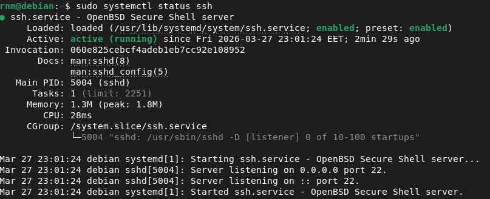
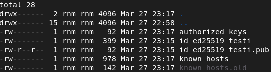
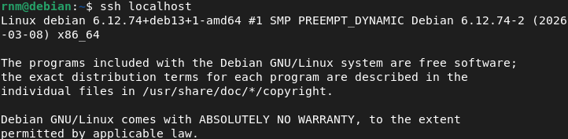
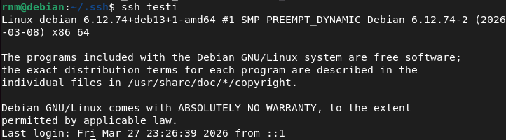
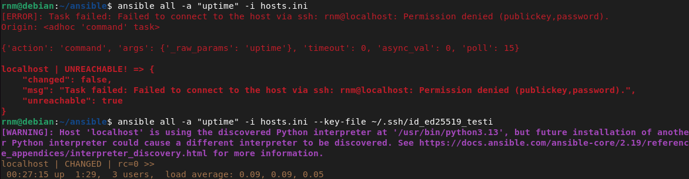
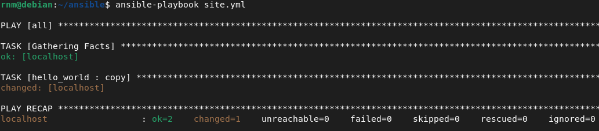
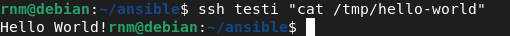

<!--- metadata

title: H1 - Hei Ansiblen maailma
date: 27.03.2026
slug:
id: ICI001AS3A-3013
week: 13
summary: 
Raportissa käsitellään SSH-demoni asennusta, julkisen avaimen autentikointia ja Ansible-automatisoinnin perusteet. SSH-avainparit luodaan ja testataan paikallisesti, yhteydet automatisoitiin .config-tiedostolla. Ansible asennettiin ja konfiguroitiin hosts.ini-tiedostolla, jonka jälkeen luotiin yksinkertainen "Hello World" -rooli SSH:n yli testattavaksi.
tags: [ "ICI001AS3A-3013", "Palvelinten hallinta"]

--->

## x) Lue ja tiivistä. (Tässä x-alakohdassa ei tarvitse tehdä testejä tietokoneella, vain lukeminen tai kuunteleminen ja tiivistelmä riittää. Tiivistämiseen riittää muutama ranskalainen viiva. Ei siis vaadita pitkää eikä essee-muotoista tiivistelmää. Lisää kuhunkin jokin oma kysymys tai huomio.)

## - Karvinen 2026: [SSH public key - Login without password](https://terokarvinen.com/ssh-public-key-login-without-password/)

## - Karvinen 2026: [Hello Ansible](https://terokarvinen.com/hello-ansible/)

- Ensimmäisessä tekstissä esitellään SSH, miten se ladataan ja käytetään

- SSH avaimet poistavat salasanojen käytön palvelimelle kirjautuessa.

- Toisessa artikkelissa esitellään Ansible. Ansible on "infrastructure as code" työkalu, jolla hallinnoidaan useita koneita saman aikaisesti.

- Työkalun käyttö ja keskeisimmät ominaisuudet ja komponentit esitellään kuten `hosts.ini, ansible.cfg & site.yml`

- `ansible.cfg` on konfiguraatio tiedosto, `hosts.ini` on tiedosto missä on lista kaikista hallittavista koneista ja `site.yml` pitää sisällään ja päättää mitä configuraatioita koneille lähetetään.

## a) Sshecrets. Asenna SSH-demoni ja testaa se kirjautumalla SSH:lla

Asennetaan ensiksi ssh palvelin komennolla:

```sh
sudo apt install openssh-server
```

Koska en ollut varma paketin nimestä tarkalleen niin etin sen ensiksi komennolla

```sh
sudo apt search ssh-server
```

ja sitä kautta löysin oikean paketin. Sitten katsoin demonin tilan komennolla:

```sh
sudo systemctl status ssh
```



Demoni pyörii ja voi hyvin. Komennolla näkee kaikkia hyödyllisiä tietoja palvelusta yleisesti.

Seuraavaksi luodaan ssh avainpari. Tämä tapahtuu komennolla:

```sh
ssh-keygen -t ed25519 -f ~/.ssh/id_ed25519_testi
```

Tässä `-t` kertoo salaus algoritmin ja `-f` nimeää tiedoston. On yleisesti hyvä tapa nimetä tiedostot, jotta ne erottaa toisistaan ja jotta ei tulis vahingossa mitään ristiriitoja muiden avaimien kanssa. Sitten vaan mennään asennus promptien läpi kunnes avainpari on saatu luotua. Sitten ajoin vain komennon:

```sh
ssh-copy-id localhost
```

Jonka jälkeen `.ssh` kansioon luotiin kaikki tarvittavat tiedostot.



Tämän jäleen vaan testattiin ssh yhteys komennolla:

```sh
ssh localhost
```

ja näin ssh yhteys saatiin muodostettua.



## b) Pubkey. Automatisoi ssh-kirjautuminen julkisella avaimella.

SSH avaimella kirjautumisen voi automatisoida käyttämällä `.config` tiedostoa. Tähän tiedostoon tallennetaan osoitteet, ja mitkä tahansa muut tarvittavat tiedot. Ensiksi luodaan itse tiedosto `.ssh/` kansioon

```sh
nano config
```

Tämän jälkeen lisätään nämä tiedot tiedostoon.

```sh
Host testi
  HostName localhost
  User rnm
  IdentityFile ~/.ssh/id_ed25519_testi
```

Kun nämä on asetettu voidaan me ottaa ssh yhteys pelkästään komennolla:

```sh
ssh testi
```



## c) Hei Ansible. Tee hei maailma ansiblella ja kokeile sitä SSH:n yli.

Ensiksi asennetaan Ansible

```sh
sudo apt-get install ansible
```

Sitten seurataan teron ohjeita, tehdään kansio ja aletaan luomaan tarvittavaa rakennetta.

```sh
mkdir ansible
cd ansible
nano hosts.ini  # lisätään localhost tiedostoon
nano ansible.cfg # lisätään ansiblen oma konfiguraatio tiedosto
```

Sitten nopea testi ennen kun jatketaan pidemmälle.



Tässä törmäsiin ensimmäiseen ongelmaani, eli ekalla kerralla kun yritin niin en pääsyt ansibleen kiinni errorilla `Permission denied (publickey,password)`. Tämä johtuu siitä että olin nimennyt mun `.pub` avain tiedoston eikä ansible löytänyt sitä automaattisesti. Kun tarkensin sille avaimen mitä haluan käyttää homma lähti toimimaan.

Sitten lisättiin teron ohjeiden mukaan muutama rivi koodia

```sh
[all:vars]
ansible_python_interpreter=/usr/bin/python3
```

`hosts.ini` tiedoston jatkeeksi, jotta joka kerta ei tulisi ärsyttävää varoitusta kun ajetaan ansible komentoja. Tämän jälkeen lisätään Ansiblen konfiguraatio tiedostoon `ansible.cfg` muutamia mukavuus asetuksia:

```sh
[defaults]
inventory = hosts.ini
private_key_file = ~/.ssh/id_ed25519_testi
```

Näin meidän ei tarvitse käyttää enään mitään lippuja vaan voidaan ajaa suoria komentoja vaan. Helpottaa aika paljon. Tämän jälkeen luodaan site.yml, mikä ohjaa mitä konfigurointeja lähetetään millekkin tietokoneille. Nyt sen sisällöksi tuli:

```yml
- hosts: all
  roles:
    - hello_world
```

Tämän jälkeen meidän pitää tehdä tarvittavat tiedostot oikeisiin paikkoihin. Seurataan Teron ohjeita.

```yml
mkdir -p roles/hello_world/tasks
nano roles/hello_world/tasks/main.yml
cat roles/hello_world/tasks/main.yml

- copy:
    dest: /tmp/hello-world
    content: "Hello World!"
```

Sitten vain ajetaan meidän Hello World ohjeet. Ja boom, onnistu!



Tarkistetaan vielä että tiedosto tuli oikeasti perille.

```sh
ssh testi "cat /tmp/hello-world"
```



Ja tämä toimi juuri odotetulla tavalla.

---

### Lähteet

#### 1. Tero Karvinen 2026. Palvelinten Hallinta. Luettavissa: [[https://terokarvinen.com/palvelinten-hallinta/]] Luettu: 28.3.2026

#### 2. Tero Karvinen 2026. SSH public key - Login without password. Luettavissa: [[https://terokarvinen.com/ssh-public-key-login-without-password/]] Luettu: 28.3.2026

#### 3. Tero Karvinen 2026. Hello Ansible. Luettavissa: [[https://terokarvinen.com/hello-ansible/]] Luettu: 28.3.2026

#### 4. Nawaz Dhandala 2026. How to Specify SSH Private Key in an Ansible Playbook . Luettavissa: [[https://oneuptime.com/blog/post/2026-02-21-ansible-specify-ssh-private-key/view]] Luettu: 28.3.2026
