<!--- metadata

title: H2 - Voileipä
date: 05.04.2026
slug:
id: ICI001AS3A-3013
week: Week 14
summary: Raportissa käydään läpi Ansiblen käyttöä, etenkin sudottoman Ansible-käyttäjän luonti manuaalisesti ja automatisoidusti, SSH-avainten käyttöönotto, sudoers-määritys, pakettien asennus (git, curl), monirivisen tiedoston luonti oikeuksineen sekä tiedoston poisto file-moduulilla. Mukana lähteet ja lyhyen reflektion.
tags: [ "ICI001AS3A-3013", "Palvelinten hallinta"]

--->

## x) Lue ja tiivistä. (Tässä x-alakohdassa ei tarvitse tehdä testejä tietokoneella, vain lukeminen tai kuunteleminen ja tiivistelmä riittää. Tiivistämiseen riittää muutama ranskalainen viiva. Ei siis vaadita pitkää eikä essee-muotoista tiivistelmää. Lisää kuhunkin jokin oma kysymys tai huomio.)

## - Karvinen 2026: [Sudo without password](https://terokarvinen.com/passwordless-sudo/)

- Artikkelissa kerrotaan miten luodaan sudo käyttäjä ilman salasanaa Ansiblen automaatiota varten.

- Tätä varten pitää luoda käyttäjä, ja sille käyttäjälle oma ryhmä.

- Aina kannattaa avata root shelli viereen varmuudeks jos jotakin rikkoo.

## - Munroe 2006: [xkcd 149: Sandwitch](https://xkcd.com/149/)

- Meemi siitä miten linux tottelee aina sudo komennolla. Ihan läppä :D

## - Karvinen 2026: [Passwordless Sudo with Ansible](https://terokarvinen.com/passwordless-sudo-with-ansible/)

- Miten luodaan Ansiblen puolella konfiguraatiot, niin että saadaan automatisoitua salasanaton sudo käyttäjän käyttö orja koneella.

## Ansiblen sisäänrakennettu dokumentaatio ansible-doc -kommennolla. Kustakin vain

## - Johdantokappale (Usein MODULE alla, päättyy OPTIONS alkuun)

## - Nimetyt optiot selityksineen

## - 'ansible-doc copy': content, dest, src; owner, group, mode

- Ansiblen copy moduuli kopioi tiedoston tai kansion rakenteen paikalliselta koneelta orja koneelle

- content = Korvaa tiedoston sisällön orja koneella. Voidaan käyttää vain jos `dest` on tiedosto. Jos tiedostoa ei löydy orja koneelta, niin tiedosto luodaan. Kentän tyyppi string muodossa.

- dest = absoluuttinen osoite orja koneella minne tiedosto kopioidaan. Kentän tyyppi on polku.

- src = Paikallisen koneen tiedosto polku mistä kopioidaan tiedosto orja koneelle. Voi olla absoluuttinen tai suhteeelline. Jos polku on hakemisto, se kopioidaan rekursiivisesti. Jos polku loppuu `/` niin vain hakemiston sisältö kopioidaan, muuten sisältö hakemistoineen kopioidaan.

- owner = Määrittää kuka orja koneella on tiedoston omistaja. Jos jätetään tyhjäksi, niin luodaan kyseisen käyttäjän mukaan. Numeerisia käyttäjänimiä suositellaan välttämään. Kentän tyyppi string muodossa.

- group = Määrittää mille ryhmälle tiedosto tai hakemisto kuuluu. Toimii samalla tavalla kun owner mutta ryhmä tasolla.

- mode = Määrittää oikeudet tiedostolle tai hakemistolle. Määritellään numeraalisena esim `0644`. Ensimmäinen numero määrittää onko oktaali numero sarja. Ansiblen 1.8 versiossa voidaan myös kertoa oikeudet symboolisessa muodossa esim. `u+rwx` tai `u=rw, g=r` ja versiosssa 2.3 on mahdollista laittaa `preserve` muutujaksi, mikä käyttää samoja oikeuksia kuin lähde tiedosto.

## a) Sudoless. Tee ansiblea varten tunnus, jolla voi käyttää sudoa ilman salasanaa. Sekä ssh-kirjautuminen että sudon käyttö tulee olla ansbilea varten automatisoitu

Ihan ensimmäisenä avasin uuden root shellin odottamaan jos rikon mitään.

```sh
sudo -i
```

.

Sitten aloitetaan luomalla käyttäjätunnus, ryhmä tunnukselle ja sitten vielä lisätään se ryhmään ja vielä testataan että käyttäjä onnistuttiin luomaan ja `erkki` on oikeassa ryhmässä.

```sh
sudo adduser erkki
sudo groupadd sudoless
sudo adduser erkki sudoless

ssh erkki@localhost
groups
```

.

Ja kaikki onnistui ongelmitta.

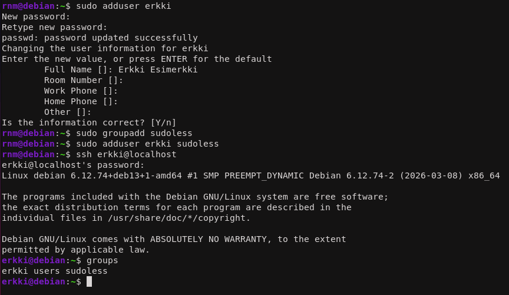

Sitten lisätään omainaisuus että käyttäjää voi käyttää `sudo:a` ilman salasanaa. Koska koneeseen yheyden saa vain meidän ssh avaimela, on kirjautuminen suojattu vaikka `erkki` käyttäjää voikin jatkossa käyttää ilman salasanaa.

Lisätään meidän julkinen avain siis erkin käyttäjälle. Koska edellisessä harjoituksessa tehtiin jo avaimet niin niitä ei tarvitse tällä kertaa enää uudestaan tehdä. Nyt ne voidaan vaan kopioida.

```sh
ssh-copy-id erkki@localhost
```

.

Koska mulla ei ole tällä hetkellä muita avaimia luotuna ei tarvitse mun erikseen tarkentaa, minkä avaimen mä haluan jakaa. Muuten on hyvä tapa aina tarkentaa `-i` lipulla avaimen nimi. Sitten testataan vielä kirjauta, ja success!

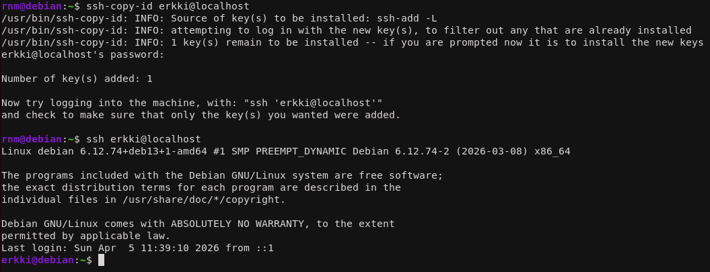

Seuraavaksi sudo oikeuksien salasanaton käyttö. Seurataan Teron ohjeita. Komennolla:

```bash
sudo visudo /etc/sudoers.d/sudoless
```

.

Luodaan sudoless tiedosto, minne voidaan lisätä salasana sääntö.

```sh
%sudoless ALL = (ALL) NOPASSWD: ALL
```

.

Sitten testataan kirjautumista. Ja tämäkin onnistui ja toimi ongelmitta.

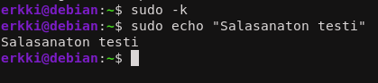

## b) Antero. Tee salasanaton, automaattisesti ssh:lla kirjautuva tunnus Ansiblella

Sitten luodaan sama homma mutta vaan Ansiblen avulla automatisoidusti. Tällöin kaikki tapahtuu konfiguraatio tiedostojen sisällä. Eli ihan ensiksi lähdetään luomaan uutta roolia ja siihen tarvittavia hakemistoja ja tiedostoja.

```sh
sudo -p roles/lol/tasks
nano roles/lol/tasks/main.yml
```

.

`-p` lippu mahdollistaa monien sisäkkäisten kansioiden tekemisen yhdellä komennolla. Sitten konfiguroidaan samat asiat mitä tehtiin manuaalisesti mutta nytten automaattisesti. Sitten lisätään rooli sekä `become: true` vielä `site.yml` tiedostoon, ja testataan että koko homma edes toimii ennen kun lähetään konfiguroimaan pidemmälle. `become: true` ohjeistaa Ansiblea käyttämään sudo oikeuksia ajaessaan komentoja.

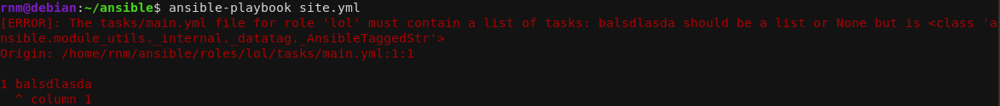

Ja viesti meni perille, koska saatiin erroria aikaseks. Sitten voidaan konfiguroida koko homma.

```yaml
- group:
    name: "sudoless"
    state: present
- user:
    name: "lol"
    state: present
    groups: ["sudoless"]
- authorized_key:
    user: "lol"
    key: "ssh-ed25519 AAAAC3NzaC1lZDI1NTE5AAAAIP36Yn4qQ34S1NpdZvKxHoFs180bC0/hPcwserIdG7u9 rnm@debian"
- copy:
    dest: "/etc/sudoers.d/sudoless"
    content: "%sudoless ALL = (ALL) NOPASSWD: ALL\n"
    owner: "root"
    group: "root"
    mode: "0644"
```

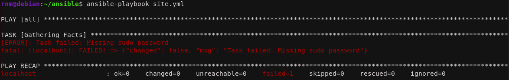

Ensimmäisellä haulla komento epäonnistui, koska käyttäjällä ei ole sudo oikeuksia. Eli komento pitää ajaa `-K` Lipulla, jolloin se kysyy sudo salasanaa.

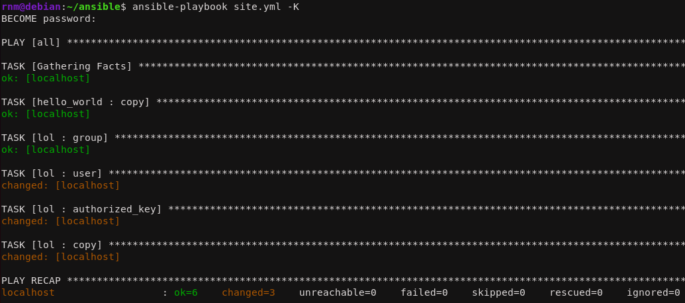

Ilmeisesti jotakin nytten tapahtui, mutta käydään vielä varmistamassa että muutokset toteutui.

Ja kyllä nopean tarkistuksen jälkeen näyttää siltä että muutokset on oikeasti astunu voimaan ja automatisoitu konfigurointi tapahtui.

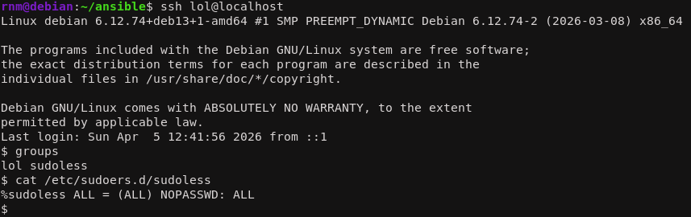

## c) Package. Asenna kaksi pakettia ansiblella

Sitten lähdetään luomaan uutta tehtävää. Lähdin lisäämään asennus ohjeet samaan jo tehtyyn `main.yml` tiedostoon. Nopealla googlauksella löysin että apt on oikea komento ja katsoin ohjeita `ansible-doc apt` komennolla optioista.

```yml
- name: 2 packages
  apt:
    name:
      - git
      - curl
    state: present
    update_cache: yes
```

.

Uusi tehtävä (task) luotiin antamalla sille nimi, jonka jälkeen kerrottiin tehtävän komento `apt`. Sitten listattiin paketit mitä halutaan asentaa, mikäli niitä ei vielä ole. Koska mun debian on minimum build, niin tästä ei löydy mitään, niin valitsin gitin ja curl:in asennettavaksi. `update_cache` toimii tässä vähän kuin `apt-get update` komentona, ennen latausta, niin otetaan sekin käyttöön. Sitten vaan testataan.

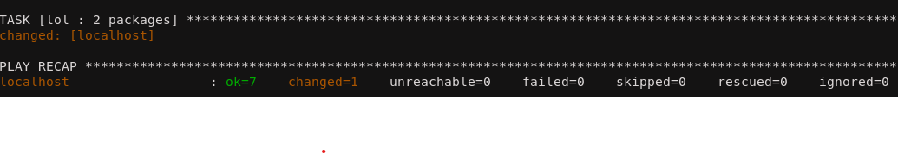

Näyttää onnistuneen, mutta varmistetaan vielä että molemmat on asennettu. Ja kyllä molemmat paketit on asennettuja onnistuneesti.

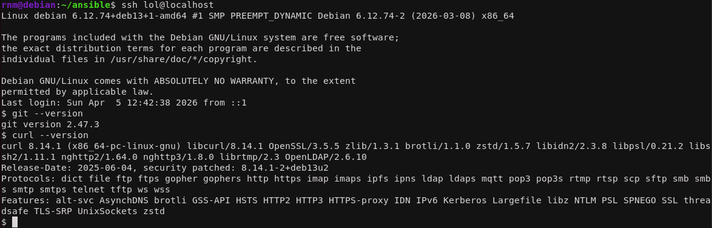

## d) File. Kirjoita orjalle useamman rivin mittainen tiedosto Ansiblella. Määrittele sen omistaja, omistava ryhmä ja oikeudet. Käytä oikeuksille oktaalinumeroa, esim. "0600". Kerro, mitä oikeudet ovat symbolisessa muodossa, esim. "-rwxr--r--". Selitä, mitä kukin käyttäjä saa tehdä tuolle tiedostolle

Samalla idealla liikeelle kuin aikasemmassa tehtävässä. Tällä kertaa käytetään `copy` komentoa. Päätin tehdä lyhyen ajettavan tiedoston.

```yml
- name: update script
  copy:
    dest: "/home/lol/update_system"
    content: |
      #!/bin/bash
      sudo apt update
      echo "updated the system sucessfully!"
    owner: "lol"
    group: "sudoless"
    mode: "0740"
```

.

Tehtävässä määritetään minne tiedosto asennetaan, mitä siinä on sisällä, kenelle kuuluu ja oikeudet. Sisällöstä niin `|` on perus yml formaattia, ja sillä voidaan kirjoittaa moni rivisiä ohjelmia. Sisältö itsessään on hyvin yksinkertainen `apt update` scripti jonka omistaa tämä käyttäjä omassa ryhmässään. Oikeudet päätin antaa 740 eli omistajalle täydet oikeudet, ryhmälle luku ja muille ei mitään, koska vain käyttäjän itse pitää pystyä tätä tiedostoa hallinnoimaan. Sitten vain testataan.

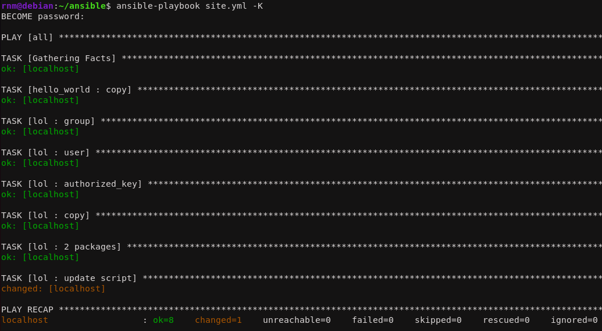

Näyttää onnistuneen, käydään vielä varmistamassa. Ja kyllä skripti löyty oikeilla tunnuksilla ja oli heti ajettavakin. Eli onnistui.

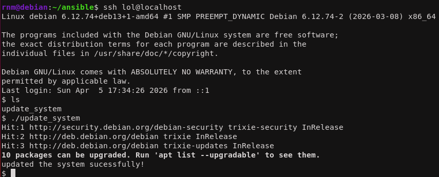

## e) Jotain muuta. Näytä esimerkki ansiblen käskystä, jota ei ole vielä käsitelty kurssilla tai kotitehtävissä. Voit ottaa jonkun muun modulin kuin apt, file, copy, user tai authorized_key. Tai voit käyttää ominaisuutta, jota ei vielä ole demonstroitu. Jos tiivistystehtävässä x on mainittu ominaisuuksia, joita ei tunneilla tai läksyissä kokeiltu, nekin kelpaavat.

Halusin tietää miten mä voin nyt siivota kaiken ja palauttaa ennen aikaisempiin muutoksiin. Päätin kokeilla poistaa aikaisemmassa tehtävässä tehtyä `update_script` tiedostoa. Nopealla googlauksella mun pitää tehdä uusi moduuli mikä korvaa tämän asennus moduulin. Tässä käytetään nyt apuna `state` muuttujaa. Eli aikaisempi moduuli muuttetaan tähän:

```yml
- name: remove script
  file:
    dest: "/home/lol/update_system"
    state: absent
```

.

Meidän pitää käyttää myös `file` komentoa, koska me manipuloidaan nytten itse tiedostoa orja koneella. Sitten testataan.

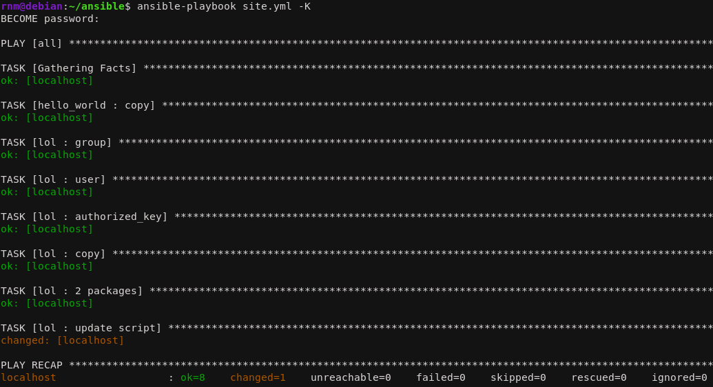

Näyttää muuttuneen (unohin muuttaa moduulin nimen, nii siks lukee vielki update script tossa). Mutta käydään tarkistamassa.

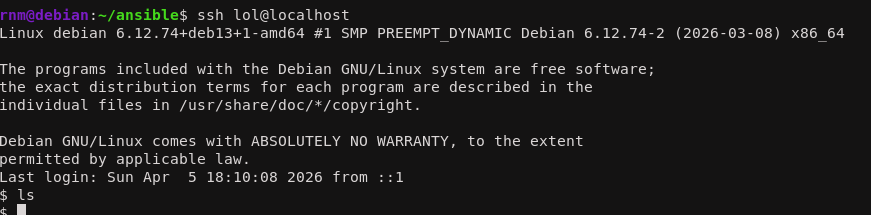

Ja poisto onnistui. Näin siis poistetaan ainakin yksi tiedosto, mutta luin että yleisesti ei ole mitään hyvää `undo` nappia olemassa, millä voisi poistaa kaikki tehdyt muutokset, ja tää on ongelma etenkin kun ajetaan monimutkaisia custom skriptejä mitkä muuttaa järjestelmää monella tapaa.

---

### Lähteet

#### 1. Tero Karvinen 2026. Palvelinten Hallinta. Luettavissa: [[https://terokarvinen.com/palvelinten-hallinta/]] Luettu: 5.4.2026

#### 2. Tero Karvinen 2026. Sudo without password. Luettavissa: [[https://terokarvinen.com/passwordless-sudo/]] Luettu: 5.4.2026

#### 3. Tero Karvinen 2026. Passwordless Sudo with Ansible. Luettavissa: [[https://terokarvinen.com/passwordless-sudo-with-ansible/]] Luettu: 5.4.2026

#### 4. Munroe 2006. xkcd 149: Sandwitch. Luettavissa: [[https://xkcd.com/149/]] Luettu: 5.4.2026

#### 5. Toydarian 2021. How to reverse ansible role installation ? (how to uninstall a role) Luettavissa: [[https://stackoverflow.com/questions/67935039/how-to-reverse-ansible-role-installation-how-to-uninstall-a-role]] Luettu: 5.4.2026