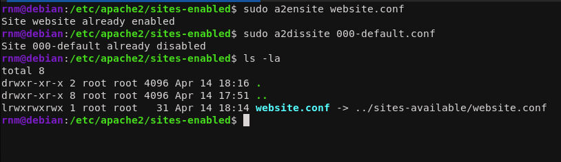
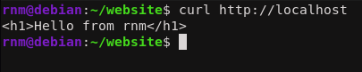
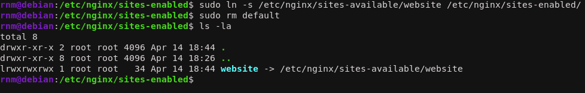
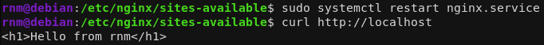
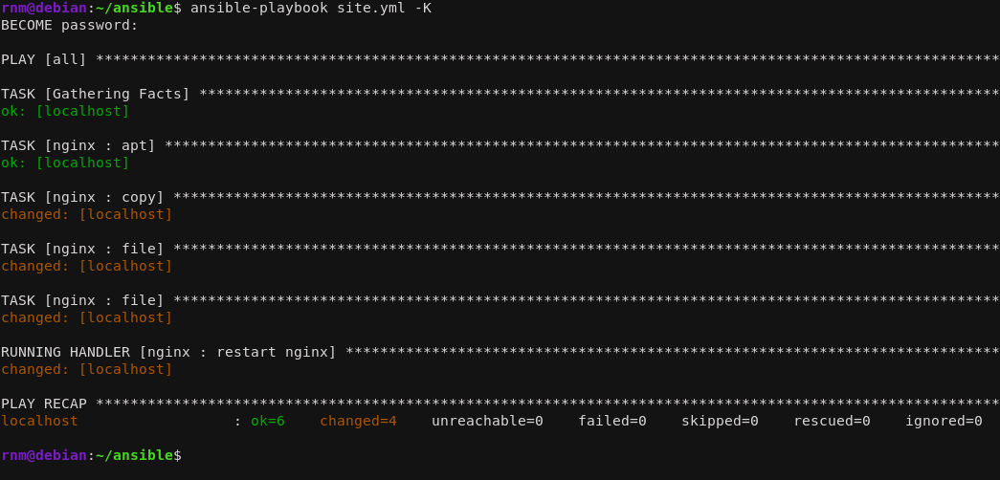
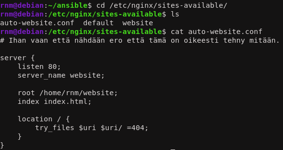

<!--- metadata

title: H3 - Demoni
date: 14.04.2026
slug:
id: ICI001AS3A-3013
week: Week 16
summary: Apache ja Nginx web-palvelimien asennus ja konfigurointi käsin sekä Ansible-automaatiolla. Harjoituksessa asennetaan Apache2 ja Nginx itsenäisesti tavallisen käyttäjän muokattavilla sivuilla, sekä automatisoidaan Nginx-asennus Ansible-roolilla.
tags: [ "ICI001AS3A-3013", "Palvelinten hallinta"]

--->

## x) Lue ja tiivistä. (Tässä x-alakohdassa ei tarvitse tehdä testejä tietokoneella, vain lukeminen tai kuunteleminen ja tiivistelmä riittää. Tiivistämiseen riittää muutama ranskalainen viiva. Ei siis vaadita pitkää eikä essee-muotoista tiivistelmää. Lisää kuhunkin jokin oma kysymys tai huomio.)

## - Karvinen 2026: [Apache installed with Ansible - quick notes](https://terokarvinen.com/apache-ansible/)

- Kerrottiin lyhyesti miten asennetaan apache2 web palvelin Ansiblen avulla automaattisesti.

- Lyhyet koodi esittelyt miltä Ansible tiedostoissa asiat pitää näyttää.

- Itselle hyödyllisimmät perus komennot millä asennetaan, muokataan ja käynnistetään.

## Ansible Community Documentation: [Handlers: running operations on change](https://docs.ansible.com/projects/ansible/latest/playbook_guide/playbooks_handlers.html)

## - Handlers: running operations on change (johdantokappale pääotsikon alta)

- Handlereita käytetään, kun halutaan ajaa tehtäviä vain kun jokin on muuttunut. Esimerkiksi kun tehdään konfiguraatio muutos niin halutaan uudelleenkäynnistää palvelu että se astuu voimaan (esim. Apache2).

## - Notifying handlers

- Handlereita kutsutaan `notify` avainsanalla. Sillä voidaan kutsua useampia, tai sitten yksittäisiä handlereita. Handlerit toteutetaan määrittely järjestyksessä.

- Jos samaa handleria kutsutaan moneen kertaan saman ajon aikana, toteuttaa Ansible sen vaan kerran. Esimerkkinä Apachen uudelleenkäynnistys tapahtuu vain kerran, vaikka 3 eri tehtävää kutsuis kyseistä handleria.

## 'ansible-doc service'

## - johdantokappale (MODULE alta)

- Service hallinnoi palveluita orja koneilla.

- Service kattaa monet eri service managerit. Tämä yleistä eri service managerien käytön yhden moduulin alle.

## - enabled

- Käynnistyykö service kun kone käynnistetään.

## - name

- Servicen nimi.

## - state

- Määrittää tilan. Voi olla esim. `started, stopped, restarted, reloaded`.

- Ainakin yksi state tai enabled pitää olla servicellä määritettynä.

## - EXAMPLES

- Eri esimerkkejä ja miten ne toimii, ittelle pisti silmään:

```yaml
- name: Restart network service for interface eth0
  ansible.builtin.service:
    name: network
    state: restarted
    args: eth0
```

## a) Apassi. Asenna Apache 2 käsin. Weppisivun tulee näkyä palvelimen etusivulla. Sivun tulee olla tavallisen käyttäjän muokattavissa, ilman root- tai sudo-oikeuksia

Lähetään liikkeelle Apachen asennuksella.

```sh
mkdir website
cd website
echo "<h1>Hello from $(whoami)</h1>" > ~/website/index.html
sudo apt update 
sudo apt install apache2
```

Sitten kun palvelin on saatu asennettua niin lähdetään muokkaamaan conf tiedostoja, jotta normi käyttäjä voi muokata nettisivuja. Eli mennään hakemistoon `etc/apache2/sites-available` ja luodaan sinne uusi conf tiedosto meidän sivulle.

```html
<VirtualHost *:80>

        DocumentRoot /home/rnm/website

        <Directory /home/rnm/website>
           Options Indexes FollowSymLinks
           AllowOverride None
           Require all granted
        </Directory>

</VirtualHost>
```

Sitten ohjataan verkkosivu näyttämään tähän sivuun käyttämällä apachen mukana tulevaa komento työkalua joka ohjaa sivut automaattisesti:

```sh
sudo a2ensite website.conf
sudo a2dissite 000-default.conf
sudo systemctl reload apache2
```



Sitten meidän pitää antaa apachelle oikeus käyttää meidän sivuja. Tämä tapahtuu antamalla ajo oikeudet kotihakemistolle. Tarkemmin komento on:

```sh
chmod o+x /home/rnm/
```

Tämä antaa vain läpikulku oikeudet, mutta ei anna luku oikeuksia kotihakemistoon. Sitten vain käynnistetään palvelin uudestaan ja katotaan toimiiko kaikki. Varmistetaan vielä että homma pelittävää oikein. Ja näyttää onnistuneelta.



## b) Moottorix. Asenna Nginx käsin. Weppisivun tulee näkyä palvelimen etusivulla. Sivun tulee olla tavallisen käyttäjän muokattavissa, ilman root- tai sudo-oikeuksia. (Muista sammuttaa Apache ensin.)

Sitten aloitetaan sammuttamalla apache.

```sh
sudo systemctl stop apache2
sudo systemctl disable apache2
```

Tässä kun tehtiin ensiksi apachella ja nyt nginx:llä voidaan ohjata täysin sama kotisivu eri palvelimen läpi.

Sitten ladataan palvelin.

```sh
sudo apt install nginx
```

Sitten mennään muokkaamaan `.conf` tiedostoja taas. Ensiksi luodaan uusi `.conf` tiedosto, samalla tavalla kun aikasemmin.

```sh
sudo nano /etc/nginx/sites-available/website
```

Sitten lisätään perus asetukset mitä nginx palvelin tarvitsee.

```nginx
server {
    listen 80;
    server_name website;

    root /home/rnm/website;
    index index.html;

    location / {
        try_files $uri $uri/ =404;
    }
}
```

Koska nginx:n mukana ei tule samanlaista automaattista symlink työkalua kun apachen, niin tehdään linkitykset käsin.

```sh
sudo ln -s /etc/nginx/sites-available/website /etc/nginx/sites-enabled/
sudo rm default 
```



Tämän jälkeen ei tarvitsekkaan muuta kun käynnistää nginx palvelin uudestaan.

```sh
sudo systemctl restart nginx
curl http://localhost
```



## c) Automoottorix. Automatisoi Nginx asennus Ansiblella. Ylläpitäjän osuus Ansiblella riittää, itse HTML-weppisivut voi tehdä käsin

Lähetään luomaan tiedosto rakennetta.

```sh
mkdir -p roles/nginx/files
mkdir -p roles/nginx/handlers
mkdir -p roles/nginx/tasks
nano roles/nginx/tasks/main.yml
```

tasks/main.yml

```yaml
- apt:
    name: nginx
    state: present

- copy:
    dest: "/etc/nginx/sites-available/auto-website.conf"
    src: "auto-website.conf"
    owner: "root"
    group: "root"
    mode: "0644"
  notify: restart nginx

- file:
    path: /etc/nginx/sites-enabled/website
    state: absent
  notify: restart nginx

- file:
    src: /etc/nginx/sites-available/auto-website.conf
    dest: /etc/nginx/sites-enabled/auto-website.conf
    owner: root
    group: root
    state: link
  notify: restart nginx
```

handlers/main.yml

```yml
- name: restart nginx
  systemd:
    name: nginx
    state: restarted
```

files/auto-website.conf

```nginx
# Ihan vaan että nähdään ero että tämä on oikeesti tehny mitään.

server {
    listen 80;
    server_name website;

    root /home/rnm/website;
    index index.html;

    location / {
        try_files $uri $uri/ =404;
    }
}
```

Lopuksi otetaan vielä rooli käyttöön `site.yml` tiedostossa. Kommentoin kaikki muut roolit ulos jotta prosessi olisi hieman nopeampi.

```yml
- hosts: all
  become: true
  roles:
#    - hello_world
#    - lol
    - nginx
```

Sitten vaan ajetaan koko homma tuttuun tapaan komennolla

```sh
ansible-playbook site.yml -K
```



Kaikki näyttää onnistuneen oikein. Ajoin vielä uudestaan saavuttaakseen idempotenssin. Sitten kävin vielä tarkistamassa että muutokset oikeasti tulivat voimaan.



Onnistui.

---

### Lähteet

#### 1. Tero Karvinen 2026. Palvelinten Hallinta. Luettavissa: [[https://terokarvinen.com/palvelinten-hallinta/]] Luettu: 14.4.2026

#### 2. Karvinen 2026: Apache installed with Ansible - quick notes. Luettavissa: [[https://terokarvinen.com/apache-ansible/]] Luettu: 14.4.2026

#### 3. Ansible Community Documentation: Handlers: running operations on change. Luettavissa: [[https://docs.ansible.com/projects/ansible/latest/playbook_guide/playbooks_handlers.html#notifying-handlers]] Luettu: 14.4.2026

#### 4. Farhan 2021. The NGINX Handbook – Learn NGINX for Beginners. Luettavissa: [[https://www.freecodecamp.org/news/the-nginx-handbook/#heading-how-to-serve-static-content-using-nginx]] Luettu: 14.4.2026
