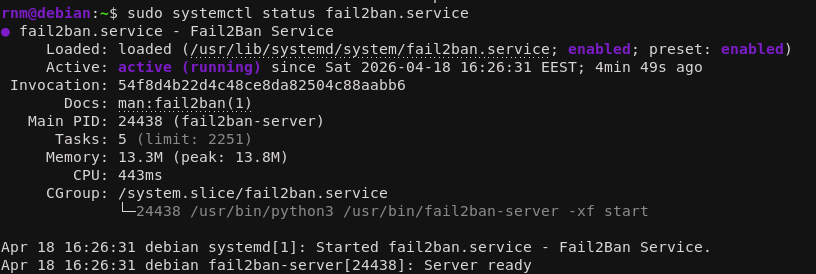
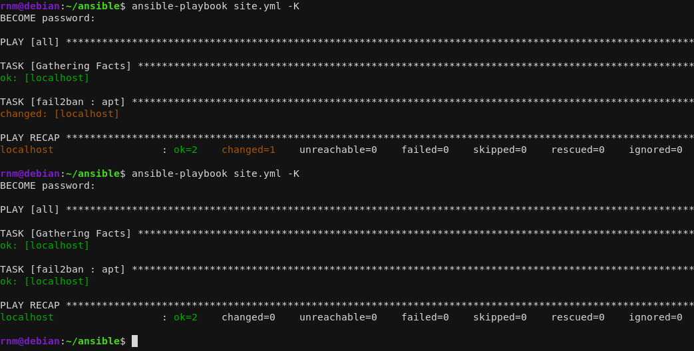
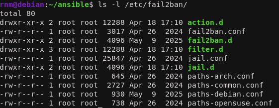
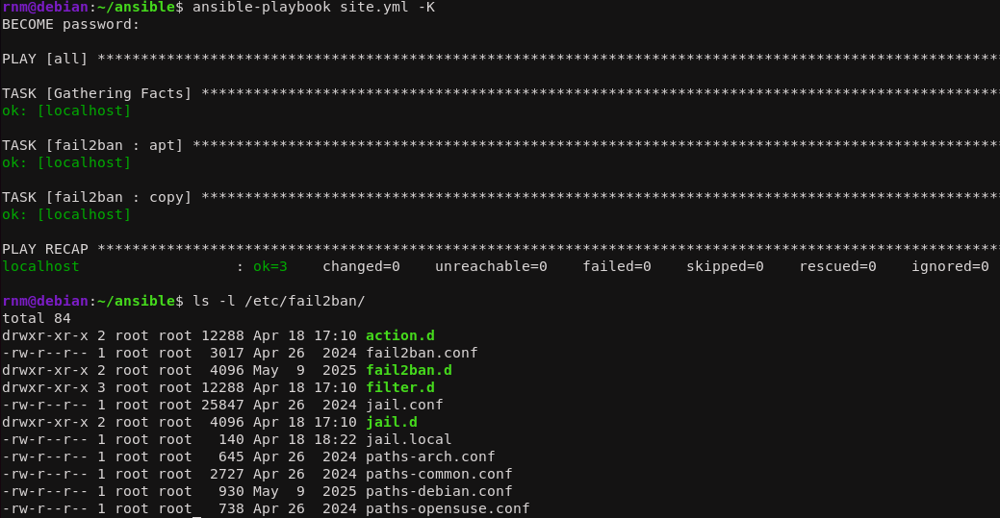
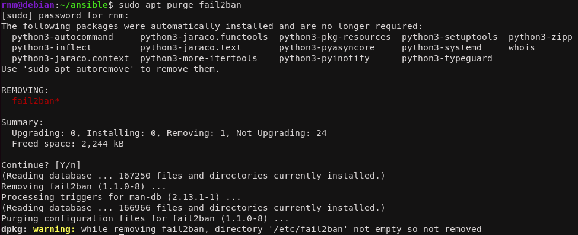
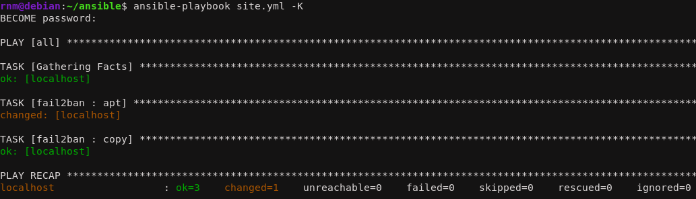
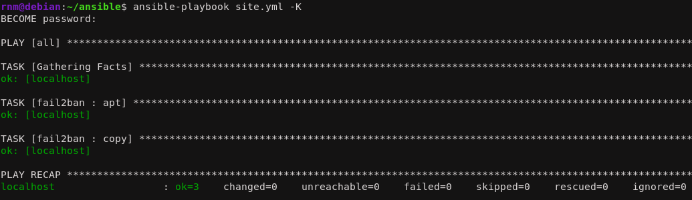

<!--- metadata

title: H4 - Pizza Fantasia
date: 18.04.2026
slug:
id: ICI001AS3A-3013
week: Week 16
summary: Tehtävässä tiivistetään Karvisen tutkimuksen DSL-havaintoja (laajuus, yleisimmät funktiot ja rakennuspalikat) sekä toteutetaan fail2ban-demonin asennus käsin ja Ansiblella. Lisäksi muokataan jail.local-asetuksia, varmistetaan palvelun uudelleenkäynnistys ja osoitetaan roolin korjaavuus sekä idempotenssi.
tags: [ "ICI001AS3A-3013", "Palvelinten hallinta"]

--->

## x) Lue ja tiivistä. (Tässä x-alakohdassa ei tarvitse tehdä testejä tietokoneella, vain lukeminen tai kuunteleminen ja tiivistelmä riittää. Tiivistämiseen riittää muutama ranskalainen viiva. Ei siis vaadita pitkää eikä essee-muotoista tiivistelmää. Lisää kuhunkin jokin oma kysymys tai huomio.)

## - Karvinen 2023: [Configuration Management of Distributed Systems over Unreliable and Hostile Networks, vain nämä kohdat:](https://westminsterresearch.westminster.ac.uk/item/w7vvz/configuration-management-of-distributed-systems-over-unreliable-and-hostile-networks)

## 4.12.1 Size and Complexity of Some DSLs (112. Ominaisuuksien määrä.)

- DSL kielet ovat usein hyvin monimutkaisia ja laajoja.

- Salt hallinta järjestelmässä on 510 tila funktiota, jolla voidaan hallita orja konetta.

- Puppetissa 113.

- Mä luulen et tän kappaleen idea oli esittää miten monimutkaisia DSL kielet usein ovat.

## 4.12.2 Use of DSL Functions in Case Configuration (112-115. Mitä oikeasti käytetään.)

- Kapppaleessa analysoitiin functioiden käyttö määrää.

- Aineistoa haettiin kahdesta lähteestä ja molemmissa yleisimpiä funktioita olivat file, package, exec ja service.

- Tässä argumentoidaan sitä, että pieni määrä funktioita kattaa laajaan määrään käyttötarkoituksia.

## 4.12.3.1 Dependencies Between Main Functions (115-117. Tärkeimmät rakennuspalikat.)

- Tärkeimpiä rakennuspalikoita konfigurointi hallinnassa ovat:

|Category | Functions |
|---------|-----------|
|Daemon setup | package, file, service|
|App setup | package, file|
|User management | user, group|
| File manipulation | file, directory, symlink|

## a) Räpylä. Asenna itse valitsemasi demoni käsin. Jokin muu kuin tunnilla tai kotitehtävissä aiemmin asennettu, eli ei apache, ngninx eikä openssh-server. Kuten aina, testaa lopputulos.

Mä päätin asentaa `fail2ban` demonin. fail2ban on portinvartia. Se automaattisesti estää IP osoitteita, mikäli se havaitsee anomaleja. Esimerkiksi jos tuntematon IP osoite epäonnistuu 3 kertaa kirjautumaan sisään, fail2ban kirjaa osoitteen vankilaan tietyksi ajaksi.

Demonin asennus on hyvinkin simppeli.

```sh
sudo apt install fail2ban
```

Asennuksen jälkeen fail2ban käynnistyy automaattisesti. Tämä on siitä kätevä demoni että tällä voidaan vangita myös muita asioita kun vain IP osoitteita. Esmimerkiksi käyttäjänimiä ja sähköposteja. Demoni on hyvin monikäyttöinen.



## b) Automaatti. Automatisoi valitsemasi demonin asennus Ansiblella.

Konfiguroidaan. Ensiksi `site.yml`

```yml
- hosts: all
  become: true
  roles:
#    - hello_world
#    - lol
#    - nginx
    - fail2ban
```

Sitten `roles/fail2ban/tasks/main.yml`

```yml
- apt:
    name: fail2ban
    state: present
```

Ennen kuin ajan komennot, poistan fail2ban demonin.

```sh
sudo apt remove fail2ban
```

Sitten ajetaan ja kaikin puolin näyttää hyvältä.



## c) Asetus. Muuta asetustiedostoa herralla (master, "control node") ja aja ansible uudestaan. Osoita, että asetukset tulivat käyttöön.

Tähän me tarvitaan muutama eri asia. Ensiksi meidän pitää muuttaa `tasks/main.yml` tiedostoa.

```yml
- apt:
    name: fail2ban
    state: present

- copy:
    src: jail.local
    dest: /etc/fail2ban/jail.local
    owner: root
    group: root
    mode: "0644"
  notify: restart fail2ban
```

Sitten meidän pitää tehdä `handlers/main.yml` ja `files/jail.local` tiedostot. Ensiksi handler tiedosto.

```yml
- name: restart fail2ban
  systemd:
    name: fail2ban
    state: restarted
```

Sitten itse konfiguraatio mikä lähetetään. Tästä otin mallia suoraan fail2ban `/etc/fail2ban/jail.conf` tiedostosta. Siellä oli eriteltynä kaikki mitä pitää olla tarkennettuna.

```sh
[DEFAULT]
bantime  = 24h
findtime = 10m
maxretry = 3

[sshd]
enabled = true
port    = ssh
logpath = %(sshd_log)s
backend = %(sshd_backend)s
```

Ennen playbookin ajamista asetukset näyttivät tältä:



Idempotentti ajon jälkeen hakemisto näytti tältä:



## d) Paikka remonttiin. Riko jotain asetuksia. Voit esimerkiksi poistaa demonin 'sudo apt-get purge foobar' (purge poistaa myös asetustiedostoja), poistaa asennuksen yhteydessä tulevan kansion (sudo rm -r /etc/foobar/ # vaarallista) tms. Ja sitten ajaa ansible-roolisi uudestaan ja todeta, että se korjaa tilanteen.

Poistin koko homman.



Sitten ajetaan playbook. Ja saatiin juuri odotettu tulos. Eli vain asennus tapahtui mutta konfigurointi tiedostot eivät päivittyneet. Tämä oli odotettavaa, sillä aikasempi `purge` ei onnistunut poistamaan näitä tiedostoja.



## e) Idempotentti. Osoita, että tilasi on idempotentti.

Sitten vain ajetaan playbook kerran vielä ja tila on idempotentti.



Hyvältä näyttää, kaikki toimii olettamalla tavalla!

---

### Lähteet

#### 1. Tero Karvinen 2026. Palvelinten Hallinta. Luettavissa: [[https://terokarvinen.com/palvelinten-hallinta/]] Luettu: 18.4.2026

#### 2. Karvinen 2023: Configuration Management of Distributed Systems over Unreliable and Hostile Networks. Luettavissa: [[https://westminsterresearch.westminster.ac.uk/item/w7vvz/configuration-management-of-distributed-systems-over-unreliable-and-hostile-networks]] Luettu: 18.4.2026

#### 3. fail2ban. Github. Luettavissa: [[https://github.com/fail2ban/fail2ban]] Luettu: 18.4.2026
