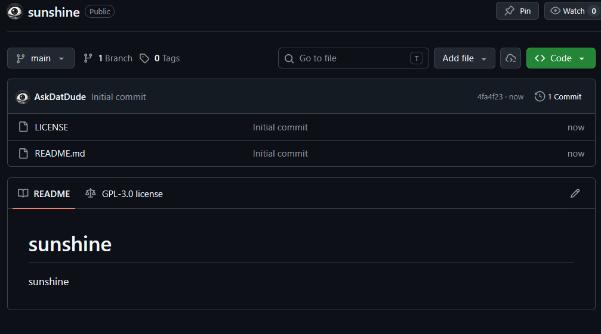
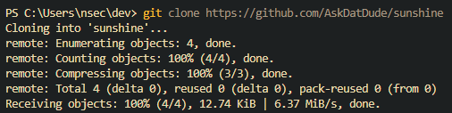
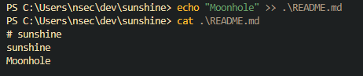
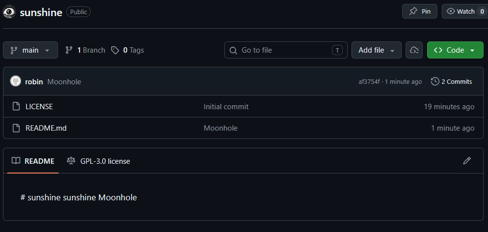
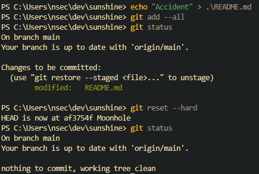
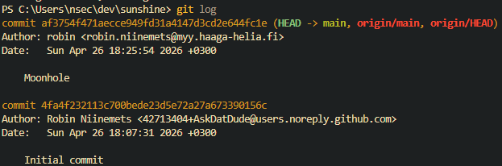
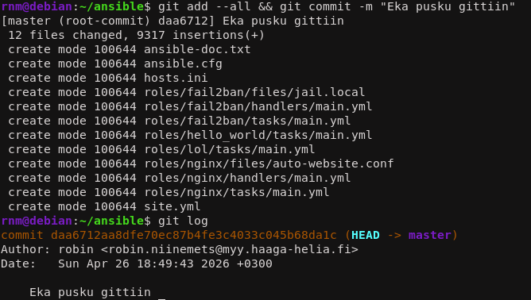

<!--- metadata

title: H5 - Gitar Hero
date: 26.04.2026
slug:
id: ICI001AS3A-3013
week: Week 17
summary: Kävin läpi Gitin perusteet (snapshotit, staged/commit, eheystarkistus) ja selitin komentosarjan osat. Tein uuden sunshine-varaston, kloonasin sen, muokkasin README:tä, puskin muutokset, testasin reset --hardin, tarkistin login sekä versionhallinnoin Ansible-kansion.
tags: [ "ICI001AS3A-3013", "Palvelinten hallinta"]

--->

## x) Lue ja tiivistä. (Tässä x-alakohdassa ei tarvitse tehdä testejä tietokoneella, vain lukeminen tai kuunteleminen ja tiivistelmä riittää. Tiivistämiseen riittää muutama ranskalainen viiva. Kannattaa lisätä mukaan myös jokin oma havainto, idea tai kysymys.)

## Chacon and Straub 2014: [Pro Git, 2ed:](https://git-scm.com/book/en/v2) [1.3 Getting Started - What is Git?](https://git-scm.com/book/en/v2/Getting-Started-What-is-Git%3F)

- Selitetään gitin toiminta, miten se on suuniteltu ja miten se toimii verrattuna muihin versio hallinta järjestelmiin.

- Git käyttää Snapshot rakennetta, se tallentaa ns. kuvankaappauksia koodista, ja tallentaa referaatti pisteen. Verrataan tiedosto järjestelmään.

- Gitin avulla voit työskennellä lokaalisti. Git käyttää paikallista tietokantaa mahdollistakseen tämän.

- Gittiin on sisäänrakennettu eheyden tarkistus. Se käyttää SHA-1 hash funktioita. Tämän avulla on mahdotonta muuttaa tiedostojen sisältöä missään vaiheessa, niin että git ei siitä tietäisi.

- Git lähestulkoon aina lisää dataa, ja hyvin harvoin poistaa sitä. Tämä tarkoittaa turvaa siihen että aina voi palata vanhaan, jos jokin rikkoontuu.

- Git toimii kolmenssa tilassa. `Modified`, `Staged` ja `Committed`. Jokaisella on oma tarkoitus. Näistä hämmentävin itselle on `staged`, mikä siis mahdollistaa sen että voit valita mitkä muutetut tiedostot menee seuraavaan lopulliseen snapshottiin.

## Gitin käyttö on lähinnä 'git add --all && git commit; git pull && git push'. Selitä tuon komennon jokainen osa. Käytä apuna itse valitsemiasi lähteitä ja viittaa niihin.

- Ensiksi git lisää kaikki muutokset `staged` tilaan. Tämä on `git add --all`.

- `&&` merkit tarkoittaa tässä että se ajaa seuraavan komennon vain jos eka onnistuu.

- `git commit` lähettää muutokset paikalliseen tietokantaan.

- `;` komentojen välillä kertoo että nämä komennot suoritetaan joka tapauksessa, onnistuuko ensimmäiset komennot tai ei.

- Tämän jälkeen `git pull` vetää viimesimmän version etä varastosta.

- Ja mikäli tämä onnistuu niin `git push` puskee paikallisen tietokanta varaston etä varastoon.

- Tässä kysyin vaan `&&` ja `;` tarkoitusta claudelta. Prompti oli: "What does semicolon mean between git commands?"

## a) Online. Tee uusi varasto GitHubiin (tai Gitlabiin tai mihin vain vastaavaan palveluun). Varaston nimessä ja lyhyessä kuvauksessa tulee olla sana "sunshine". Aiemmin tehty varasto ei kelpaa. (Muista tehdä varastoon tiedostoja luomisvaiheessa, esim README.md ja GNU General Public License 3) Edistyneemmille voi olla hauskaa etsiä ja kokeilla jokin muu palvelu kuin Github.

Tein varaston ja lisäsin tarvittavat sanat ja tiedostot ihan vaan githubin sivuilla.



## b) Dolly. Kloonaa edellisessä kohdassa tehty uusi varasto itsellesi, tee muutoksia omalla koneella, puske ne palvelimelle, ja näytä, että ne ilmestyvät weppiliittymään.

Kloonasin sen ihan vaan käyttämällä url osotetta. En jaksanu alkaa väsää SSH avainten kanssa, kun mul menee OS vaihtoon.



Sitten muutin tiedostoa. Koska mä vedän näitä WSL läpi niin käytin nyt komentoa:

```sh
echo "Moonhole" >> README.md
```

Että voisin muuttaa tiedostoja. `>>` lisää tiedostoon tekstin, `>` korvaisi tekstin.



Sitten pusketaan ne etä varastoon komennolla:

```sh
git add --all && git commit; git pull && git push
```



Muutokset näkyy git logissa ja myöskin weppisivulla.

## c) Doh! Tee tyhmä muutos gittiin, älä tee commit:tia. Tuhoa huonot muutokset ‘git reset --hard’. Huomaa, että tässä toiminnossa ei ole peruutusnappia.

Eli vahingossa ylikirjotin koko README.md tiedoston ja lisäsin sen `staging` tilaan. Onneks sen pysty peruuttamaan edelliseen snapshottiin.



## d) Tukki. Tarkastele ja selitä varastosi lokia. Näytä myös, mitä muutoksia tiedostoihin on tehty. Tarkista, että nimesi ja sähköpostiosoitteesi näkyy haluamallasi tavalla ja korjaa tarvittaessa.



Logissa näkyy githubissa tehty ensimmäinen pusku ja nyt toinen pusku omalta koneelta. Siinä näkyy muutos minkä olen tehnyt `Moonhole` ja tiedot näkyvät oikein.

## e) Gitanbile. Laita Ansible-kansio versionhallintaan. Tee jokin muutos, aja ansiblella, tallenna versio (commit).

Toivoin et oisin voinu välttää tän, mut sit siirryttiin VM puolelle, missä mulla on vanhat ansible kansiot valmiina. Komennolla:

```sh
git init
git add --all && git commit -m "Eka pusku gittiin"
```

Saadaan tehtyä git varasto ansible kansiosta ja puskettuu sen gittiin. `-m` lippu kertoo commit viestin, näin mun ei tarvii kirjotella erillisessä ikkunassa viestiä, vaan saan sen heti kätevästi tossa samassa.



En ihan tiiä mitä tolla muutoksella ja ajamisella tarkotetaan tässä kontekstissa, niin oletan et tää nyt demonstroi tätä tarpeeks.

## f) Hae pari projektiin Moodlen keskustelusta. (Tästä alakohdasta f ei tarvitse tehdä vaiheittaista teknistä raporttia, riittää kun toteat, että pari on hankittu.)

Pari on hankittu. Teen Andron kanssa parityön.

---

### Lähteet

#### 1. Tero Karvinen 2026. Palvelinten Hallinta. Luettavissa: [[https://terokarvinen.com/palvelinten-hallinta/]] Luettu: 26.4.2026

#### 2. Chacon and Straub 2014: 1.3 Getting Started - What is Git?. Luettavissa: [[git-scm.com/book/en/v2/Getting-Started-What-is-Git%3F]] Luettu: 26.4.2026
