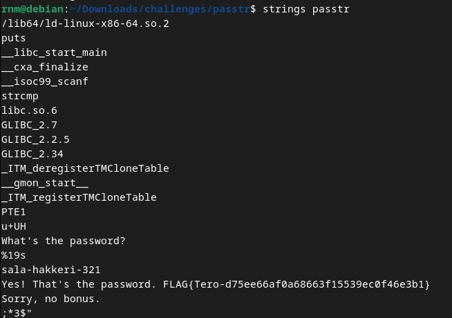
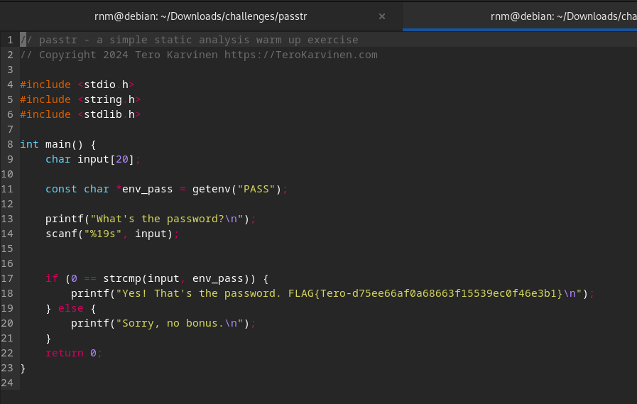
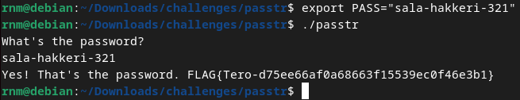
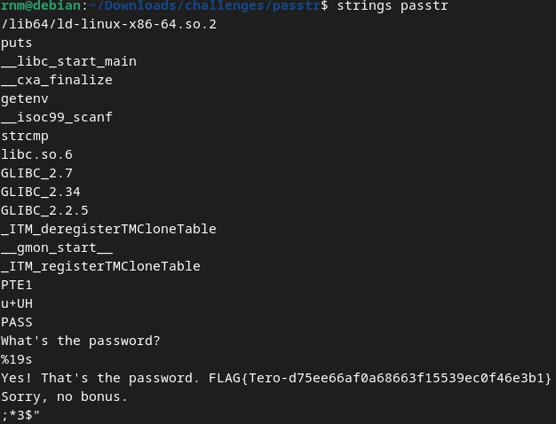
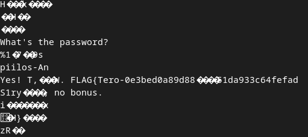
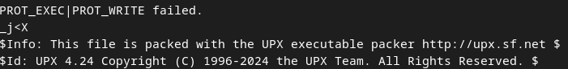
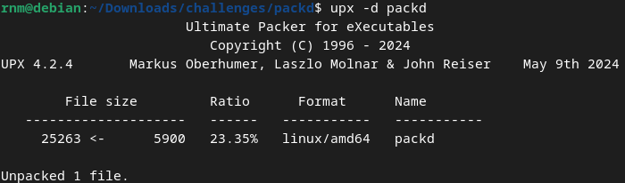
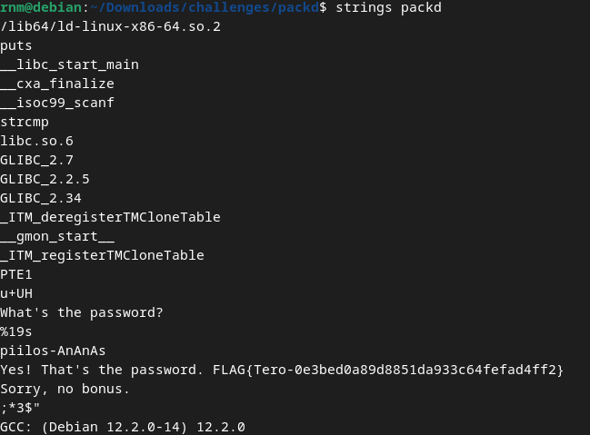

<!--- metadata

title: h3 - No Strings Attached
date: 2024-11-07
slug:
id: ICI012AS3A-3001
week:
summary: Tehtävässä purettiin binääritiedostoja strings-työkalulla, obfuskointiin salasana ympäristömuuttujaan, purettiin UPX-paketti ja etsittiin lippuja. Opittiin binäärien analysointia, ympäristömuuttujien käyttöä ja pakkaustyökalujen hyödyntämistä.
tags: [ "ICI012AS3A-3001", "Application Hacking"]

--->

### Ympäristö

**OS:** Debian GNU/Linux 12 Bookworm

**Browser:** Firefox 128.3.1esr (64-bit)

**Hardware Model:** innotek GmbH VirtualBox

**Memory:** 5.7 GiB

**Processor:** AMD Ryzen 9 3900X - 6 cores used

**Disk:** 21.5 GB

**Network:** NAT

---

## a) Strings. Lataa ezbin-challenges.zip Aja 'passtr'. Selvitä oikea salasana 'strings' avulla. Selvitä myös lippu

Ihan ekana latasin ja unzippasin tiedostot, sen jälkeen, en edes ajanut ohjelmaa vaan käytin suoraan strings ohjelmaa komennolla `strings passtr`, joka purki koodin ja mistä löytyikin heti salasana sekä lippu.

**Salasana:** `sala-hakkeri-321`

**Lippu:** `FLAG{Tero-d75ee66af0a68663f15539ec0f46e3b1}`

Lähteestä luin vain nopeasti syntaksin, mutta en käyttänyt sitä edes muuten.

[Mosse-Institute](https://library.mosse-institute.com/articles/2022/05/the-strings-tool-extracting-text-for-digital-forensics)

---

## b) Tee passtr.c -ohjelmasta uusi versio, jossa salasana ei näy suoraan sellaisenaan lähdekoodista. (Obfuskointi riittää.)

Tämä oli hieman haastavampi, koska en ole koskaan tehnyt mitään vastaavaa. Käytin apuna ChatGPT:tä eri lähestymistapojen löytämiseen ja googlailin paljon. Lopulta löysin yksinkertaisen tavan, joka toimi itselleni.

Ratkaisin ongelman lisäämällä salasanan environment variableen. Tämän voi tallentaa joko vain shellin runtime muistiin hetkellisesti, tai sitten ihan konfigurointi tiedostoon. Tässä tapauksessa käytin väliaikaista muistia.

Koska `C` on täysin tuntematon kieli itselleni, ja koodauksesta muutenkin on melko vähän osaamista, niin tämä tuntui järkevimmältä vaihtoehdolta itselle. Tässä on monia eri ongelmia, kuten esim. että tämä toimii vain paikallisesti tässä ympäristössä sekä muita turvallisuusriskejä. Mutta koin kaikki muut vaihtoehdot liian vaikeiksi itselleni, mihin netissä törmäsin.

Koodi tosiaan toimii luomalla `env_pass` muuttujan, mikä sitten hakee `PASS` nimistä env muuttujaa, joko conf tiedostosta tai muistista.

Ja itse salasanan env muuttujan loin komennolla `export PASS='sala-hakkeri-321'`. Ja tosiaan saman staattisen skannauksen tehneenä niin salasana ei enää näkynyt vaan sen tilalla näkyi PASS.

Kokeilin myös jotain muita vaihtoehtoja mitä netistä löytyi kuten `XOR obfuskointia` ja jopa `openSSL hash:austa`, mutta koin huomattavia haasteita niiden kanssa, koska tosiaan `C` kieli on todella vieras, joten päädyin tähän ratkaisuun. Tämä oli kyllä vaikea tehtävä itselleni.

[Crasseux](http://crasseux.com/books/ctutorial/Environment-variables.html)

---

## c) Packd. Aja 'packd' paketista ezbin-challenges.zip. Mikä on salasana? Mikä on lippu?

Tämä tehtävä osoittautuikin hieman vaikeammaksi. Aluksi lähdin kokeilemaan eri optioita, mitä stringsistä löytyy.

Komennolla `strings -eS packd` selvisi että strings löytää merkkejä, mitä se ei pysty näyttämään jostakin syystä ja printtasikin siis vain osan merkeistä.

Aluksi en edes huomannut tätä, mutta tästä tuloksesta selvisi että minkä takia strings ei pystynyt näyttämään kaikkia merkkejä. Tajusin sen vasta myöhemmin kun yritin manuaalisesti tehdä eri ASCII muunnoksia ja yksi hypoteesistani oli, että tässä piti tapahtua kaksinkertainen muunnos, esim. muutettu base64 ja siitä johonkin muuhun, minkä takia `strings` ei pystynyt luomaan suoraa muunnosta.

No hypoteesi oli väärässä, mutta suunta oli oikea ja se herätti uuden ajatuksen minkä pohjalta oikea polku löytyikin.

Staattisessa analyysissä selvisi että tiedostoon oli kirjoitettu selkokielellä, että millä ohjelmalla tämä tiedosto sitten olikin pakattu, mikä oli avain sotkun selvittämiseen. Eli sitten lähdin lataamaan työkalua. Tähän mä käytin `homebrew:ta`, mikä oli itselle helpoin.

Komennolla `brew install upx` sain sen ladattua, ja sitten nopealla vilkaisulla .doc sivuja selvisi että tiedoston voi decompressa `-d` optiolla. Eli komennolla `upx -d packd` se decompressa tiedoston jonka jälkeen ihan yksinkertaisesti `strings packd` komennolla saatiin salasana ja lippu kokonaisena.

**Salasana:** `piilos-AnAnAs`

**Lippu:** `FLAG{Tero-0e3bed0a89d8851da933c64fefad4ff2}`

Tässäkin sorruin samaan ansaan. Ajattelin liian vaikeasti, kun ratkaisu löytyy helposti olemalla huolellinen. Myös huomasin että pitää ottaa rauhassa ja lukea kaikki tiedettävät tiedot tarkasti, eikä vain selailla silmillä.

Opin paljon uutta, ja vasta tämän viimeisen tehtävän jälkeen tajusin että olisin voinut tehdä myös b) tehtävän vastaavalla työkalulla, ja olisin päässyt helpommalla. Päädyin myös oppimaan aiheeseen liittymättömiä asioita kuten ASCII muunnoksia ja miten `byte arrayt` toimii. (mitä tarvitseekin jo bonus tehtävässä)

[Homebrew 2024,](https://formulae.brew.sh/formula/upx) [UPX Documentation](https://github.com/upx/upx/blob/devel/doc/upx-doc.txt)

---

## d) Vapaaehtoinen bonus: Cryptopals. Crypto Challenge Set 1. Tätä voi tehdä useamman viikon bonuksena

Työn alla.

---

### Lähteet

#### 1. Mosse-Institute 2022. The Strings Tool: Extracting Text for Digital Forensics. Luettavissa: [[https://library.mosse-institute.com/articles/2022/05/the-strings-tool-extracting-text-for-digital-forensics]] Luettu: 06.11.2024

#### 2. Crasseux. Environment Variables. Luettavissa: [[http://crasseux.com/books/ctutorial/Environment-variables.html]] Luettu: 06.11.2024

#### 3. Homebrew 2024. UPX. Luettavissa: [[https://formulae.brew.sh/formula/upx]] Luettu: 07.11.2024

#### 4. Markus F.X.J. Oberhumer, László Molnár & John F. Reiser 2024. UPX Documentation. Luettavissa: [[https://github.com/upx/upx/blob/devel/doc/upx-doc.txt]] Luettu: 07.11.2024
