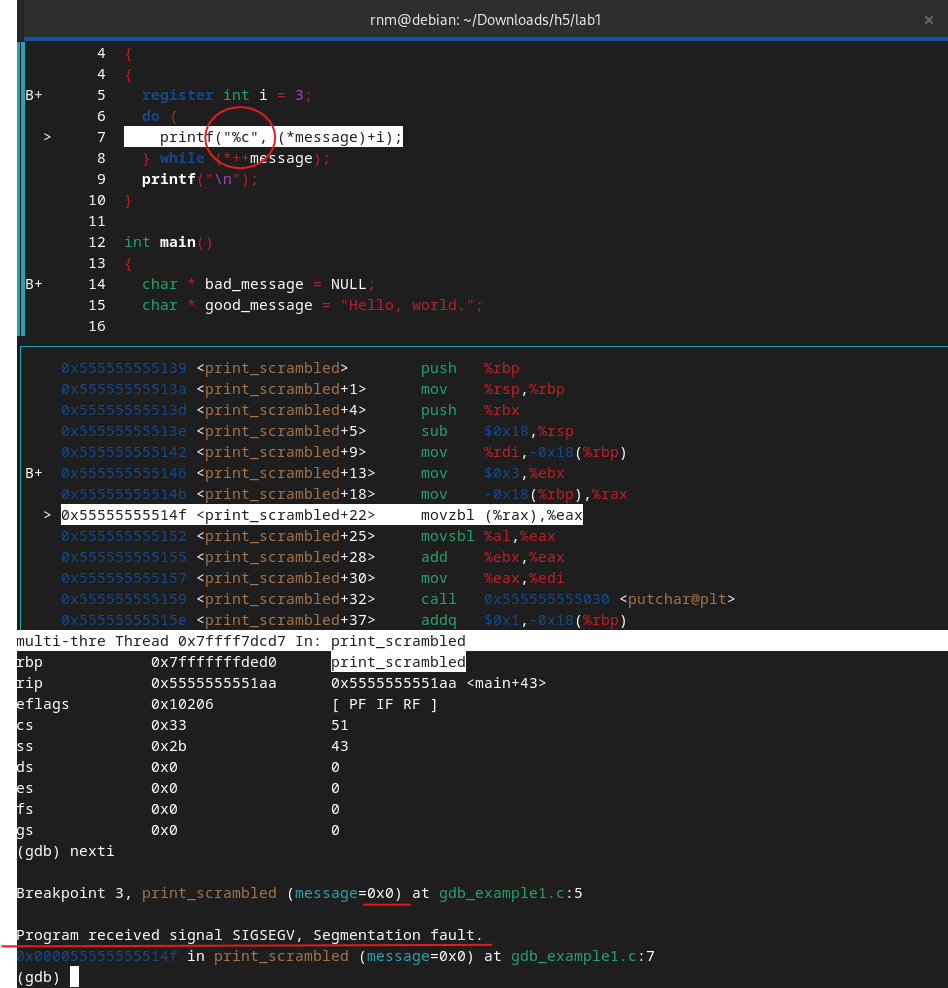
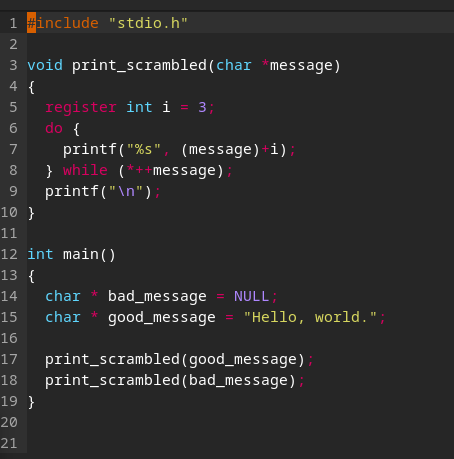
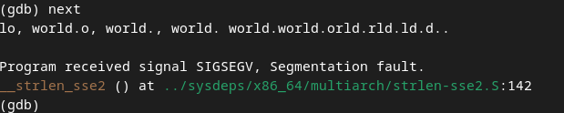
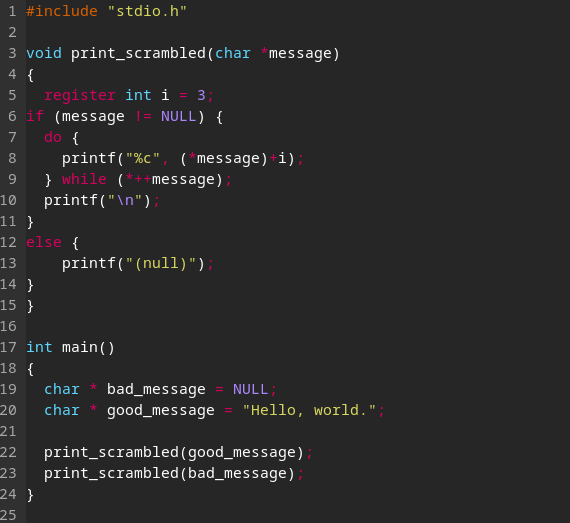
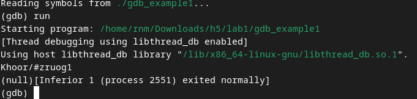
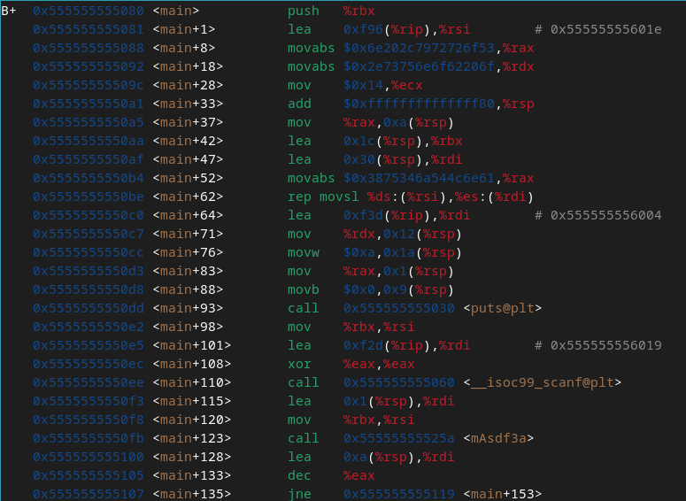
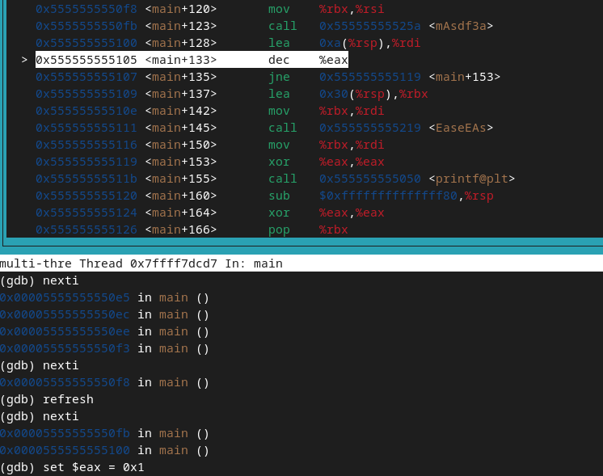
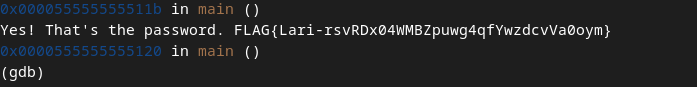

<!--- metadata

title: H5 - Se elää!
date: 2024-11-24
slug:
id: ICI012AS3A-3001
week:
summary: Tehtävän aikana tutustuttiin ohjelman virheiden etsimiseen ja korjaamiseen GDB:llä, analysoitiin ohjelmalogiikkaa sekä kokeiltiin erilaisia lähestymistapoja salasanan ja lipun löytämiseksi. Lopuksi pohdittiin ratkaisuja ja dokumentoitiin opitut asiat.
tags: [ "ICI012AS3A-3001", "Application Hacking"]

--->

### Ympäristö

**OS:** Debian GNU/Linux 12 Bookworm

**Browser:** Firefox 128.3.1esr (64-bit)

**Hardware Model:** innotek GmbH VirtualBox

**Memory:** 5.7 GiB

**Processor:** AMD Ryzen 9 3900X - 6 cores used

**Disk:** 21.5 GB

**Network:** NAT

---

## a) Lab1. Tutkiminen mikä on ohjelmassa vialla ja miten se korjataan

Ensiksi latasin gdb:n komennolla `sudo apt-get install gdb`. Tämän jälkeen avasin ohjelman ja lähdin debuggaamaan. Ajoin muutaman kerran ohjelman ilman mitään breakpointteja ja vastaukseksi tuli `"Program received signal SIGSEGV, segmentation fault."` En tosiaankaan tiennyt mitä tämä tarkoittaa, joten aloin debuggaamaan asettamalla breakpointteja ja watchpointteja.

Itselleni tärkein watchpoint oli `"message"` koska, kun ohjelma ensimmäisellä kerralla ajoi `good_message` stringin, sieltä tuli oletettu vastaus, joka kertoi että ohjelman logiikassa ei välttämättä ole ongelmaa.

Debugaus vaiheessa kun oli vuoro kääntää `"bad_message"` niin ohjelma heitti kyseisen errorin. Tästä siis totesin, että ongelma löytyy jotenkin tähän muuttujaan liittyen. Kun aloin katsomaan tarkemmin tähän liittyvää koodia, totesin hypoteesikseni, että ongelma löytyy riviltä 7. Laitoin siis hypoteesini ChatGPT:lle ja kysyin että voisiko tämä olla ongelma.

**Tarkka prompti:** "if im getting SIGSEGV segmentation fault error, and my input is NULL but in the printf the format specifier is %c. Is the error because it is specified? so if i change it to something else or remove it completely would that fix the error?"

Vastaukseksi tuli, että ongelma voisi johtua juuri tästä, sillä `%c` ei osaa tulkita NULL syötettä, minkä takia se sitten tämän errorin syöttää. Näin lähdin muuttamaan koodia sitten hypoteesin pohjalta.

Tässä oli korjattu source. Kun lähdin testaamaan että toimiko ratkaisu, selvisikin, että nyt `"good_message"` ei toimi ja se palautti samaa erroria.

Onneksi tässä kohdassa ongelma oli todettu, ja nyt piti vain löytää oikea korjaus tähän ongelmaan, niin että molemmat menee läpi halutulla tavalla. Seuraavaksi rupesin miettimään, mikä voisi olla toimiva tapa ratkaista tämä. Ensimmäisenä ajatuksena tuli erottaa do while lauseessa oleva silmukka if lauseella, eli erottaa kokonaan syötteet.

Tässä oli toinen yritys, kun olin lisännyt if lauseen.

Ja ihan vain ajamalla ohjelman niin selvisi, että korjaus toimi ja ongelma oli ratkaistu onnistuneesti.

[Anna 9.6.2019](https://www.sololearn.com/en/Discuss/1836131/what-means-the-c-or-the-d-in-c-language)

---

## b) Lab2. Selvitä salasana ja lippu + kirjoita raportti siitä miten aukesi

Tein tätä tehtävää monen päivän ajan ja tutkin kaikkia mahdollisia rekistereitä, että mistä mahdollinen salasana voisi löytyä. Jossain vaiheessa tajusin, että nyt ei löytymällä löydy kyllä millään, ja kun tuli ilmi myös että source on compressattu ja on käytetty hashausta ja oletin että salasana on varmaan myös pilkottu osiin tai jotain vastaavaa niin lopulta luovutin salasanan etsimisen.

Aloin sitten kuitenkin tutkimaan tarkemmin main funktiota, ja mitä siinä oikeasti tapahtuu. Siitä melko nopeasti selvisi, että `< main+135 >` tapahtuu hyppy. Eli kyseessä on if lause, joka antaa tämän perustella vastauksen.

Tämän jälkeen kysyin ChatGPT:ltä miten gdb:ssä voi muuttaa jonkin rekisterin tietoa. Josta se antoi vastaukseksi, että komennolla `set {rekisteri} = 0x1` voi muuttaa ohjelman logiikan kulkua. Eli lähdin kokeilemaan tätä, ja tässä tapauksessa olin tunnistanut mahdolliseksi `%eax` rekisterin, koska se oli rekisteri mikä oli koko ajan joko 1 tai 0.

Ja kun ennen tämä hyppäsi seuraavaksi `< main+153 >` kohtaan, mutta muutoksen jälkeen se ei tehnytkään hyppäystä, vaan jatkoi suoritusta rivi kerrallaan ja lopuksi palautti lipun.

Eli en koskaan löytänyt oikeaa salasanaa, mutta sain kuitenkin lipun selville.

**Lippu:** `FLAG{Lari-rsvRDx04WMBZpuwg4qfYwzdcvVa0oym}`

---

## c) Lab3. Kokeile Nora Crackmes harjoituksia tehtävä 3 ja 4 ja loput vapaaehtoisia. Tindall 2023: [NoraCodes / crackmes](https://github.com/NoraCodes/crackmes)

Kokeilin tehtäviä, mutta en ehtinyt ratkaista niitä, koska aika loppui kesken tällä viikolla ja tehtävät piti palauttaa. (Yritän palata näihin ja myös vapaaehtoiseen lab4, kun siihen löytyy aikaa)

---

### Lähteet

#### 1. Anna 9.6.2019. What means the -c or the -d in C language. Sololearn. Luettavissa: [[https://www.sololearn.com/en/Discuss/1836131/what-means-the-c-or-the-d-in-c-language]] Luettu: 21.11.2024

#### 2. Tero Karvinen. 2022. Application Hacking. Luettavissa: [[https://terokarvinen.com/2022/application-hacking/]] Luettu: 24.11.2024

#### 3. GDB Tutorial with Examples. Cprogramming. Luettavissa: [[https://www.cprogramming.com/gdb.html]] Selattu: 24.11.2024

#### 4. GDB Tutorial. SEAS UPenn. Luettavissa: [[https://www.seas.upenn.edu/~ese5320/fall2021/handouts/hw1/gdb_tutorial.html]] Selattu: 24.11.2024

#### 5. NoraCodes. 2023. Crackmes. Luettavissa: [[https://github.com/NoraCodes/crackmes]] Vierailtu: 24.11.2024
