<!--- metadata

title: H6 - Sulaa hulluutta
date: 28.11.2024
slug:
id: ICI012AS3A-3001
week:
summary: Tehtävässä tutkittiin epäilyttävää jpg-tiedostoa eri työkaluilla (file, strings, binwalk), löydettiin piilotettuja tiedostoja ja analysoitiin niiden sisältöä. Lisäksi perehdyttiin Android FOSS -sovelluksiin ja APK-tiedostojen avaamiseen eri ohjelmilla.
tags: [ "ICI012AS3A-3001", "Application Hacking"]

--->

### Ympäristö

**OS:** Debian GNU/Linux 12 Bookworm

**Browser:** Firefox 128.3.1esr (64-bit)

**Hardware Model:** innotek GmbH VirtualBox

**Memory:** 5.7 GiB

**Processor:** AMD Ryzen 9 3900X - 6 cores used

**Disk:** 21.5 GB

**Network:** NAT

---

## a) Tutki tiedostoa [h1.jpg](https://terokarvinen.com/application-hacking/h1.jpg) jo opituilla työkaluilla. Mitä saat selville?

Ensiksi aloitin lataamalla tiedoston.

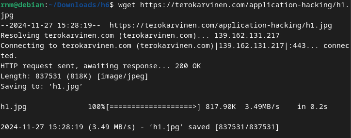

Tämän jälkeen kokeilin file työkalulla saada jotakin rajausta tiedostosta, sillä se ei selkeästi ollut vain kuvatiedosto.

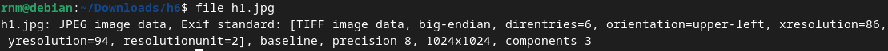

Ensimmäiseksi mielenkiintoa herätti components tieto niin googlailin mitä se tarkoittaa, mutta se osoittautuikin vain standardi .jpg tiedoston osaksi *(eli ei mitään jännittävää)*. Seuraavaksi päätin avata vain tiedoston ja katsoa, mikä se edes on. Se oli selkeästi tekoälyllä tuotettu kuva, mutta huomasin että tiedostokoot eivät täsmää, kun vertasin hakemistoa ja avattua tiedostoa.

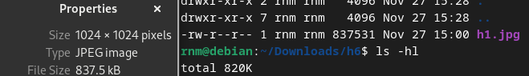

Vaikka ero on pieni, se herätti heti epäilystä, että nyt on jotakin outoa tässä, eikä koko totuus ole tiedossa.

Sitten kun olin sulkemassa tiedostoa, se pyysi minua tallentamaan tiedoston, vaikka en ollut siis mitään muokannut. Ja epäilys alkoi kasvamaan, että kun avasin tiedoston niin se on ajanut siinä jotakin samalla.

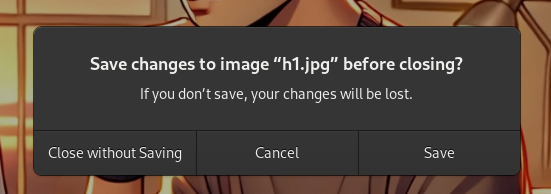

Luonnollisesti tallensin tämän muutoksen ja katsoin tiedoston kokoa uudestaan niin sehän olikin muuttunut, eli tämä tiedosto selkeästi sisälsi jotakin ajettavaa koodia.

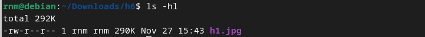

Nyt myös tiedosto on selkeästi muuttunut.

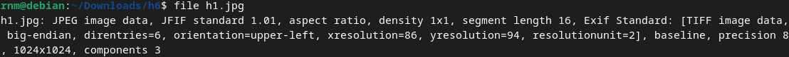

Seuraavaksi latasin tiedoston uudestaan ja lähdin tutkimaan alkuperäistä tiedostoa stringsilllä. Komennolla `strings -a -n 14 h2.jpg` missä `-a` printtaa kaiken, `-n 14` printtaa vain tulosteen mikä on enemmän kuin 14 merkkiä. Tämä rajaa kaiken turhan pois ja sieltä esiintyikin mielenkiintoisesti `.xml` päätteisiä tiedostoja.

*(Strings man pages, 2023)*

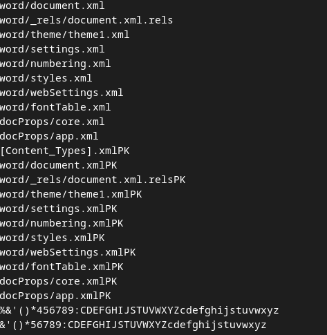

Tiesin heti että nämä eivät tänne kuulu ja ovat outoja, mutta en tiennyt mitä ne oikeasti tarkoittavat, niin kysyin ChatGPT:ltä promptilla: `"What does it mean if the file has .xmlPk and .xml in the strings?"`

Vastaus mitä se antoi oli erittäin hyödyllinen.

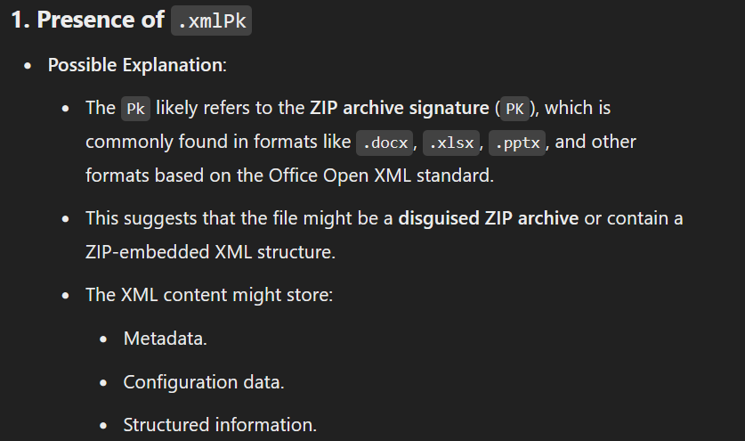

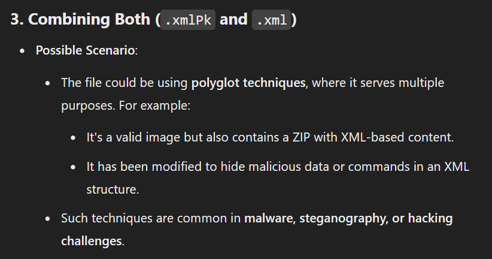

Tämän vastauksen jälkeen lähdin heti unzippaamaan tiedostoa.

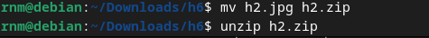

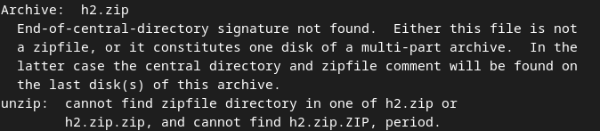

En pystynyt tätä kuitenkaan tekemään ja kun luin uudestaan ChatGPT:n vastausta läpi, niin selvisikin että tästä päästään suoraan seuraavaan tehtävään.

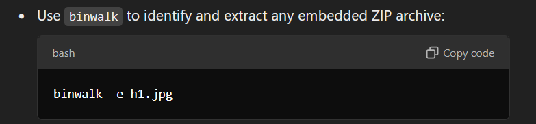

---

## b) Tutki tiedostoa h1.jpg binwalkilla. Mitä tietoja löydät nyt tiedostosta? Mitä työkalua käyttäisit tiedostojen erottamiseen?

Ensiksi katsoin löytyykö binwalkia, mutta sitä ei löytynyt, niin siirryin asentamaan sitä.

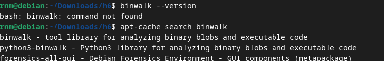

Latasin binwalkin komennolla `sudo apt-get install binwalk` ja sen jälkeen lukemaan man sivuja.

*(Binwalk man pages, 2023)*

Sitten ChatGPT:ltä saadulla komennolla lähdin avaamaan tiedostoa.

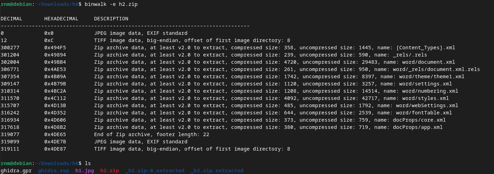

Komennolla `binwalk -e h2.zip` me saatiinkin eroteltua kaikki piilotettu tieto tiedostosta ja `-e` optio oli tämä mikä siis just extractasi kaiken tiedon.

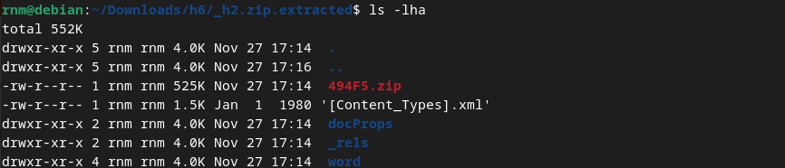

Tässä vaiheessa mä aloin käymään läpi tiedostoja yksitellen käyttämällä `xmllint` työkalua. Asensin sen komennolla `sudo apt-get install libxml2-utils`. Ja taas kerran man sivuilta selvisi että xml tiedostot pystyy formatoimaan `--format` optiolla.

Ainoaa mielenkiintoista mitä löysin omasta mielestä oli kun core.xml tiedostosta löytyi luoja ja viimeinen muokkaaja *(lari)*. Ja sitten document.xml tiedostosta löytyi itse tarina. Tämä oli oletettavasti joku fiktiivinen ennustuskirjoitus.

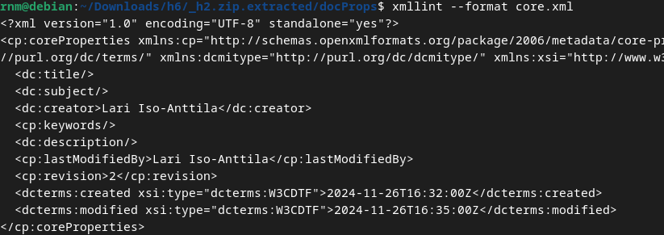

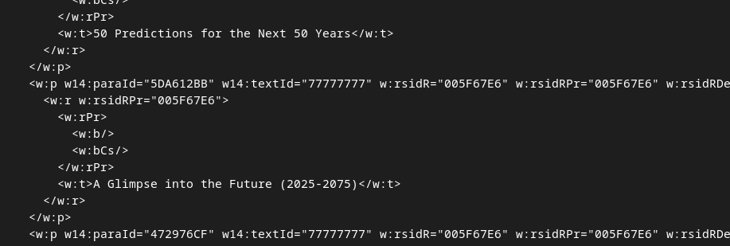

Tässä vaiheessa en tiedä pitikö kaivaa vielä syvemmälle, mutta itse en löytänyt enää mitään muuta erityistä mielenkiintoa herättävää.

---

## c) FOSS (Free Android OpenSource). Tutustu Android-sovelluksiin Offan (2024) listalta: Android FOSS. Valitse listalla itsellesi mielenkiintoisin applikaatio ja mene sen GitHubiin. Lataa ohjelman APK itsellesi ja käytä seuraavia työkaluja tutustuaksesi, miten APK:n voi avata **ZIP**, [**JADX**](https://github.com/skylot/jadx), [**Bytecode-viewer**](https://github.com/Konloch/bytecode-viewer/)

Mä lähdin aluksi tutustumaan kaikkiin eri aplikaatioihin ja jostakin syystä omaan silmään jäi **Wire** kommunikaatiosovellus. Näin mä siis lähdin lataamaan tämän ohjelmiston viimeisimmän päivityksen .apk paketin.

[(Wire)](https://github.com/wireapp/wire-android)

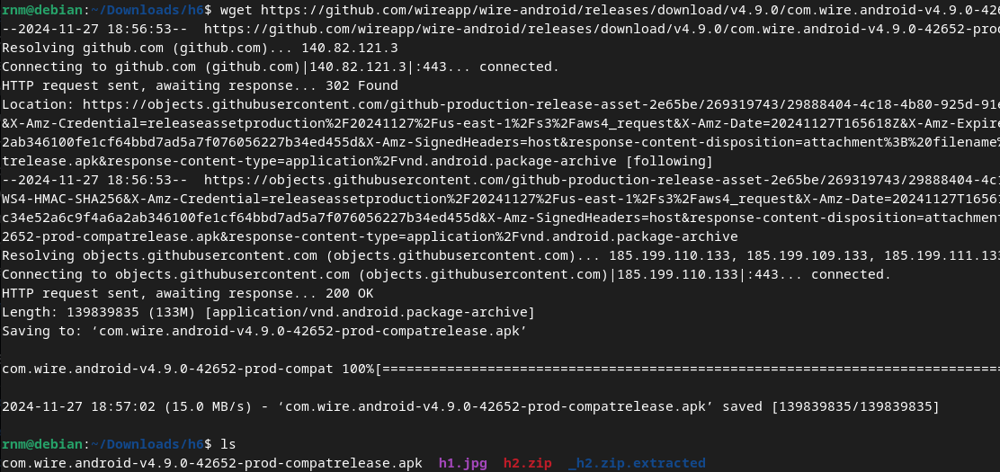

Kun olin saanut ladattua .apk paketin lähdin avaamaan sen komennolla `binwalk -e {apk paketin nimi}`. Tämä loi uuden hakemiston mihin se oli extractannut kaikki tiedostot. Sama asia saatiin tehtyä myös `unzip` komennolla, mutta en tykännyt siitä että se purki sen kyseiseen hakemistoon. Siihen löytyy varmasti joku optio, että voi purkaa eri hakemistoon mutta en tutkinut sitä sen pidemmälle.

Seuraavaksi kokeilin **Bytecode Vieweria**. Latasin viimeisimmän version sovelluksesta. Tämän jälkeen sovellusta ajettiin komennolla `java -jar Bytecode-Viewer-2.12.jar`. Tämä avasi sovelluksen.

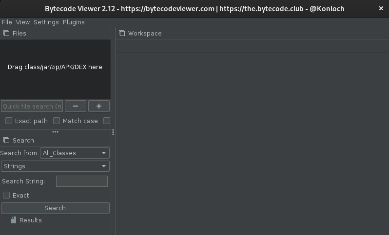

Vedin ohjeiden mukaan tutkittavan tiedoston `files` kohtaan jonka jälkeen sovellus avasi tämmöisen näkymän, ja sieltä sitten lähdin kaivamaan samat tiedostot kuin aikaisemminkin. Siellä oli myös paljon muuta mitä unzippaamalla tai binwalkia käyttämällä löytyi.

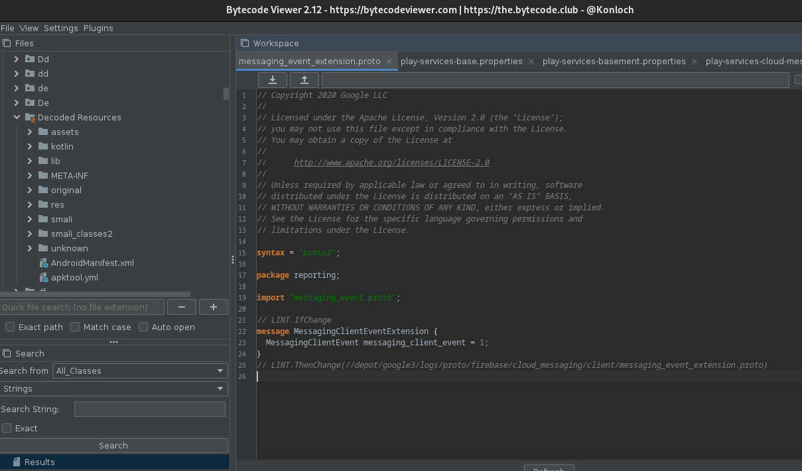

Ja viimeisenä kokeilin myös **JADX** mutta sitä mä en saanut toimimaan ja en sen syvemmin ruvennut ratkaisemaan erroria. Mutta sovellus ei siis vain halunnut käynnistyä. Itselleni mieluisin tapa oli avata se `binwalk` työkalulla koska, tämä oli helposti nopein, helpoin ja järjestelmällisin lähestymistapa.

---

### Lähteet

#### 1. Skylot. Jadx. GitHub. Luettavissa: [[https://github.com/skylot/jadx]] Luettu: 27.11.2024

#### 2. Konloch. Bytecode Viewer. GitHub. Luettavissa: [[https://github.com/Konloch/bytecode-viewer/]] Luettu: 28.11.2024

#### 3. Wireapp. Wire Android. GitHub. Luettavissa: [[https://github.com/wireapp/wire-android]] Luettu: 28.11.2024

#### 4. Offa. Android FOSS. GitHub. Luettavissa: [[https://github.com/offa/android-foss]] Luettu: 27.11.2024

#### 5. Strings man pages. Luettu: 27.11.2024

#### 6. Binwalk man pages. Luettu: 27.11.2024

#### 7. xmllint man pages. Luettu: 27.11.2024
