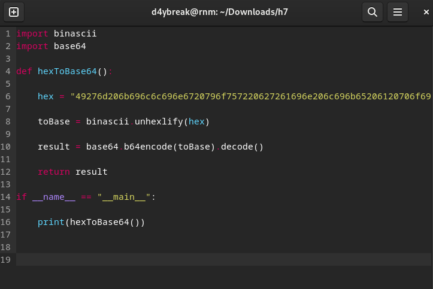
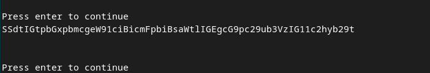
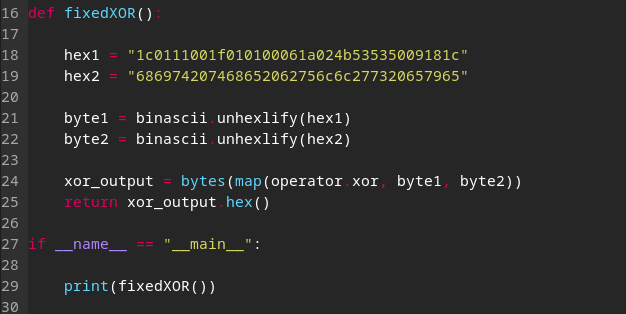
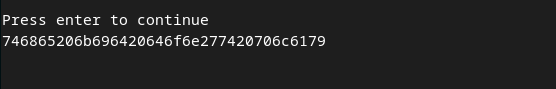
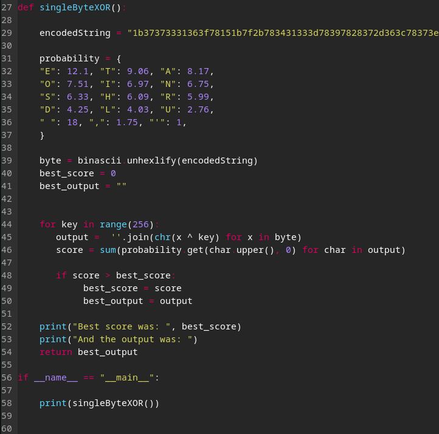
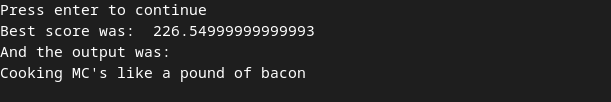
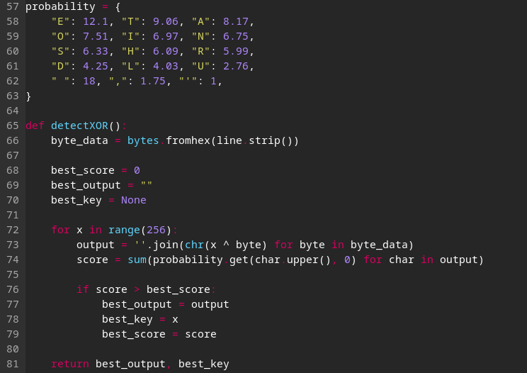
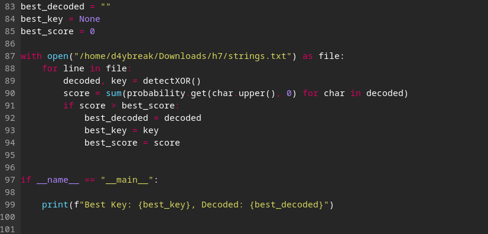

<!--- metadata

title: H7 - Uhagre2
date: 05.12.2024
slug:
id: ICI012AS3A-3001
week:
summary: Tehtävässä perehdyttiin salauksen perusteisiin, Python-ohjelmointiin ja XOR-salaustehtäviin. Ratkaistiin useita kryptografisia haasteita, kuten heksadesimaali-base64-muunnos ja XOR-salauksen murtaminen. Opittiin todennäköisyysanalyysin hyödyntämistä salauksen purussa.
tags: [ "ICI012AS3A-3001", "Application Hacking"]

--->

### Ympäristö

**OS:** Debian GNU/Linux 12 Bookworm

**Browser:** Firefox 128.3.1esr (64-bit)

**Hardware Model:** innotek GmbH VirtualBox

**Memory:** 5.7 GiB

**Processor:** AMD Ryzen 9 3900X - 6 cores used

**Disk:** 21.5 GB

**Network:** NAT

---

## x) Lue/katso/kuuntele ja tiivistä

## € Schneier 2015: Applied Cryptography, 2ed: Chapter 1: Foundations: 1.1 Terminology ("Historical Terms" loppuun), 1.4 Simple XOR, 1.7 Large Numbers

## Karvinen 2024: [Python Basics for Hackers:](https://terokarvinen.com/python-for-hackers/)

## Vapaaehtoinen: Karvinen 2024: [Get Started Micro Editor](https://terokarvinen.com/get-started-micro-editor/)

## Vapaaehtoinen: Karvinen 2024: [Getting Started with Cryptopals using Python](https://terokarvinen.com/getting-started-python-cryptopals/)

**1.1 Terminology:**
Esitellään salausalan peruskäsitteet, kuten salaus, avaimet, algoritmit ja viestit. Käsitellään myös historiallisia termejä, kuten Caesar-salaus ja Vigenere-salaus, jotka ovat osa salauksen kehityshistoriaa.

**1.4 Simple XOR:**
Yksinkertainen XOR-operaatio on keskeinen yksinkertaisessa salauksessa. Se on symmetrinen operaatio, joka muuttaa bittijonon toisen bittijonon avulla. XOR on helppo toteuttaa ja nopea, mutta ei riitä turvallisiin salauksiin yksinään.

**1.7 Large Numbers:** Suuret luvut ovat keskeisiä salauksen alalla, erityisesti julkisen avaimen salauksessa, kuten RSA:ssa. Suurten lukujen käsittely on tärkeää, koska salaus perustuu matemaattisiin ongelmiin, jotka ovat vaikeita ratkaista suurilla luvuilla.

**Python Basics for Hackers:**

Tässä käydään läpi kaikki perusasiat, joita tarvitaan Python-ohjelmoinnissa. Käydään läpi mm. muuttujat, silmukat ja data tyypit ja niiden käyttö. Tässä oli kaikki mitä tehtävien tekemiseen tarvitsee. Itselleni hyödyllinen Convert and Calculate in Python sekä Looping shorter and longer osiot.

**Get Started Micro Editor:**

Tässä käydään läpi Micro-editorin peruskäyttö. Oli esitelty myös muutamia hyödyllisiä komentoja, joita voi käyttää editorissa. Ja plugineita, joita voi asentaa.

**Getting Started with Cryptopals using Python:**

Tässä käydään läpi Cryptopalsin aloittaminen. Artikkelista myös löytyi vinkkejä, miten tehtäviä kannattaa lähestyä ja mitä kannattaa ottaa huomioon. Nämä vinkit tulivat ainakin itselle tarpeeseen.

---

## a) 1. Convert hex to base64

Olin jo aiemmin tehnyt tämän tehtävän, mutta päätin tehdä sen uudestaan. Tehtävänä on muuntaa annettu heksadesimaaliluku base64-muotoon. Tehtävä onnistuu helposti Pythonilla, kun käytetään base64-kirjastoa.

Tehtävässä käytetään myös binascii-kirjastoa, joka on tarpeellinen heksadesimaaliluvun muuntamiseen binääriluvuksi. Tehtävä onnistuu seuraavalla koodilla:

Tämä oli suhteellisen nopea ja helppo tehtävä, kunhan muisti kirjastot ja niiden käytön.

[(Pyhton Documentation)](https://docs.python.org/3/library/binascii.html)

---

## b) 2. Fixed XOR

Seuraavaksi tehtävänä oli laskea kahden annetun heksadesimaaliluvun XOR-operaatio. Tehtävä onnistuu helposti Pythonilla, kun käytetään binascii-kirjastoa. Tehtävässä käytetään myös bytes-funktiota sekä operator-kirjastoa, joka on tarpeellinen heksadesimaaliluvun muuntamiseen binääriluvuksi. Tehtävä onnistuu seuraavalla koodilla:

Tämä tehtävä oli hieman haastavampi, jouduin googlailemaan hieman, esimerkiksi operator-kirjastosta sekä miten byte arrayt toimii Pythonissa.

---

## c) 3. Single-byte XOR cipher

Seuraavaksi tehtävänä oli löytää annetusta heksadesimaaliluvusta XOR-salauksen avain. Koska olin tehnyt tehtävän jo kertaalleen huonommin, niin nyt halusin käyttää hyväksi todennäköisyysanalyysiä.

Tässä merkittävin kohta oli pitää kirjaa todennäköisimmästä avaimesta. Sitä varten oli `score` muuttuja, johon tallennettiin avaimen todennäköisyys `probability` taulukon mukaisesti.

Sitten tarvittiin vielä oma muuttuja verratakseen `score` muuttujaa ja pitämään kirjaa parasta avainta tämän `score` muuttujan avulla.

Tämä tehtävä oli haastava, mutta onnistuin lopulta ratkaisemaan sen. Tehtävä opetti minulle paljon todennäköisyysanalyysistä ja siitä, miten sitä voi käyttää hyväksi salauksen murtamisessa. Tämä tulee varmasti jatkossa olemaan hyödyllinen taito muissakin konteksteissa.

[(Python Documentation,](https://docs.python.org/3/library/operator.html) [GeeksForGeeks)](https://www.geeksforgeeks.org/python-strings-decode-method/)

---

## d) 4. Detect single-character XOR

Tämä tehtävä oli todella haastava jo minulle, ja jouduin käyttämään paljon aikaa sen ratkaisemiseen. Tehtävänä oli löytää annetusta tiedostosta rivi, joka on salattu XOR-salauksella. Ensimmäisellä kerralla tehtävä jäi kesken, mutta nyt onnistuin ratkaisemaan sen. Tehtävässä käytin samaa todennäköisyysanalyysiä kuin edellisessä tehtävässä. Tästä oli todella iso apu ja ilman sitä, tätä tehtävää ei pysty suorittamaan kovin helposti.

Koin tässä paljon haasteita. Isoin haaste oli lukea tiedoston sisältöä. Tämän takia piti siirtää probability taulukko globaaliksi muuttujaksi, jotta sitä pystyi käyttämään myös muissa funktioissa.

Hyödynsin siis aikaisempaa koodia aika pitkälti, pieniä muutoksia myöten. Jäin kuitenkin jumiin, kun en saanut millään käytyä tiedostoa läpi rivi riviltä. Lopulta vinkkien avulla selvisi, että tarvitaan toinen for loop, joka käy läpi tiedoston rivit. Tämä oli ratkaiseva tekijä, joka auttoi minua ratkaisemaan tehtävän.

Eli `detectXOR()` funktiossa käydään läpi yhtä syötettä jokaisella avaimella ja tallennetaan se `score` muuttujaan. Sitten verrataan `score` muuttujaa ja pidetään kirjaa parhaasta avaimesta. Lopuksi palautetaan paras avain ja rivi. Tämä hoitaa siis yhden rivin syötteen tiedostosta.

Sitten me tarvittiin se toinen `for loop` joka vertaa jokaisen rivin parasta tulosta keskenään. Koska olin ratkaissut tiedoston avaamisen täten ChatGPT:n avulla, niin jouduin käyttämään globaaleja muuttujia `best_decode, best_key & best_score`. Tämän jälkeen näitä verrattiin tässä toisessa `for loop` ja lopulta palautettiin paras rivi ja avain kaikista mahdollisista vaihtoehdoista.

Tässä tehtävässä hyödynsin jonkin verran ChatGPT:tä, mutta käytin sitä vain error koodien selittämiseen ja teknisten haasteiden ratkaisemiseen. Tämä tehtävä oli todella haastava, mutta onnistuin lopulta ratkaisemaan sen. Tehtävä opetti minulle paljon todennäköisyysanalyysistä ja siitä, miten sitä voi käyttää hyväksi salauksen murtamisessa.

Tämä tulee varmasti jatkossa olemaan hyödyllinen taito muissakin konteksteissa. Koen että oma koodausosaaminen tulee myös tässä vaiheessa aika loppuun, joten en lähtenyt yrittämään tällä kertaa vapaaehtoisia tehtäviä vaikkakin hyvin mielenkiintoinen koodaushaaste sarja. *(palaan jatkossa varmasti näihin tehtäviin)*

[(Python Documentation,](https://docs.python.org/3/library/stdtypes.html) [GeeksForGeeks,](https://www.geeksforgeeks.org/python-map-function/) [W3Schools,](https://www.w3schools.com/python/ref_dictionary_get.asp) [Karvinen)](https://terokarvinen.com/getting-started-python-cryptopals/)

---

### Lähteet

#### 1. Python Documentation. 2024. binascii — Convert between binary and ASCII. Luettavissa: [[https://docs.python.org/3/library/binascii.html]] Luettu: 05.12.2024

#### 2. Python Documentation. 2024. base64 — Base16, Base32, Base64, Base85 Data Encodings. Luettavissa: [[https://docs.python.org/3/library/base64.html]] Luettu: 05.12.2024

#### 3. Python Documentation. 2024. operator — Standard operators as functions. Luettavissa: [[https://docs.python.org/3/library/operator.html]] Luettu: 05.12.2024

#### 4. W3Schools. Python bytes() Function. Luettavissa: [[https://www.w3schools.com/python/ref_func_bytes.asp]] Luettu: 05.12.2024

#### 5. Cryptopals. Cryptopals Crypto Challenges. Luettavissa: [[https://cryptopals.com/sets/1]] Luettu: 05.12.2024

#### 6. GeeksforGeeks. Python Strings decode() Method. Luettavissa: [[https://www.geeksforgeeks.org/python-strings-decode-method/]] Luettu: 05.12.2024

#### 7. GeeksforGeeks. Python map() Function. Luettavissa: [[https://www.geeksforgeeks.org/python-map-function/]] Luettu: 05.12.2024

#### 8. W3Schools. Python Dictionary get() Method. Luettavissa: [[https://www.w3schools.com/python/ref_dictionary_get.asp]] Luettu: 05.12.2024

#### 9. W3Schools. Python sum() Function. Luettavissa: [[https://www.w3schools.com/python/ref_func_sum.asp]] Luettu: 05.12.2024

#### 10. Python Documentation. 2024. str.strip. Luettavissa: [[https://docs.python.org/3/library/stdtypes.html]] Luettu: 05.12.2024

#### 11. Python Documentation. 2024. bytes.fromhex. Luettavissa: [[https://docs.python.org/3/library/stdtypes.html]] Luettu: 05.12.2024

#### 12. Schneier, Bruce. Applied Cryptography, 2nd Edition. Luettavissa: [[http://103.203.175.90:81/fdScript/RootOfEBooks/E%20Book%20collection%20-%202023%20-%20E/CSE%20ITAIDSML/Applied%20Cryptography%202e%20-%20Schneier.pdf]] Luettu: 05.12.2024

#### 13. Karvinen, Tero. Python Basics for Hackers. Luettavissa: [[https://terokarvinen.com/python-for-hackers/]] Luettu: 05.12.2024

#### 14. Karvinen, Tero. Get Started Micro Editor. Luettavissa: [[https://terokarvinen.com/get-started-micro-editor/]] Luettu: 05.12.2024

#### 15. Karvinen, Tero. Getting Started with Cryptopals using Python. Luettavissa: [[https://terokarvinen.com/getting-started-python-cryptopals/]] Luettu: 05.12.2024
