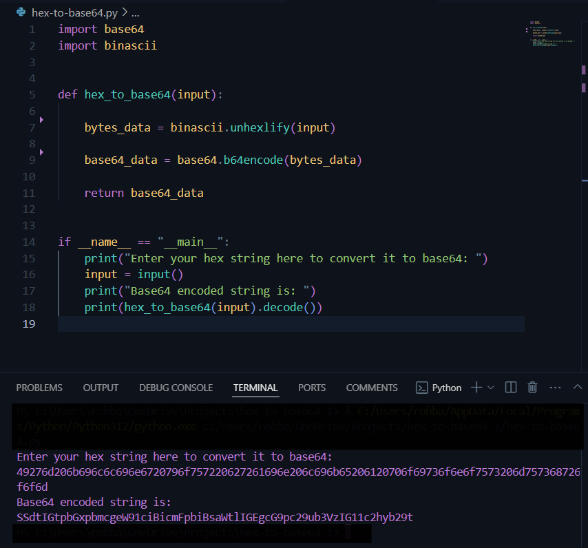
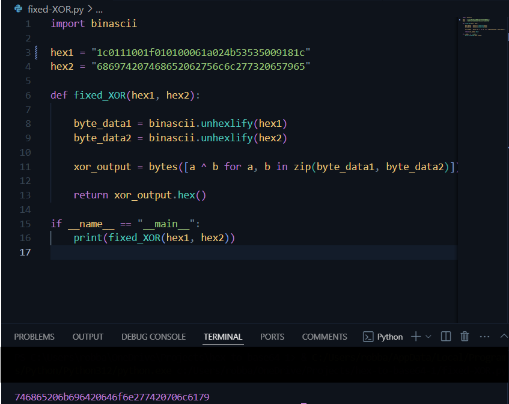
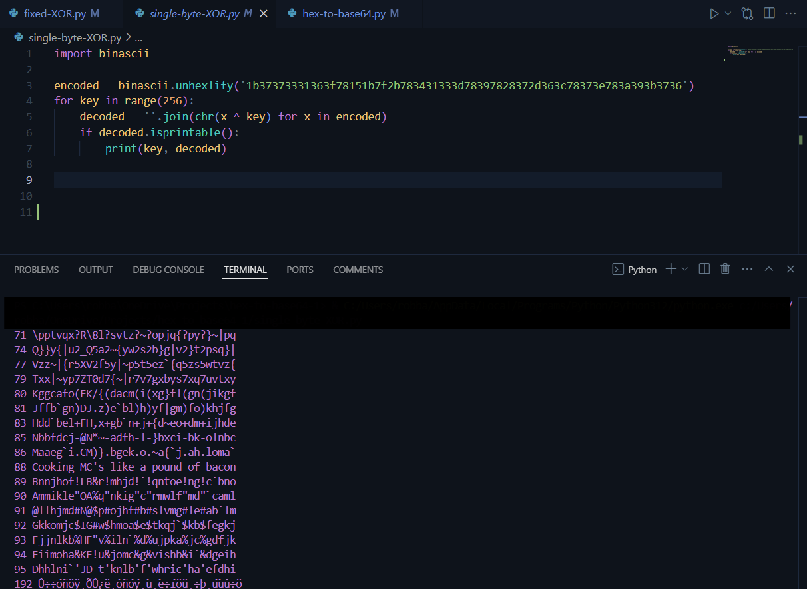
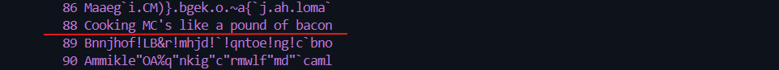

<!--- metadata

title: Tästä löytyy kaikki Bonus tehtävät
date: 15.11.2024
slug:
id: ICI012AS3A-3001
week:
summary: Tässä merkinnässä käydään läpi Cryptopals-haasteiden ensimmäiset kolme tehtävää: HEX-muunnos Base64:ään, Fixed XOR sekä Single-byte XOR cipher. Ratkaisut toteutettiin Pythonilla, ja lähteitä sekä apua haettiin dokumentaatiosta ja verkosta. Neljäs tehtävä jäi vielä ratkaisematta.
tags: [ "ICI012AS3A-3001", "Application Hacking"]

--->

### h3-Cryptopals Challenges Set 1, 1-3

## 1. Convert HEX to Base64

Koska aihe oli minulle vieras lähdin lukemaan Pythonin dokumentaatiota ja löysin sieltä base64 sekä binascii kirjastot. Näiden avulla sain muunnettua annetun HEX arvon base64 muotoon suhteellisen helposti.

Eli koodasin ihan yksinkertaisen `hex_to_base64` funktion joka ottaa vastaan HEX arvon ja palauttaa sen base64 muodossa.

Ja tämän jälkeen vain kutsuin tätä funktiota annetulla arvolla ja sain vastauksen.

---

## 2. Fixed XOR

Tämä tehtävä oli hieman haastavampi, mutta sain sen ratkaistua kuitenkin. Tässä tehtävässä piti XORata kaksi annettua HEX arvoa keskenään ja palauttaa se HEX muodossa.

Tämä oli ensimmäinen kerta kun olin kuullut XOR operaatiosta, joten jouduin lukemaan siitä hieman lisää. Löysin myös googlailessani `zip()` funktion joka mahdollisti kahden listan yhdistämisen yhdeksi listaksi.

Tämän jälkeen vain XORasin nämä listat keskenään ja palautin sen HEX muodossa.

[(Vidhya, 2021)](https://medium.com/analytics-vidhya/crypto-basics-fixed-xor-implementation-python-9cfba54f4661)

---

## 3. Single-byte XOR cipher

Tässä tehtävässä tarkoituksena oli löytää oikea XOR avain jolla on XORattu annettu HEX arvo. Kokeilin paljon eri vaihtoehtoja, miten ohjelman voisi toteuttaa. Tiesin päässä logiikan miten ohjelman pitäisi toimia, mutta en osannut sitä koodata heti. Käytin tähän siis apuna ChatGPT:tä ja sain sieltä vinkkejä miten voisin toteuttaa tämän.

Ohjelma ei kuitenkaan ole täydellinen, sillä se ei anna vain yhtä oikeaa vastausta, vaan kaikki mahdolliset vastaukset. Rajoitin tätä `isprintable()` funktiolla, joka poistaa kaikki merkit jotka eivät ole tulostettavissa.

Ohjelma siis kokeilee kaikkia mahdollisia XOR avaimia `for loopissa` ja palauttaa kyseisen avaimen ja sen XORatun arvon.

No siellä oli tasan yksi oikea vastaus ja se oli "Cooking MC's like a pound of bacon" mikä löytyi avaimella numero `88` eli `"X"`.

---

## 4. Detect single-character XOR

Joo eli oma osaaminen loppui tähän tehtävään. Koska olin ratkaissut aikaisemman tehtävän todella tehottomasti, niin samaa funktiota, ei pystynyt enää uudelleen käyttämään.

Tämä tehtävä jäi siis ratkaisematta, mutta yritän palata tähän myöhemmin.

---

### Lähteet

#### 1. Python Documentation. 2024. binascii — Convert between binary and ASCII. Python Documentation. Luettavissa: [[https://docs.python.org/3/library/binascii.html]] Luettu: 15.11.2024

#### 2. Python Documentation. 2024. base64 — Base16, Base32, Base64, Base85 Data Encodings. Python Documentation. Luettavissa: [[https://docs.python.org/3/library/base64.html]] Luettu: 15.11.2024

#### 3. Python Documentation. 2024. Built-in Functions. Python Documentation. Luettavissa: [[https://docs.python.org/3/library/functions.html]] Luettu: 15.11.2024

#### 4. Analytics Vidhya. 26.1.2021. Crypto Basics: Fixed XOR Implementation in Python. Analytics Vidhya. Luettavissa: [[https://medium.com/analytics-vidhya/crypto-basics-fixed-xor-implementation-python-9cfba54f4661]] Luettu: 15.11.2024
