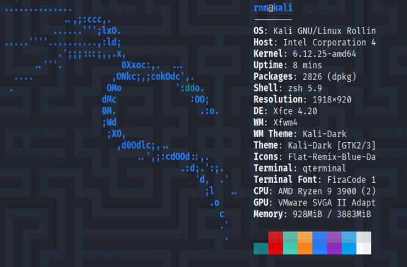

<!--- metadata

title: H1 - Kybertappoketju
date: 2025-08-22
slug:
id: ICI005AS3A-3005
week:
summary: Viikon tehtävissä perehdyttiin Cyber Kill Chain -malliin, porttiskannaukseen ja virtuaalikoneiden asentamiseen (Kali, Metasploitable2). Opittiin hyökkäysketjun vaiheista, työkalujen käytöstä sekä palveluiden tunnistamisesta ja analysoinnista käytännön testein.
tags: [ "ICI005AS3A-3005", "Tunkeutumistestaus"]

--->

## x) Lue/katso/kuuntele ja tiivistä. (Tässä x-alakohdassa ei tarvitse tehdä testejä tietokoneella, vain lukeminen tai kuunteleminen ja tiivistelmä riittää. Tiivistämiseen riittää muutama ranskalainen viiva.)

- Kuuntelin DarkNet Diaries jakson 162: Hiue.

    - Tosi mielenkiintoinen tarina vietnamilaisesta hakkerista joka väärien valintojen ja rikollisuuden kautta köyhyydessä pääsi tienaamaan rahaa varastamalla aluksi kortti tietoja ja myöhemmin myymällä henkilöllisyys tietoja.

    - Tarina olikin mielenkiintoinen koska se ei ollu niin yksi selitteinen ku mitä vois kuvitella. Hän siis teki vääryyksiä ja rikko lakia, mutta joutui vankilaan ihan eri syistä ja sai tuomion täysin muista asioista.

    - Pääpointtina tässä tarinassa puhuttiin siitä miten epä-eettisiä datan keräys yritykset ovat ja miten hän hyödynsi heidän palveluitaan tienatakseen rahaa. Kertoo hyvin sen miten todellisuudessa black hat hakkerit toimii ja mitä he hakee.

- Hutchins:in paperissa esitellään Cyber Kill Chain. Tätä me käsiteltiin myös tunnilla, mutta paperissa tähän liittyy todella hyviä havainne kuvia ja mitä tekniikoita minkäkin kohdan alle kuuluu ja mitä konkreettisia asioita näihin liittyy.

    - Tässä myös kerrottiin, että koska tämä framwork jakaa vastuun eri osa-alueille, on puolustajien huomattavasti helpompi mitata ja tunnistaa heikkouksia omassa puolustuksessa. Tämä ei siis anna etulyöntiasemaa hyökkääjälle vaan puolustajalle. Heti kun puolustaja parantaa menetelmiän, hyökkääjän hinta kasvaa, mikä taas itsessään vähentää kannattavauutta.

- Sitten Art of Hacking video sarjassa käsiteltiin eri työkaluja kuten nmap, masscan, udpprotoscanner ja EyeWitness. Siinä käytiin läpi eri työkalujen toiminnallisuuksia ja ominaisuuksia. Tosi mielenkiintoista koska moni näistä ei ollut tuttu mulle aikasemmin.

    - Muissa videoissa käytiin läpi muita työkaluja kuten OpenVAS eli haavoittuvuus skanneria. Siinä näytettiin myös miten nmap:pia voi käyttää tähän tarkoitukseen.

- Ja sitten viimeisenä oli tämä OP porttiskannaus oikeus keissi, missä teini sai siis syytteen ja joutu maksaa korvauksia. Aika uskomaton tapaus ja vielä suomessakin niin nostattaa kyllä kulmakarvoja, kun miettii sit et ei ite vahingossakaan skannaa mitään sopimatonta.

[Hutchins et al 2011,](https://lockheedmartin.com/content/dam/lockheed-martin/rms/documents/cyber/LM-White-Paper-Intel-Driven-Defense.pdf) [Rhysider 05.08.2025,](https://darknetdiaries.com/episode/162/) [KKO 2003:36](https://finlex.fi/fi/oikeuskaytanto/korkein-oikeus/ennakkopaatokset/2003/36)

---

## a) Asenna Kali virtuaalikoneeseen. (Jos asennuksessa ei ole mitään ongelmia tai olet asentanut jo aiemmin, tarkkaa raporttia tästä alakohdasta ei tarvita. Kerro silloin kuitenkin, mikä versio ja millä asennustavalla. Jos on ongelmia, niin tarkka ja toistettava raportti)

Kali on asennettu onistunesti. Asensin sen läppärille käyttäen virt-manageria. Mutta suoritin loput tehtävät pöytäkoneella ja siihen käytin VMware Workstation Pro virtualisointi alustaa.

---

## b) Irrota Kali-virtuaalikone verkosta. Todista testein, että kone ei saa yhteyttä Internetiin (esim. 'ping 8.8.8.8')

Irrotin koneen verkosta ja pingaus anto tämän vastaukseksi.

---

## c) Porttiskannaa 1000 tavallisinta tcp-porttia omasta koneestasi (nmap -T4 -A localhost). Selitä komennon paramterit. Analysoi ja selitä tulokset

Komennossa käytettiin kahta parametria. "-A" kertoo mahdollisen käyttöjärjestelmän, palveluiden versiot, scripti tiedot sekä myös traceroute tiedot ja "T4" kertoo nmap:ille miten agressiivisesti komento toteutetaan. T4 on melkein agressiivisin vaihtoehto, eli se toimii tehokkaasti mutta myöskin näitä skannauksia on helppo huomata.

Muuta huomioitavaa on myöskin "sudo" komentoo joka antaa super omistajan oikeudet käyttäjälle ja mahdollistaa joidenkin parametrien ja komentojen käyttämistä.

Ensimmäisessä skannauksessa ei näy sinänsä mitään mielenkiintoista koska mitään ei löytynyt. Ainoa huomioitava asia on ehkä Network Distance: 0 hops mikä kertoo että verkko on pieni, mutta se ei ole tässä merkityksellistä koska kyseessä on vaan localhost skannaus. Mutta jatkossa huomioitava kohta.

[nmap man sivut](https://man.freebsd.org/cgi/man.cgi?query=nmap&sektion=1&format=html)

---

## d) Asenna kaksi vapaavalintaista demonia ja skannaa uudelleen. Analysoi ja selitä erot

Kun olin asentanut demonit ja laitoin ne käyntiin, tein saman skannauksen kun aikasemminkin, mutta tällä kertaa vastuakset olivat paljon mielenkiintosemmat.

Kun aikasemmin kaikki portit olivat "ignoored" tilassa, nyt löytyikin kaksi jotka olivat auki. Portissa 22 ja 80 pyörii kaks eri palvelinta. Portissa 22 löytyy ssh server ja portissa 80 apache web server.

Näistä palveluista me saadaan tietää versiot mitä ne käyttää, mahdollinen käyttöjärjestelmä sekä muiden script hakujen perusteella saadaan tietää apache server header ja että default sivu toimii ilman että meidän pitää vierailla sivulla.

Tässä on paljon tietoa mitä voi hyödyntää haavoittuvuuksien etsimiseen.

[MariaDB Server Management,](https://mariadb.com/docs/server/server-management/starting-and-stopping-mariadb/systemd)
[Baeldung: List Running Daemons in Linux,](https://www.baeldung.com/linux/list-running-daemons)
[Cyberciti: Start SSHD OpenSSH Server Command](https://www.cyberciti.biz/faq/linux-start-sshd-openssh-server-command/)

---

## e) Asenna Metasploitable 2 virtuaalikoneeseen

Kun sain asennettua metasploitable2 ja käynnistettyä. Kirjauduin sisään `msfadmin:msfadmin` tunnuksilla ja näkymä oli tämä sen jälkeen. Sitten oli aika skannata systeemi.

[Metasploitable 2](https://sourceforge.net/projects/metasploitable/)

---

## f) Tee koneiden välille virtuaaliverkko

Kun olin saanut koneet verkosta pois, olin yhdistäny ne host-only yhteydellä ja seuraavaksi hain metasploitable ip osoitteen.

Tässä kohtaa koin ongelmia virtualisointi alustojen kanssa. Eli mull oli ongelma kun koneet eivät olleet samassa sub-netissä. Monien kokeilujen jälkeen ja teron vinkkien avulla sain koneet samaan verkkoon ja toimimaan keskenään. Tähän debugaamiseen mä käytin apuna ChatGPT:tä, monien promptien kautta.

Mutta loppuen lopuks kun asetin koneet manuaalisesti samaan verkkoon asettamalla staatiset ip osoitteet, sain ne toimimaan.

---

## g) Etsi Metasploitable porttiskannaamalla (nmap -sn). Tarkista selaimella, että löysit oikean IP:n - Metasploitablen weppipalvelimen etusivulla lukee Metasploitable

---

## h) Porttiskannaa Metasploitable huolellisesti ja kaikki portit (nmap -A -T4 -p-). Poimi 2-3 hyökkääjälle kiinnostavinta porttia. Analysoi ja selitä tulokset näiden porttien osalta

Skannauksesta tuli niin pitkä ettei se edes mahdu kokonaan yhteen kuvaan mutta pieni pätkä mun mielestä kiinnostavimmista porteista. 21, 513 ja 2049.

Ensimmäisessä portissa 21 pyörii ftp palvelu. Tämä on tarkotettu tiedostonhallintaan ja tiedostojen välittämiseen. Tämä jäi silmään kuitnekin kun nmap ilmotti että "Anonymous FTP login allowed", eli pääsee käsiksi tiedostoihin ilman autetikaatiota. Aina arvokas kohde. Kyseisestä palvelusta selvisi myös et mikään tieto ei oo encryptattua eli plain text tyylillä toimii.

Tisena oli portti 513 eli rlogin palvelu, mikä oli ittelle tuntematon ennen, mutta nopeen googlailun jälkeen selvisi että tää on todella haavoittuva ja sitä kautta saa suoran root shellin aikaseks, eli tosi voimakas. Kuitenkin mitä lueskelin aiheesta niin tää on nykyään tosi harvinainen että on käytössä. Mut sen takii mielenkiintonen et jos ikinä näkee tämmösen nii tietää mennä kokeilee!

Ja viimesenä portti 2049. Tämäkin tideostojen hallintaan tarkoitettu nfs protokolla. Jos onnistuu hyödyntää tälle jotain haavoittuvuutta niin tämä antaa todella laajan hyökkäys pinnan, eli erittäin mielenkiintonen, ja mitä löysin niin pystyy myös kasvattamaan oikeuksia ja siirtämään tiedostoja huomaamatta. Niin mahdollisuuksia on monia, minkä takia valitsin nämä.

[Pentestlab: rlogin Service Exploitation,](https://pentestlab.blog/2012/07/20/rlogin-service-exploitation/)
[HackTricks: NFS Service Pentesting,](https://book.hacktricks.wiki/en/network-services-pentesting/nfs-service-pentesting.html)
[HackTricks: NFS no_root_squash Misconfiguration PE](https://book.hacktricks.wiki/en/linux-hardening/privilege-escalation/nfs-no_root_squash-misconfiguration-pe.html)

---

### Lähteet

#### 1. Tero Karvinen 2025. Tunkeutumistestaus 2025 alkusyksy. Luettavissa: [[https://terokarvinen.com/tunkeutumistestaus/]] Luettu: 22.8.2025

#### 2. Tero Karvinen 2025. Install Debian on Virt-Manager - Trixie update 2025. Luettavissa: [[https://terokarvinen.com/install-debian-on-virt-manager/]] Luettu: 22.8.2025

#### 3. Kali Linux. Saatavilla: [[https://www.kali.org/get-kali/]] Luettu: 22.8.2025

#### 4. Darknet Diaries, Episode 162: Hiue. Saatavilla: [[https://darknetdiaries.com/episode/162/]] Luettu: 22.8.2025

#### 5. Metasploitable 2. Saatavilla: [[https://sourceforge.net/projects/metasploitable/]] Luettu: 22.8.2025

#### 6. MariaDB Server Management. Saatavilla: [[https://mariadb.com/docs/server/server-management/starting-and-stopping-mariadb/systemd]] Luettu: 22.8.2025

#### 7. Baeldung: List Running Daemons in Linux. Saatavilla: [[https://www.baeldung.com/linux/list-running-daemons]] Luettu: 22.8.2025

#### 8. Pentestlab: rlogin Service Exploitation. Saatavilla: [[https://pentestlab.blog/2012/07/20/rlogin-service-exploitation/]] Luettu: 22.8.2025

#### 9. HackTricks: NFS Service Pentesting. Saatavilla: [[https://book.hacktricks.wiki/en/network-services-pentesting/nfs-service-pentesting.html]] Luettu: 22.8.2025

#### 10. HackTricks: NFS no_root_squash Misconfiguration PE. Saatavilla: [[https://book.hacktricks.wiki/en/linux-hardening/privilege-escalation/nfs-no_root_squash-misconfiguration-pe.html]] Luettu: 22.8.2025

#### 11. Hutchins et al. 2011. Intelligence-Driven Computer Network Defense Informed by Analysis of Adversary Campaigns and Intrusion Kill Chains. Saatavilla: [[https://lockheedmartin.com/content/dam/lockheed-martin/rms/documents/cyber/LM-White-Paper-Intel-Driven-Defense.pdf]] Luettu: 22.8.2025

#### 12. Cyberciti: Start SSHD OpenSSH Server Command. Saatavilla: [[https://www.cyberciti.biz/faq/linux-start-sshd-openssh-server-command/]] Luettu: 22.8.2025

#### 13. KKO 2003:36. Saatavilla: [[https://finlex.fi/fi/oikeuskaytanto/korkein-oikeus/ennakkopaatokset/2003/36]] Luettu: 22.8.2025

#### 14. Tero Karvinen 2025. Install Debian on Virt-Manager - Trixie update 2025. Saatavilla: [[https://terokarvinen.com/install-debian-on-virt-manager/]] Luettu: 22.8.2025

#### 15. freeBSD: NMAP manual pages. Saatavilla [[https://man.freebsd.org/cgi/man.cgi?query=nmap&sektion=1&format=html]] Luettu: 22.8.2025
