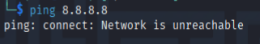

<!--- metadata

title: H2 - Lisää vain vesi
date: 2025-08-28
slug:
id: ICI005AS3A-3005
week: Week 35
yhteenveto: Tämä merkintä dokumentoi tunkeutumistestausharjoituksia käyttäen Metasploitia ja Metasploitablea. Käsitellään verkon eristystä, porttiskannausta, hyödyntämistä, lateraalista liikkumista ja sessioiden hallintaa. Keskeiset havainnot ja haasteet käydään läpi käytännön esimerkkien ja lähteiden avulla.
tags: [ "ICI005AS3A-3005", "Tunkeutumistestaus"]

--->

## x) Lue/katso/kuuntele ja tiivistä. € Jaswal 2020: Mastering Metasploit - 4ed: Chapter 1: Approaching a Penetration Test Using Metasploit (kohdasta Conducting a penetration test with Metasploit luvun loppuun eli "Summary" loppuun)

- Käytiin läpi metasploitin erilaisia ominaisuuksia ja komentoja mitä sillä pystyy tekemään ja missä se on parempi ku manuaalisesti tunkeutua.

- Avattiin metasploitin database mahdollisuuksia ja miten niitä kannattaa käyttää.

- Kerrottiin moduleiden arvot ja mitä ne tarkoittaa, esim. `exellent`

- Näytettiin miten vaikeutetaan administrattorin tehtävää, exploittauksen jälkeen ja istutetaan ittemme syvemmälle järjestelmään vaihatamalla prosessi hostia.

- Loistavia esimerkkejä post exploittaamisesta käyttämällä eri menetelmiä kuten `autroute`, `enum_domain` moduleita ja `tokeneita`.

- Lopuksi siirryttiin verkon sisällä ja päästiin AD syvyyteen ja sieltä saatiin salasanojen hashit.

- Nämä kräkättiin `mimikatz` ja `kiwi` pluginien avulla.

- Loistava kokonaiskuva koko hyökkäysketjusta ja myöskin erittäin kattavasta post exploiting mahdollisuuksista ja ominaisuuksista.

[(Jaswal 2020)](https://learning.oreilly.com/library/view/mastering-metasploit/9781838980078/B15076_01_Final_ASB_ePub.xhtml)

---

## a) Harjoittelemme omassa virtuaaliverkossa, jossa on Kali ja Metaspoitable. Osoita testein, että 1) koneet eivät saa yhteyttä Internetiin 2) Koneet saavat yhteyden toisiinsa. (Koneiden ja verkon asentamista ei tarvitse raportoida uudestaan, paitsi jos siinä on ongelmia)

1)

Tämä testi on tehty Kali koneella ei saa yhteyttä nettiin.

Tämä testi on tehty MSF2 koneella eikä sekään pääse nettiin.

2)

Ja koneet saavat yhteyden toisiins.

---

## b) Ota Metasploit msfconsole käyttöön

Msfconsole on otettu käyttöön onnistuneesti.

---

## c) Etsi Metasploitable porttiskannaamalla (db_nmap -sn). Tarkista selaimella, että löysit oikean IP:n - Metasploitablen weppipalvelimen etusivulla lukee Metasploitable

Oikea kohde löytyi ja IP osoite tarkistettu.

---

## d) Porttiskannaa Metasploitable perusteellisesti. Skannaa kaikki 65535 tcp-porttia. Tallenna tulokset Metasploitin tietokantoihin (db_nmap) ja tiedostoihin (nmap -oA foo)

Skannasin kaikki portit ja tallensin ne sekä tietokantaan että omaan foo tiedostoon.

---

## e) Tarkastele Metasploitin tietokantoihin tallennettuja tietoja komennoilla "hosts" ja "services". Kokeile suodattaa näitä listoja tai hakea niistä

Etsin `services` kohdassa seuraavan tehtävän palvelua `vsftpd`. Ohjeet tähän lööysin kun hain `services -h` josta se antoi mulle kaikki mahdolliset vaihtoehdot mitä olisin pystynyt käyttämään.

---

## f) Vertaile nmap:n omaa tiedostoon tallennusta (-oA foo) ja db_nmap:n tallennusta tietokantoihin. Mitkä ovat eri tiedostomuotojen ja Metasploitin tietokannan hyvät puolet?

No metasploitin oma tietokanta on siitä hyvä että sielä on heti nopeasti kaikki tarvittava tieto saatavilla. Mutta muiden tiedostomuotojen etu on kyllä varmasti se että sinne tallentuu paljon enemmän kaikkea ylimääräistä tietoa mitä tietokantoihin ei mahdu, mutta mikä ilmenee kuitenkin skannausta tehdessä.

Nmapin oma tiedosto tallennus on siitä hyvä et sinne tallentuu myös millon skannaus on tehty ja mitä komentoja on käytetty. Tämä on raportointi vaiheessa erittäin tärkeää, että voidaan todentaa millon, mitäkin ollaan tehty.

---

## g) Murtaudu Metasploitablen vsftpd-palveluun

No koska tiedetään että tämä palvelu on haavoittuva niin aloin skannaus tulosten perusteella vaan etsimään `search vsftpd 2.3.4` komennolla sopivaa exploittia, koska tiedän että palvelu on haavoittuva.

Ja no sieltähän löyty, nii ei kun vaan käyttämään. Asetettiin oikee RHOSTS vaan ja sit käyntiin ja BOOM, ollan sisällä. Niin helppoa se oli.

---

## h) Päivitä äskeisen vsftpd-murron yhteydessä syntynyt sessio meterpretriin

Jätin tämän session pyörimään ja menin takaisin `Ctrl + Z`. Seuraavaksi koitetaan saada shell meterpreter sessioksi. Löysin ohjeet siihen `sessions -h` komennolla missä olikin ohjeet eli `-u` parametrillä tätä voi lähteä yrittämään.

Eli komennolla `sessions -u 1` saatiin kasvatettuu shelliä. Hämmennyin kuitnekin kun vahingossa palasin koko ajan siihen ensimmäiseen shelliin ja mietin että miksi se ei kasvanu vaikka kaikki onnistu järjestelmän mukaan. Niin tajusin onneks kattoo kaikki sessiot uudestaan ja no sinnehän mä olinki jo vahingossa avannu 2 kasvatettua shelliä alkuperäisen lisäksi.

Noh ei se tässä tapauksessa haittaa että niitä on kaksi auki, mutta pitää muistaa olla huolellisempi jatkossa.

Noh sieltä se kuitenkin löyty ja saatiin se myös aktivoitua.

---

## i) Kerää levittäytymisessä (lateral movement) tarvittavaa tietoa metasploitablesta. Analysoi tiedot. Selitä, miten niitä voisi hyödyntää

Jos nyt ymmärsin tämän tehtävän kohdan oikein niin tässä haetaan, että MSF2 pitäisi analysoida ja kerätä dataa siitä miten järjestelmässä voisi edetä muilla tavoilla?

Niin jos ymmärsin oikein niin esimerkiksi lähdin liikumaan järjestelmässä ja etsin msfadmin ssh salaisen avaimen. Ja pienten ongelmien kautta latasin sen omalle hyökkäys koneelle. Eli mul on kohteen yksityinen ssh avain millä voi nyt kirjautua ihan normaalisti sisään.

---

## j) Murtaudu Metasploitableen jollain toisella tavalla. (Jos tämä kohta on vaikea, voit tarvittaessa turvautua verkosta löytyviin läpikävelyohjeisiin. Merkitse silloin raporttiin, missä määrin tarvitsit niitä)

Noh tätä jo alustin tossa aikasemmassa vaiheessa pikkasen, mutta nyt kun mulla on yksityinen ssh avain niin toinen tapa miten järjestelmään voi murtauta, on juuri tämä yksityinen avain.

Tässä törmäsinki pieniin ongelmiin taas. Eli se ei hyväksynyt tätä avainta, niin kysyin asiasta ChatGPT:ltä, promptilla: `Unable to negotiate with 192.168.20.128 port 22: no matching host key type found. Their offer: ssh-rsa,ssh-dss. I get this error every time`

Nopeen selvittelyn kautta selvisi että tämä ei kyllä ole helpoin tapa päästä järjestelmään, koska se käyttää `rsa-dss` avain yhdistelmää, niin nykyinen kali ei enään tue tätä. Noh vaikka siis käytännössä voisin lähteä tätä kautta kans yrittämään pääsemään järjestelmään niin tämä on liian työlästä tähän ja päätin pivotoida pois mun alkuperäisestä ajatuksesta.

Lähdin siis skannaamaan järjestelmää uudestaan ja koska meillä on root oikeudet niin menin sitten katsomaan `/etc/shadow/` kansiosta löytyiskö täältä mitään kiinnostavia tiivisteitä ja no niitä löytyi. Eli tästä kansiosta löytyy salasanojen tiivisteit, ja jos nämä onnistuu kräkkäämään niin saa tietää salasanan.

Jäi heti silmään root käyttäjän tiiviste mikä löytyi tästä, ja päätin lähteä murtamaan tätä.

Tosta tiivisteestä voi päätellä että kyseessä on MD5 hash, eli tämän murtaminen tulee olemaan melko nopeaa työkalulla kuten hashcat. Noh olin tässäkin hieman väärässä. Koska olin antanu virtuali koneelle vain 2 loogista corea käyttöön niin tässä kesti hetki :D

Kuitenkin komennolla `hashcat -m 500 tiiviste.txt /usr/share/wordlists/rockyou.txt` hashcat alkoi hommiin. Arvioitu aika tälle kräkkäykselle oli annettu noin 20min.

Vastuas: Ei mitään. Sieltä ei löytynyt yhtään salasanaa. Ja tähän jäinki jumiin sitten. Varmasti olisi voinut vielä kaivaa enemmän mutta mulla loppu ideat kesken tässä systeemin sisältä.

Toinen tapa miten mä murtauduin järjestelmään oli aikasemmlla viikolla tutkimani rlogin haavoittuvuus portissa 513. Se olikin niin yksinkertainen kun komenolla `rlogin -l root 192.168.20.128` ja sillä sain suoraan root shellin käyttöön.

Tämä liittyy tehtävään m), mutta tätä kautta onnistuin myös kasvattamaan tty sessiota silleen että sain nano:n auki koko näytölle ja mulla oli täys interaktiivinen shell yhteys. Komento tähän oli vain `export TERM=xterm` ja tämä kasvatti kyseistä shelliä.

[(StackExchange,](https://unix.stackexchange.com/questions/23291/how-to-ssh-to-remote-server-using-a-private-key) [Pentestlab: rlogin Service Exploitation)](https://pentestlab.blog/2012/07/20/rlogin-service-exploitation/)

---

## k) Demonstroi Meterpretrin ominaisuuksia

Meterpreteris on esimerkiksi hyvinkin yksinkertainen mutta hyödyllinen ominaisuus `sysinfo`. Se kertoo tarkat laitetiedot, mikä antaa varmuuden esimerkiksi linuxin versiosta, koska ulkopuolisten skannausten perusteella me ei saatu sitäkään varmaksi tietää. Toinen on `shell` joka tuleekin käyttöön vapaaehtoisissa tehtävissä.

---

## l) Tallenna shell-sessio tekstitiedostoon script-työkalulla (script -fa log001.txt)

Tää olikin tosi mielenkiintonen. Tämä pitää ottaa käyttöön joka kerralla kun aloittaa hakkerointi sessioita, niin kaikki on tallennettua.

---

## m) Vapaaehtoinen: Titityy. Saatko Metasploitableen tty-shellin, eli esimerkiksi avattua koko ruudulle piirtävän nano:n?

Kasvatin tty shelliä komennolla minkä löysin netistä, eli `script -qc /dev/null /bin/bash`. Tämäkin oli kuitenkin puuttellinen mutta sain sentään auki Vim työkalun. Nano:a en onnistunut saamaan auki tällä menetelmällä.

Sain nano:n auki kuitnekin toisen palvelun kautta, minkä demonstroinkin jo j) tehtävässä.

[(bughra, 2025)](https://bughra.dev/posts/shell/)

---

### Lähteet

#### 1. StackExchange: How to ssh to remote server using a private key? Luettavissa: [[https://unix.stackexchange.com/questions/23291/how-to-ssh-to-remote-server-using-a-private-key]] Luettu: 27.8.2025

#### 2. Tero Karvinen 2025. Tunkeutumistestaus 2025 alkusyksy. Luettavissa: [[https://terokarvinen.com/tunkeutumistestaus/]] Luettu: 27.8.2025

#### 3. Bughra 10.4.2025. Shell Upgrade Techniques. Luettavissa: [[https://bughra.dev/posts/shell/]] Luettu: 28.8.2025

#### 4. Pentestlab: rlogin Service Exploitation. Saatavilla: [[https://pentestlab.blog/2012/07/20/rlogin-service-exploitation/]] Luettu: 28.8.2025

#### 5. Jaswal 2020: Mastering Metasploit - 4ed: Chapter 1: Approaching a Penetration Test Using Metasploit. Luettavissa: [[https://learning.oreilly.com/library/view/mastering-metasploit/9781838980078/B15076_01_Final_ASB_ePub.xhtml]] Luettu: 28.8.2025
