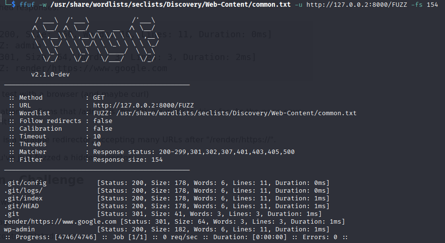
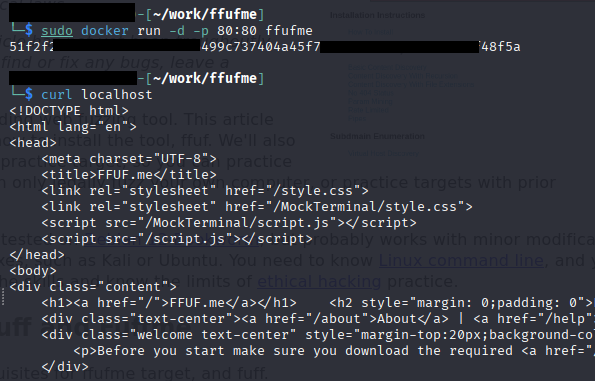
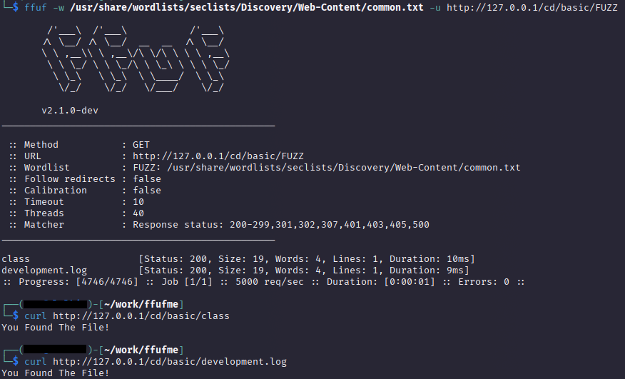
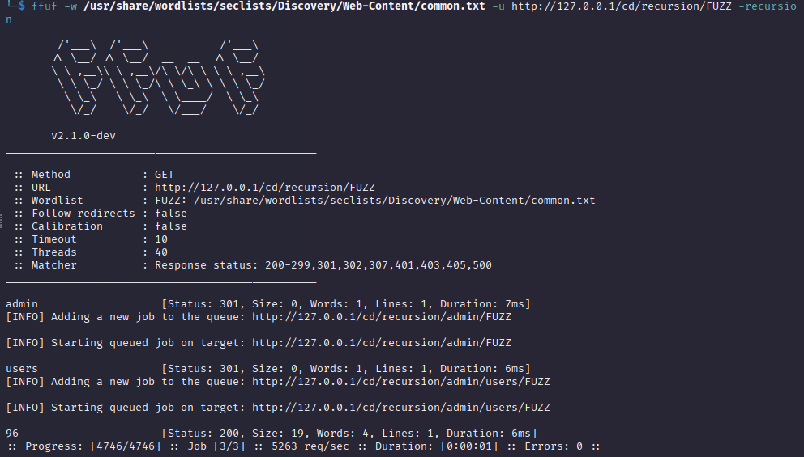
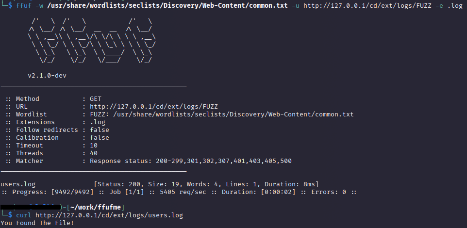
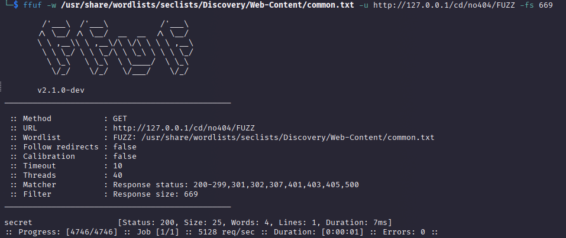
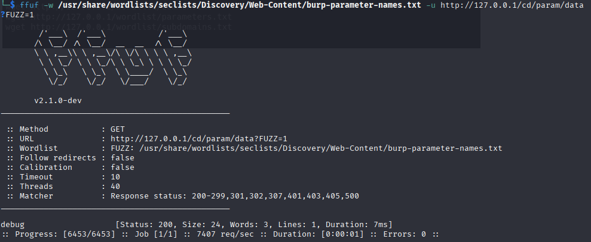
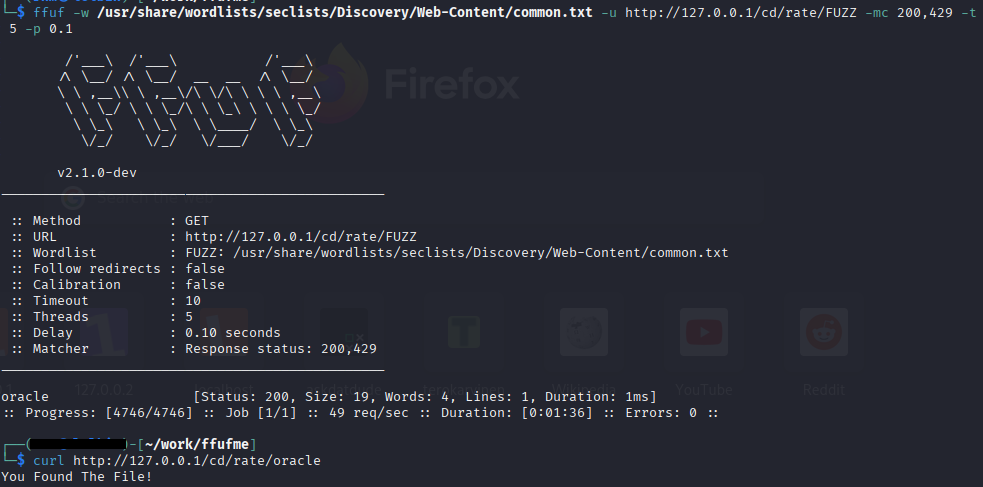
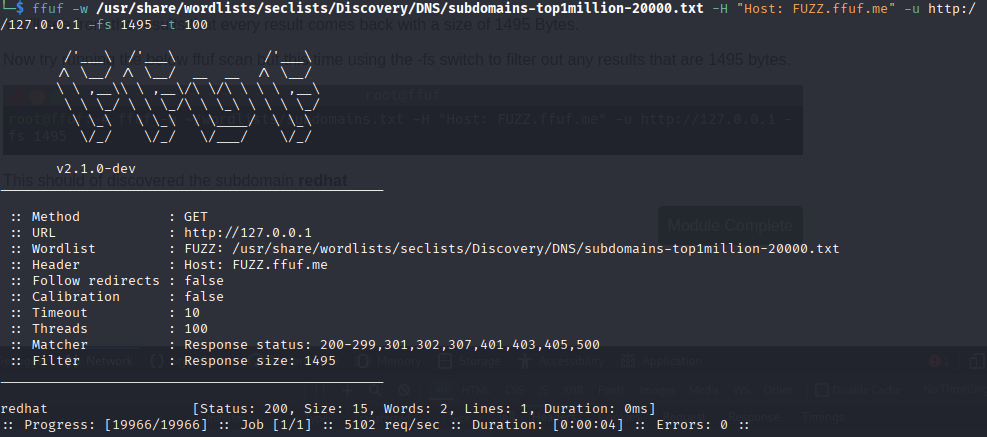
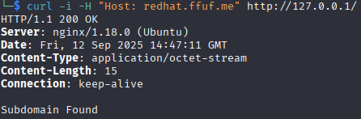

<!--- metadata

title: H4 - Fuzzy
date: 12.09.2025
slug:
id: ICI005AS3A-3005
week: Week 37
summary: Ffuf-työkalulla löydettiin piilotettuja hakemistoja ja lippuja, asennettiin harjoitusympäristö Dockerilla ja ratkaistiin useita fuzzing-tehtäviä eri asetuksilla. Opittiin mm. sanalistojen käyttö, recursion, file extension ja rate limiting.
tags: [ "ICI005AS3A-3005", "Tunkeutumistestaus"]

--->

## x) Lue/katso/kuuntele ja tiivistä. (Tässä x-alakohdassa ei tarvitse tehdä testejä tietokoneella, vain lukeminen tai kuunteleminen ja tiivistelmä riittää. Tiivistämiseen riittää muutama ranskalainen viiva. Lisää mukaan jokin oma idea, huomio, kysymys tai kommentti.)

## - Karvinen 2023: [Find Hidden Web Directories - Fuzz URLs with ffuf](https://terokarvinen.com/2023/fuzz-urls-find-hidden-directories/)

## - Hoikkala 2023: [ffuf README.md](https://github.com/ffuf/ffuf/blob/master/README.md)

- Find Hidden Web Directory artikkelissa Tero Karvinen avaa yksinkertaisuudessa miten ffuf työkalu ladataan, mistä sanalistoja ladataan, miten näitä käytetään ja lopuksi on tehtäviä mitkä tekemällä pystyy testaamaan työkalua.

- Sitten Ffuf:in virallinen README. Tässä on paljon tietoa, eri mahdollisuuksista mitä työkalulla voi tehdä. Käydään läpi asennus, esimerkki käyttö ja lopuksi on esitetty kaikki asetukset ja miten `Interactive mode` toimii.

---

## a) Fuzzzz. Ratkaise dirfuz-1 artikkelista Karvinen 2023: [Find Hidden Web Directories - Fuzz URLs with ffuf](https://terokarvinen.com/2023/fuzz-urls-find-hidden-directories/)

Aloitin tehtävän lataamalla kohteen eli tässä tapauksessa `dirfuzt-1` binäärin, muutin sen ajettavaksi ja käynnistin sen. Sitten latasin tarvittavat sanalistat käyttämällä komentoa `sudo apt -y install seclists`. Tämän jälkeen lähdin FUZZaamaan palvelua. Koska tämä tehtävä oli tuttu aikaisemmasta, niin käytin apuna tähän mun aikaisempaa [raporttia](https://askdatdude.github.io/diary/entries/diary.html?entry=SH24-002&week=) aiheesta.

Näin siis jo tiesin käyttää teidoston koko filtteriä `-fs 154` ja sieltä tuli just oikeat vastaukset ja löytyi `wp-admin` sekä `.git` sivu jossa oli liput.



Hakemistot:

- Version hallinta hakemisto: .git/

- Flag: `FLAG{tero-git-3cc87212bcd411686a3b92547d47fc51}`

- Admin sivun hakemisto: wp-admin/

- Flag: `FLAG{tero-wpadmin-3364c855a2ac87341fc7bcbda995b580}`

---

## b) Fuff me. Asenna FuffMe-harjoitusmaali. Karvinen 2023: [Fuffme - Install Web Fuzzing Target on Debian](https://terokarvinen.com/2023/fuffme-web-fuzzing-target-debian)

Sitten lähdettiin asentamaan teron ohjeiden mukaan ffuf.me harjoitus ympäristöä. Tämä asentui ilman ongelmia käyttäen ohjeita ja sain sen heti myös käyntiin.

Tässä vielä komennot mitä käytin ffuf.me asennukseen, mitkä löytyivät teron ohje sivuilta.

```sh
sudo apt-get update
sudo apt-get install docker.io git ffuf
```

```sh
git clone https://github.com/adamtlangley/ffufme
cd ffufme/
sudo docker build -t ffufme .
```

```sh
sudo docker run -d -p 80:80 ffufme
curl localhost
```



En lähtenyt enään erikseen asentamaan sanalistoja koska ne jo löytyikin aikaisemmasta seclists mukana tulleista listoista.

---

## Ratkaise ffufme harjoitukset - kaikki paitsi ei "Content Discovery - Pipes"

## c) Basic Content Discovery

Sitten lähdin vain seuraamaan ohjeita. Komento tähän oli:

```sh
ffuf -w ~/wordlists/common.txt -u http://127.0.0.1/cd/basic/FUZZ
```



## d) Content Discovery With Recursion

Sieltä löytyi kaikki alakansiot ja itse tiedosto. Tässä komentona toimii:

```sh
ffuf -w ~/wordlists/common.txt -recursion -u http://127.0.0.1/cd/recursion/FUZZ
```



## e) Content Discovery With File Extensions

Tässä tehtävässä tarkoituksena oli käyttää `-e` (extensions) ominaisuutta, millä pystyy etsimään tiettyjä tiedostoja ja sieltäkin löytyi oikea tiedosto komennolla:

```sh
ffuf -w ~/wordlists/common.txt -e .log -u http://127.0.0.1/cd/ext/logs/FUZZ
```



## f) No 404 Status

Tässä tehtävässä oli sama idea, kuin myöskin dirfuz-1 tehävässä. Eli koska sivu ei palauta 404 error headeria, niin se palauttaa kaikki tulokset oikeina. No se ei pidä paikkaansa ja `-fs` vaihtoehdon avulla me onnistutaan saamaan vain sivu joka on eri kaikista muista vastauksista.

Eli komennolla:

```sh
ffuf -w ~/wordlists/common.txt -u http://127.0.0.1/cd/no404/FUZZ -fs 669
```



## g) Param Mining

Tässä tehtävässä löytyi sivu, mutta sille ei päässyt ellei ollut jokin HTTP parametri käytössä. Tämä parametri fuzzattiin ja sieltä saatiin sivu auki komennolla:

```sh
ffuf -w ~/wordlists/parameters.txt -u http://127.0.0.1/cd/param/data?FUZZ=1
```



## h) Rate Limited

Tässä demonstroitiin miten, kun työkalua hidastetaan ihan hieman vaan, niin saadaan parempia tuloksia aikaseksi. Tässä oli kaksi parametria mitä me käytettiin `-t 5` ja `-p 0.1`. Tässä -t parametri vähensi threadeja 40 -> 5. Näin ollen hidastaen fuzzausta. Sitten -p 0.1 lisää jokaiseen hakuun 10ms viiveen, näin että me pystytään ohittamaan automaattinen-rate limiter. Komento tähän tehtävään oli:

```sh
ffuf -w ~/wordlists/common.txt -t 5 -p 0.1 -u http://127.0.0.1/cd/rate/FUZZ -mc 200,429
```



## i) Subdomains - Virtual Host Enumeration

Ja tässä viimeisessä tehtävässä etsittiin subdomaineja.



Komennolla:

```sh
ffuf -w ~/wordlists/subdomains.txt -H "Host: FUZZ.ffuf.me" -u http://127.0.0.1 -fs 1495
```

löytyy vastaus eli `redhat` subdomain. Varmistin vielä curl:illa mitä mä löysin:

```sh
curl -i -H "Host: redhat.ffuf.me" http://127.0.0.1/
```

Tässä `-i ja -H` näyttää kaikki headerit mitä vaan on.



---

### Lähteet

#### 1. Tero Karvinen 2025. Tunkeutumistestaus 2025 alkusyksy. Luettavissa: [[https://terokarvinen.com/tunkeutumistestaus/]] Luettu: 12.9.2025

#### 2. Tero Karvinen 2023. Find Hidden Web Directories - Fuzz URLs with ffuf. Luettavissa: [[https://terokarvinen.com/2023/fuzz-urls-find-hidden-directories/]] Luettu: 12.9.2025

#### 3. Ffuf README.md. ffuf - Fuzz Faster U Fool. Luettavissa: [[https://github.com/ffuf/ffuf/blob/master/README.md]] Luettu: 12.9.2025

#### 4. Robin Niinemets 2024. H2 - Break & unbreak. Luettavissa: [[https://askdatdude.github.io/diary/entries/diary.html?entry=SH24-002]] Luettu 12.9.2025

#### 5. Tero Karvinen 2023. Fuffme - Install Web Fuzzing Target on Debian. Luettavissa: [[https://terokarvinen.com/2023/fuffme-web-fuzzing-target-debian]] Luettu: 12.9.2025
