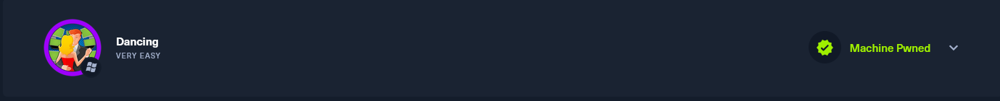
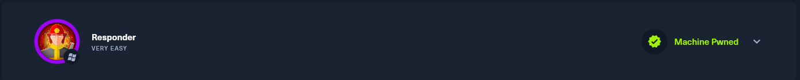

<!--- metadata

title: H7 - Maalisuoralla
date: 2025-10-03
slug:
id: ICI005AS3A-3005
week: Week 40
summary: Valmistelua kurssin CTF haastetta varten. Asennettiin sovelluksia, mitä CTF kilpailussa tarvitaan. Luettiin myös vertais arvioituja tutkimus artikkeleita, ja tehtiin HTB Starting point tehtäviä.
tags: [ "ICI005AS3A-3005", "Tunkeutumistestaus"]

--->

## x) Lue/katso ja tiivistä. (Tässä x-alakohdassa ei tarvitse tehdä testejä tietokoneella, vain lukeminen tai kuunteleminen ja tiivistelmä riittää. Tiivistämiseen riittää muutama ranskalainen viiva kustakin artikkelista. Kannattaa lisätä myös jokin oma ajatus, idea, huomio tai kysymys.)

## Karvinen 2025: [Start Your Research with a Review Article](https://terokarvinen.com/review-article)

## Review. Etsi vapaavalintainen review eli katsausartikkeli, joka liittyy kurssin aiheisiin. Artikkelin pitää olla [JUFO-arvioidusta](https://jfp.csc.fi/jufoportaali) julkaisusta eli jufo-taso 1, 2 tai 3. Mieluiten tuore, julkaisusta alle 2 vuotta.

- Karvisen artikkelissa esitellään "review article", mitä se tarkoittaa, mistä eri artikkeleita löytää ja miten eri jufo tasot toimivat.

- Valitsin artikkelin: [Where Are the Red Lines? Towards Ethical Server-Side Scans in Security and Privacy Research](https://ieeexplore.ieee.org/abstract/document/10646650)

- Tämä artikkeli oli aika pitkä niin silmäilin sen läpi, mutta tässä perus ideana tässä yritettiin selvittää rajaa siinä, miksi tutkijat välttävät server-side haavoittuvuuksien tutkimista.

- Tutkimus pohjautui haastatteluihin ja kyselyihin. Tässä haastateltiin 119 palvelin operaattoria ja 23 muuta asiantuntijaa.

- Tutkimuksessa selvisi, että koska ei ole selkeitä ohjeita/lakeja, moni tutkija kokee tilanteen riskialttiiksi.

- Artikkelissa myös esitettiin mahdollisia parannuksia/korjauksia. Yksi ehdotus oli rekisteröinti prosessi, eli kerrotaan mitä aijotaan tehdä, niin palvelin operaattorit osaavat varautua ja toiminta on avointa, turvallista ja läpinäkyvää.

---

## a) Lippuvalmistelu. Valmistele kone ensi viikon lipunryöstöön. Tästä kohdasta ei tarvita kattavaa raporttia, riittää pelkkä luettelo siitä, miten ratkaisit allaolevat kysymykset. Jos sinulla on esimerkiksi valmis, toimiva Kali VM tavallisella PC:llä, tässä ei tarvitse tehdä juuri mitään

Joo eli valmisetlin tietokoneen asentamalla kaikki kurssilla käytetyt sovellukset ja päivittämällä järjestelmä. Tässä lista ohjelmista mitkä asensin:
- Nmap
- Metasploit
- Wireshark
- Ffuf
- crunch
- John The Ripper
- hashcat
- seclists
- Zap
&nbsp;

Muuten koneelle en tehnyt muuta. Kali virtuali kone oli myös asennetuna ja oletan että pärjään näillä. Muita juttuja ehtii latailla sit kisanki aikana.

---

## b) HTB Dancing. Ratkaise HackTheBox.com: [Starting Point](https://app.hackthebox.com/starting-point): Tier 0: Dancing

Olen jo ratkaissut tämän aikaisemmin joskus, niin ei tarvinnut tätä ratkaista.

---

## c) HTB Responder. Ratkaise HackTheBox.com: [Starting Point](https://app.hackthebox.com/starting-point): Tier 1: Responder

Ja samoin myös tämän olen tehnyt joskus aikaisemmin, enkä enään muista miten se meni.

---

### Lähteet

#### 1. Tero Karvinen 2025. Tunkeutumistestaus 2025 alkusyksy. Luettavissa: [[https://terokarvinen.com/tunkeutumistestaus/]] Luettu: 3.10.2025

#### 2. F. Hantke, S. Roth, R. Mrowczynski, C. Utz and B. Stock, "Where Are the Red Lines? Towards Ethical Server-Side Scans in Security and Privacy Research," 2024 IEEE Symposium on Security and Privacy (SP), San Francisco, CA, USA, 2024, pp. 4405-4423, doi: [[https://doi.org/10.1109/SP54263.2024.00104]]