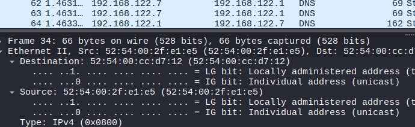

<!--- metadata

title: H1 - Sniff
date: 22.10.2025
slug:
id: ICI013AS3A-3002
week: Week 43
summary: Raportin käydään surfing-secure.pcap-kaappauksen yleiskuvaa ja sen osa-alueita. Tutkitaan TLSv1.3 ja DNS liikennettä. Koitetaan fingerprinttaa käyttäjää hyödyntämällä JA3/4 hasheja ja tunnistetaan muuten kohdetta.
tags: [ "ICI013AS3A-3002", "Network Attacks"]

--->

## x) Lue ja tiivistä. (Tässä x-alakohdassa ei tarvitse tehdä testejä tietokoneella, vain lukeminen tai kuunteleminen ja tiivistelmä riittää. Tiivistämiseen riittää muutama ranskalainen viiva.)

## Karvinen 2025: [Wireshark - Getting Started](https://terokarvinen.com/wireshark-getting-started/)

## Karvinen 2025: [Network Interface Names on Linux](https://terokarvinen.com/network-interface-linux/)

- Ensimmäisessä artikkelissa kerrottiin miten Wireshark asennetaan, miten liikennettä kuunellaan ja miten näitä tietoja tallennetaan tiedostoihin ja miten niitä sieltä voidaan lukea.

- Myös perus filtterit ja `Follow TCP stream` komento oli kerrottu, mitä käytetään eniten.

- Toisessa artikkelissa selitettiin eri verkkoliitäntöjä, mitä tunnisteita niissä on esim. `wl` on wlan verkkoliitäntä. Artikkelissa avataan ne vielä esimerkkien kautta ja kerrotaan komento `ip a` millä omat verkkoliitännät saa tietää omalta koneelta.

---

## a) Linux. Asenna Debian tai Kali Linux virtuaalikoneeseen. (Tätä alakohtaa ei poikkeuksellisesti tarvitse raportoida, jos sinulla ei ole mitään ongelmia. Jos on mitään haasteita, tee täsmällinen raportti)

Asennettu ennestään.

---

## b) Ei voi kalastaa. Osoita, että pystyt katkaisemaan ja palauttamaan virtuaalikoneen Internet-yhteyden.

Aluksi yhteys oli olemassa, sitten se katkaistiin.

Yhteyttä ei ollut ja sen jälkeen kun laitoin yhteyden takaisin päälle samasta paikasta mistä sen aluksi otin pois niin yhteys toimi.

---

## c) Wireshark. Asenna Wireshark. Sieppaa liikennettä Wiresharkilla. (Vain omaa liikennettäsi. Voit käyttää tähän esimerkiksi virtuaalikonetta)

Avasin wiresharkin ja kuuntelin mun omaa verkkokorttia ja tallensin liikenteen missä yritin pingata mun host konetta.

---

## d) Oikeesti TCP/IP. Osoita TCP/IP-mallin neljä kerrosta yhdestä siepatusta paketista. Voit selityksen tueksi laatikoida ne ruutukaappauksesta. (Voit käyttää vastauksesi osana ruutukaappaustasi h0-tehtävästä, mutta tässä tehtävässä tarvitaan myös sanallinen selitys.)

Eli niin kuin aikaisemmassa tehtävässä avasin niin lähetään TCP/IP-mallin korkeimmalta tasolta eli Application kerroksesta, missä näkyy protokollana DNS. Sitten siirryttään transport kerrokseen, missä käytetään UDP protokolla, sitten internet kerrokseen mistä löytyi IPv4 ja siihen liittyvät osoitteet ja lopuksi link kerros, missä näkyy itse laitteiden MAC osoitteet tai tässä tapauksessa niitä ei ole näkyvillä.

---

## e) Mitäs tuli surffattua? Avaa [surfing-secure.pcap](https://terokarvinen.com/verkkoon-tunkeutuminen-ja-tiedustelu/surfing-secure.pcap). Tutustu siihen pintapuolisesti ja kuvaile, millainen kaappaus on kyseessä. Tässä siis vain lyhyesti ja yleisellä tasolla. Voit esimerkiksi vilkaista, montako konetta näkyy, mitä protokollia pistää silmään. Määrästä voit arvioida esimerkiksi pakettien lukumäärää, kaappauksen kokoa ja kestoa.

Tiedosto on 283 pakettia ja se sisältää pääasiallisesti TSLv1.3 ja TCP liikennettä. Seassa on muitakin protokollia. Esimerkiksi DNS pyyntöjä tallentunut, eli käyttäjä `192.168.122.7` osoitteessa hakee verkkosivuja koneellaan. Tässä on pari eri sivua mitä haetaan eli terokarvinen.com, commentero.terokarvinen.com ja terokarvinen.goatcounter.com. Ensiksi käyttäjä ottaa yhteyden `139.168.131.217` sivuun mikä on terokarvinen.com.

Sitten näkyy melko outo ip osoite `3.75.10.80` minkä ajattelin aluksi että voisi olla esim. AWS jonku pilvi serverin osoite mutta rivillä 86 näkyykin serverin SNI mikä on `gc.zgo.at` ja kun itse menin sivulle niin selvisi että se on GoatCounterin käyttämä CDN.

Ja tämän jälkeen melko nopeasti näkyikin että seuraavaksi otetaan yhteyttä eri sivulle: `terokarvinen.goatcounter.com` mikä oli `135.181.139.209` osoitteessa. Tämän jälkeen katsoin liikenteen kokoja ja määriä mitkä oli melko pitkään `1514` pitkiä paketteja mistä päätellen ja aikaisemmasta huomiosta että kyseessä oli CDN tarkoittaa että koneiden välillä lähetettiin jotakin tiedostoa tai jotain dataa kuten kommentti syötettä palvelimelle. Tämän tiedoston lähetyksen jälkeen, mikä ei ollut mikään älyttömän iso, varmaan joku .txt tiedosto tai muu pienikokoinen tiedosto, niin koneet lopettavat yhteydet [FIN, ACK] kättelyillä.

---

## f) Vapaaehtoinen, vaikea: Mitä selainta käyttäjä käyttää? [surfing-secure.pcap](https://terokarvinen.com/verkkoon-tunkeutuminen-ja-tiedustelu/surfing-secure.pcap) (Päivitys 2025-03-31 w14 ma - muutin tehtävän vapaaehtoiseksi Giang:n suosituksesta)

Tässä kohtaa olin jumissa todella pitkään ja kävin pitkää keskustelua ChatGPTn kanssa, että mistä tieto voisi löytyä, kun liikenne on salattua TLS liikennettä ja yleensä tieto löytyy HTTP headerien User-Agent kohdasta. Se osasi vinkata, että jos tiedoista löytyy JA3 tai JA4 hasheja niin niitä käyttämällä voisi selvitä mahdollinen fingerprint.

JA3 ja JA4 ovat siis fingerprinting hasheja, joita käytetään esimerkiksi malwaren ja viruksien tunnistamisessa. Sitten etsin vain työkalun joka näitä hasheja voisi lukea ja löytyi heti kätevästi nettityökalu kuin [JA3.ZONE](https://ja3.zone/). Siihen sitten aloin syöttämään näitä hasheja mitä .pcap tiedostosta löytyi.

Filtteröin käyttäjä koneen IP osoitteen mukaan, ja aloin etsimään sieltä JA3/4 hasheja. Niitä löytyi moniakin. Kokeilin kaikkia ja niistä kaksi antoi vastauksia. Vain JA3 hashit `a195b9c006fcb23ab9a2343b0871e362` ja  `b5001237acdf006056b409cc433726b0` paluttivat vastauksia. Huomasin myös että jostakin syystä tämä hash on siis muuttunu välissä, mutta en tiiä sille syytä. Se muuttui kuitenkin takaisin? Ehkä kaksi eri selainta auki tai jotain?

Nämä vastaukset kuitnekin viittaisivat siis Firefox selaimeen. Vaikka seassa on myös muita kuten Chrome, Chromium ja Opera, niin Firefox on 95% koko määrästä

---

## g) Minkä merkkinen verkkokortti käyttäjällä on? [surfing-secure.pcap](https://terokarvinen.com/verkkoon-tunkeutuminen-ja-tiedustelu/surfing-secure.pcap)

En meinannut millään löytää verkko kortin valmistajaa, koska osoitteiden MAC osoitteen OUI oli jokaisessa `52:54:00` alkuinen, ja Wireshark ei antanut tälle suoraa valmistajaa, minkä se yleensä tekee. Tässä vaiheessa olin tehtävään käyttänyt useita tunteja ja käyny koko tiedoston läpi. Kuitenkin kun käytin semmosta työkalua kuin [MAC Adress Lookup](https://maclookup.app/macaddress) niin sitten onnistuin saamaan edes jotakin infoa esiin mikä se voisi olla. Eli tämän mukaan se olisi Realtek tai mahdollisesti UpTech.

Varmistin tämän vielä Giangin esimerkki raportista, missä oli sama OUI ja siinä näkyi että se olisi ollut Realtek, niin uskon että tämä on oikein. Käytin tähän tehtävään useita tunteja, ja vaikka tiesin, mistä tieto löytyy niin en saanu sitä pitkään aikaan millään mistään irti, ja en ole vieläkään ihan varma, koska MAC Adress Lookup ei antanut myöskään varmaa vastausta.

---

## h) Millä weppipalvelimella käyttäjä on surffaillut? surfing-secure.pcap

## Huonoja uutisia: yhteys on suojattu TLS-salauksella

No sivut mitä löysin jo heti alussa ovat terokarvinen.com, terokarvinen.goatcounter.com, commentero.terokarvinen.com, terokarvinen.goatcounter.com. Nämä olivat eri palvelimet millä käyttäjä kävi, tai käytti edes välillisesti. Tämä tieto löytyi pääasiallisesti kaikista DNS pyynnöistä.

---

## i) Analyysi. Sieppaa pieni määrä omaa liikennettäsi. Analysoi se, eli selitä mahdollisimman perusteellisesti, mitä tapahtuu. (Tässä pääpaino on siis analyysillä ja selityksellä, joten liikennettä kannattaa ottaa tarkasteluun todella vähän - vaikka vain pari pakettia. Gurut huomio: Selitä myös mielestäsi yksinkertaiset asiat.)

Tässä otin otokseksi tosi pienen määrän paketteja mitkä liikkuivat sillä hetkellä kun tehtävää tein. Koska en tehnyt kohde koneella paljoa mitään. Tässä kuitenkin huomataan, että ainoo liikenne mikä syntyy on mun host koneen `UDP` ja `ARP` liikenne mikä vuotaa läpi virtual machineen. Joitakin huomioita, mitä voisin päätellä, niin UDP pyynnöt mitä lähetetään on todennäköisesti jonkun sovelluksen kuten Steamin tai vastaavan lähettämää.

`MDNS` pyynnöt liittyvät Spotify sovelluksen device discovery ominaisuuteen, eli se etsii samasta domain verkosta laitteita, jotka voisivat käyttää myös spotifyta. Toiminto toimii esimerkiksi silleen että musiikin voi siirtää laitteelta laitteelle, kun vaihtaa laitetta. Tähän liittyen liikenteessä on mys `SSDP` protokolla, mikä oletettavasti liittyy tähän spotifyn toimintaan, kun se etsii muita laitteita.

Lopuksi kuvassa näkyy `ARP` pyynnöt, mikä on itsessään melko normaali taustatoiminto kanssa. Tässä sama homma, eli todennäköisesti joku sovellus yrittää etsiä vanhaa osoitetta, mitä ei enään ole käytössä tai sitten vain testaa et löytyyks tämmöstä osoitetta edes. Varmaa vastausta tästä ei ole, koska se ei saanut vastausta siihen, joten perus verkkoliikennettä.

Eli tässä ei oikeasti ollut mitään mielenkiintoista liikennettä.

---

### Lähteet

#### 1. Karvinen 2025. Verkkoon tunkeutuminen ja tiedustelu. Luettavissa: [[https://terokarvinen.com/verkkoon-tunkeutuminen-ja-tiedustelu/]] Luettu: 21.10.2025

#### 2. Karvinen 2025: Wireshark - Getting Started. Luettavissa: [[https://terokarvinen.com/wireshark-getting-started/]] Luettu: 21.10.2025

#### 3. Karvinen 2025: Network Interface Names on Linux. Luettavissa: [[https://terokarvinen.com/network-interface-linux/]] Luettu: 21.10.2025

#### 4. MAC Address Lookup. Luettavissa: [[https://maclookup.app/macaddress]] Luettu: 21.10.2025

#### 5. Golovanov 2025: JA3.ZONE. Luettavissa: [[https://ja3.zone/]] Luettu: 21.10.2025

#### 6. Giang Le 2024: H1 Sniff. Luettavissa: [[https://github.com/gianglex/Courses/blob/6e74794c2e27752698f9bff0455a927843d9f934/Verkkoon-Tunkeutuminen-ja-Tiedustelu/h1-sniff.md#f-mit%C3%A4-selainta-k%C3%A4ytt%C3%A4j%C3%A4-k%C3%A4ytt%C3%A4%C3%A4]] Luettu: 21.10.2025
