<!--- metadata

title: H2 - Lempiväri: violetti
date: 30.10.2025
slug:
id: ICI013AS3A-3002
week: Week 44
summary: Analysoidaan Apache-weppipalvelimen lokeja, nmap-skannauksien havaitsemimista sekä Wireshark-verkkoliikennekaappausta. Keskeinen osuus käsittelee nmap:n peittämistä: käyttäjäagentin muuttamista, "nmap"-merkkijonojen poistamista skriptitiedostoista ja SSH-palvelimen skannauksessa esiintyvien identifikaatioiden piilottamista.
tags: [ "ICI013AS3A-3002", "Network Attacks"]

--->

## x) Lue ja vastaa lyhyesti kysymyksiin. Tässä alakohdassa x ei tällä kertaa tarvitse lukea artikkeleita kokonaan, ei tarvitse tiivistää niitä, eikä tehdä testejä koneella

## - Selitä tuskan pyramidin idea 1-2 virkkeellä. Bianco 2013: [Pyramid of Pain](http://detect-respond.blogspot.com/2013/03/the-pyramid-of-pain.html). (Katso eritoten pyramidin kuvaa.)

## - Selitä timanttimallin (Diamond Model) idea 1-2 virkkeellä. Tekijä esittelee sen aika juhlallisesti, voit myös etsiä yksinkertaisempia artikkeleita hakukoneella tai kelata suoraan timantin kuvaan. Caltagirone et al 2013: [Diamond Model](https://www.threatintel.academy/wp-content/uploads/2020/07/diamond-model.pdf)

- Tuskan pyramidissa arvoitetaan eri indikaattorit. Nämä ovat hyökkääjän eri tasoja, millä he toimivat ja mitä vastaan voidaan suojautua. Ideana tässä, että mitä korkeamman tason indikaattori pystytään eliminoimaan, sitä enemmän tuskaa se aiheuttaa hyökkääjälle.

- Timanttimallissa taas luodaan kokonaiskuva hyökkäyksestä. Siinä on oas-alueina hyökkääjä, toiminnallisuus, infra ja kohde. Timanttimallin perus idea on analysoida koko hyökkäyksen kulkua, syitä ja miten eri osa-alueet ovat yhteydessä toisiinsa.

- Timanttimalli on loistava tapa profiloida hyökkäyksiä, ja alkaa keräämään tietokantaa eri hyökkäyksistä ja luomaan yksittäisiä hyökkääjä profiileja.

---

## a) Apache log. Asenna Apache-weppipalvelin paikalliselle virtuaalikoneellesi. Surffaa palvelimellesi salaamattomalla HTTP-yhteydellä, http://localhost. Etsi omaa sivulataustasi vastaava lokirivi. Analysoi yksi tällainen lokirivi, eli selitä sen kaikki kohdat. (Jos Apache ei ole kovin tuttu, voit tätä tehtävää varten vain asentaa sen ja testata oletusweppisivulla. Eli ei tarvitse tehdä omia kotisvuja tms.)

Latasin apache2 palvelimen virtuaalikoneeseen komennolla

```bash
sudo apt install apache2 -y
```

Asennuksen jälkeen tarkistettiin palvelimen tila ja käynnistettiin se

```bash

sudo systemctl status apache2
sudo systemctl start apache2

```

Kun palvelin oli asennettu ja pystyssä, selvitin mistä voin löytää apachen eri logi tiedostot ja miten niitä käytetään.

```bash

cd /var/log/apache2/
tail -f access.log

```

## (4.)

Löysin oikean paikan ja aloin live seuraamaan access tiedostoa, ennen kun menin sivulle.

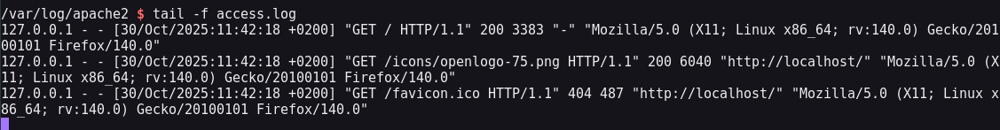

Tässä yhden pyynnön logi rivit. Ensimmäisellä rivillä rivi alkaa IP osoitteella. Seuraavaksi näkyy kaksi `- -` mitkä ovat tässä tapauksessa tyhjiä rivejä, mutta mikäli sivulla olisi autentikaatio käytössä, se data löytyisi näistä kohdista. Sitten tulee tarkka aika, milloin tämä pyyntö on tapahtunut. Sitten esitetään pyyntö tyyppi, tässä tapauksesa se on `GET /` eli haetaan index etusivua. Pyyntö on onnistunut joten saadaan `200` koodi ja tämän perään vielä tiedoston koko, mikä tässä tapauksessa 3383 byteä.

Sitten saadaan taas `-` eli tässä pyynnössä tyhjä mutta, se on `refferer` kohta, eli kertoo suosittelija sivun mistä pyyntö on saanut alkunsa. Ja lopuksi on user-agent tietoja eli käyttäjän fingerprintti. Mitä selainta se käyttää ja mitä järjestelmää se käyttää.

---

## b) Nmapped. Porttiskannaa oma weppipalvelimesi käyttäen localhost-osoitetta ja 'nmap -A' päällä. Selitä tulokset. (Pelkkä http-portti 80/tcp riittää)

Skannattiin palvelin

```bash

sudo nmap -A -p 80 -v localhost

```

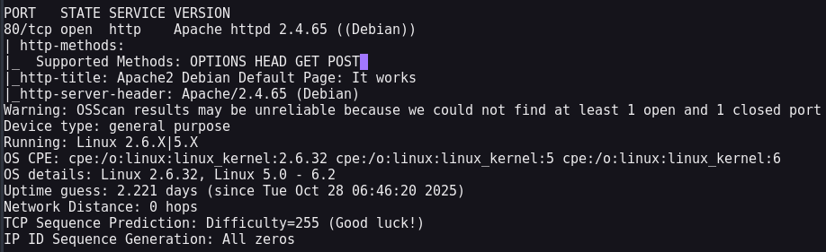

Sieltä saattiin tulokset, ei mitään ihmeellistä saatiin kaikki perus tiedot palvelimelta, mutta logi tiedostossa tulikin paljon liikennettä näkyviin.

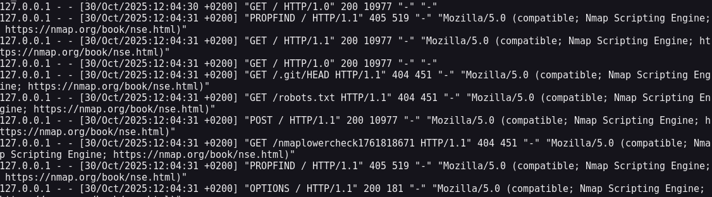

Tässä pieni otos kaikista logeista, mutta näkyy idea. Eli melko helppoa tunnistaa että on nmap skannaus kyseessä kun heti toisessa pyynnössä user-agent kohdassa lukee `nmap.org` ja `Nmap Scripting Engine`. Koska kyseessä oli `-A` scannaus, niin nmap skannasi useaan kertaan lähettämällä useita eri pyyntöjä. Tällä tavalla se pystyy selvittämään just eri tietoja palvelimesta.

Huomiona, ihan ensimmäinen pyyntö mikä näkyy, ei ole nmap tunnistettu, vaikka se kuitenkin on nmap pyyntö. Nmap siis varmistaa ihan ensimmäiseksi, että palvelu on edes olemassa ja että se saa siihen yhteyden, ennen kun se lähettää mitään muita pyyntöjä palvelimelle. Nmap:in päässä tämä on `SYN Stealth Scan`.

---

## c) Skriptit. Mitkä skriptit olivat automaattisesti päällä, kun käytit "-A" parametria? (Näkyy avoimien porttinumeroiden alta, http-blah, http-blöh...)

Tässä skannauksessa käytettiin: `http-methods, http-title & http-server-header` scriptejä.

---

## d) Jäljet lokissa. Etsi weppipalvelimen lokeista jäljet porttiskannauksesta (NSE eli Nmap Scripting Engine -skripteistä skannauksessa). Löydätkö sanan "nmap" isolla tai pienellä? Selitä osumat. Millaisilla hauilla tai säännöillä voisit tunnistaa porttiskannauksen jostain muusta lokista, jos se on niin laaja, että et pysty lukemaan itse kaikkia rivejä?

Tätä jo avasinkin b) tehtävässä, mutta nmap löytyi selvästi eri muodoissa logi tiedostoista. Erityisiä filttereitä tai hakuja mitä käyttäisin olisi just tämä `Nmap Scripting Engine` mutta myöskin kaikki `SYN` yhteydet, mitä palvelin saa. Koska SYN paketteja ei lähetetä yleensä, minkään todellisen palvelun toimesta, on se erittäin huomiota herättävää, ja haluaisin heti tietää kaikki tämmöiset pyynnöt.

Tätä voitaisiin filtteröidä esimerkiksi user-agent tiedon puutteella. Eli, jos user-agent tietoja ei löydy, niin sillä flagataan nämä pyynnöt. Manuaalisesti esimerkiksi tälläinen filtteri voisi näyttää jotakuinkin tältä:

```bash

tail -f access.log | grep '"-"$'

```

Tässä komennossa etsitään `"-"` kohtaa tiedostosta ja `$` määrittää että tätä etsitään vain viimeisestä kentästä. Eli vaikka se esintyis muualla, niin sillä ei ole merkitystä koska sen pitää olla viimeisessä kentässä. Tätä voidaan havainnoida kuvasta, missä näkyy viimeinen kenttä punaisella, mutta ei aikaisempi, vaikka sisältö on täysin sama.

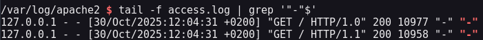

---

## e) Wire sharking. Sieppaa verkkoliikenne porttiskannatessa Wiresharkilla. Huomaa, että localhost käyttää "Loopback adapter" eli "lo". Tallenna pcap. Etsi kohdat, joilla on sana "nmap" ja kommentoi niitä. Jokaisen paketin jokaista kohtaa ei tarvitse analysoida, yleisempi tarkastelu riittää

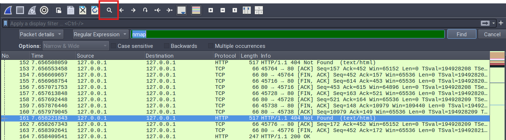

Tämä oli noin 7.7 sekunnin skannaus ja tästä samaisesta skannauksesta tuli 343 pakettia. Tiedostosta me päästään etsimään ihan hakusanoilla klikkaamalla suurennuslasi kuvaketta, valitsemalla `string` tai `Regular Expression`. Tämän jälkeen kun klikkaa `Find` nappia, niin valitaan ensimmäinen paketti, missä kyseinen sana esiintyy. Tässä tapauksessa se on rivillä 94 ja viimeinen esiintyminen on rivillä 317.

Näistä paketeista itselle ei pistänyt mitään muuta ihmeellistä silmään, kun että tässäkin näkyy User-Agent kohdassa NSE ja että kyselyn lähtöportti vaan vähän muuttuu, eli kaikki pyynnöt eivät tule samasta portista. Nämä näkyivät myös vain HTTP pyynnöissä, niin filtteröimällä vain HTTP pyynnöt me saadaan nopea käsitys siitä, mitä kaikkea Nmap on kokeillut. Muita sen suurempia huomioita en osannut näistä pyynnöistä tehdä.

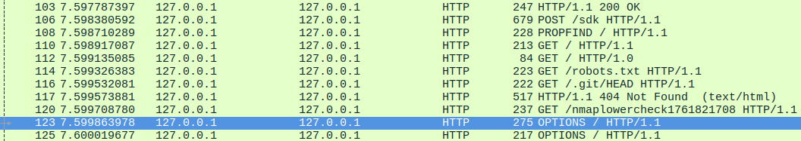

Muuta huomioitavaa oli aikaisemmin mainitsemani SYN paketit. Ne näkyivät nyt myöskin ja olivat erittäin tunnistettavia, koska SYN Stealth Scan ei ikinä muodosta yhteyttä, niin se palauttaa aina RST paketin, minkä perusteella on helppoa huomata, missä on palvelinta skannattu.

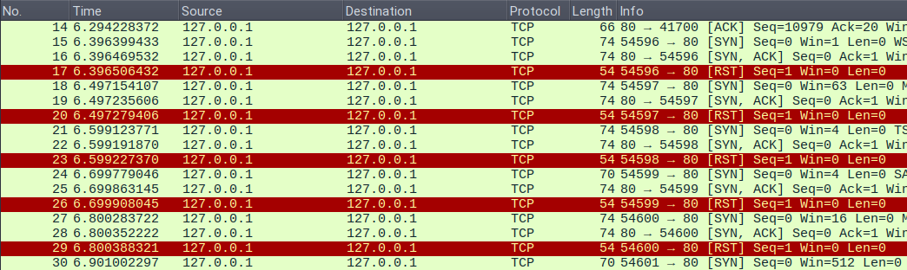

Näistä ei siis itsessän saa mitään irti, mutta kun tietää miten skannaus toimii, niin nämä paketit pistää heti silmään, ja voi antaa nopean katsauksen siitä mitä mahdollisesti tapahtuu/on tapahtunut.

---

## f) Net grep. Sieppaa verkkoliikenne 'ngrep' komennolla ja näytä kohdat, joissa on sana "nmap"

Nopealla man sivujen silmäyksellä selvisi, miten ngreppiä ajetaan. En ollut aikaisemmin käyttänyt työkalua. Komennolla

```bash

sudo ngrep -I wiresharking.pcapng -C -i nmap

```

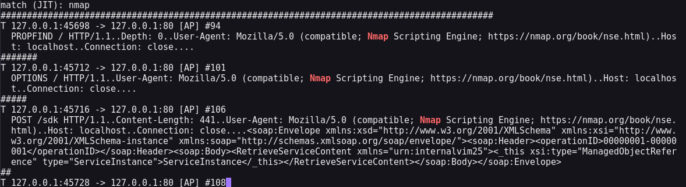

saatiin filtteröity tulos. En ajanut tätä livenä, vaan käytin jo aikaisemman tehtävän .pcap tiedostoa.

---

## g) Agentti. Vaihda nmap:n user-agent niin, että se näyttää tavalliselta weppiselaimelta

Nopealla googlauksella DuckDuckGo:n tekoäly avustin antoi vastauksen kysymykselle `"change nmap user agent"`. Vastaus: "To change the user agent in Nmap, you can use the --script-args option with the http.useragent parameter, like this: `--script-args http.useragent="YourCustomUserAgent"`. This allows you to specify a custom user agent string for your scans."

```bash

sudo nmap localhost -A -p 80 -v --script-args http.useragent=""Mozilla/5.0 (X11; Linux x86_64; rv:140.0) Gecko/20100101 Firefox/140.0"

```

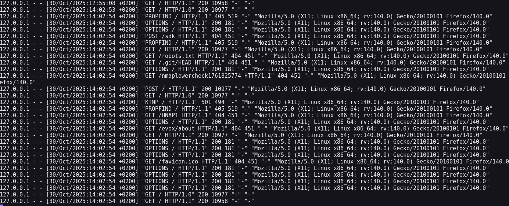

Nyt liikenne näyttää User-Agentin perusteella normallilta, ainoona epäilyttävänä asiana on juuri nämä SYN, RST paketit ja että kaikki pyynnöt on tapahtunu samalla millisekunnilla, eli ihminen ei ole voinut hakea näitä kaikkia luonnollisestikkaan.

---

## h) Pienemmät jäljet. Porttiskannaa weppipalvelimesi uudelleen localhost-osoitteella. Tarkastele sekä Apachen lokia että siepattua verkkoliikennettä. Mikä on muuttunut, kun vaihdoit user-agent:n? Löytyykö lokista edelleen tekstijono "nmap"?

Kaappasin liikennettä ja nyt nmap löytyi hakusanalla vain yhdestä paketista. Rivillä 111, vaikka User-Agent onkin obfuskoitu piiloon niin nmap tekee GET pyynnön johonkin lowercheck osoitteeseen. Sama näkyy myös logi tiedostossa.

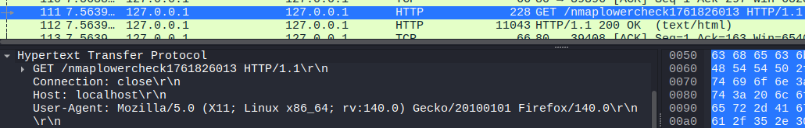

---

## i) Hieman vaikeampi: LoWeR ChEcK. Poista skritiskannauksesta viimeinenkin "nmap" -teksti. Etsi löytämääsi tekstiä /usr/share/nmap -hakemistosta ja korvaa se toisella. Tee porttiskannaus ja tarkista, että "nmap" ei näy isolla eikä pienellä kirjoitettuna Apachen lokissa eikä siepatussa verkkoliikenteessä. (Tässä tehtävässä voit muokata suoraan lua-skriptejä /usr/share/nmap alta, 'sudoedit'. Muokatun version paketoiminen siis rajataan ulos tehtävästä.)

Tehtävän annosta lähdin heti etsimään kyseistä nmaplowercheck:iä eri tiedostoista. Aluksi etsin sitä `nmap-service-probes` tiedostosta, mutta sielät ei löytynyt mitään ja vasta kun tein laajemman haun kaikista hakemiston tiedostoista niin löyty oikea paikka. Komennossa `-R` lukee kaikki hakemiston tiedostot recursiivisesti ja seuraa kaikkia symboolisia linkkejä.

```bash
sudo grep -R "nmaplowercheck" /usr/share/nmap --line-number
```

Lähdinkin siis muuttamaan tiedostoa itseään. Eli tämä oli tiedoston 2625 rivillä. Sielät kun muutti vaan muuttujan nimen joksikin muuksi, esim. `favicon` ja tallensin tiedoston, niin nyt tämä kyseinen GET pyyntö on vähemmän huomiota herättävä favicon pyyntö eikä `nmap` löydy mistään.

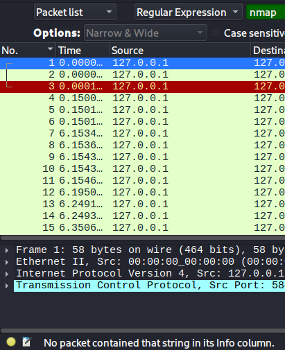

Kuvan ala osassa filtterin varmistus, että mitään ei löytynyt.

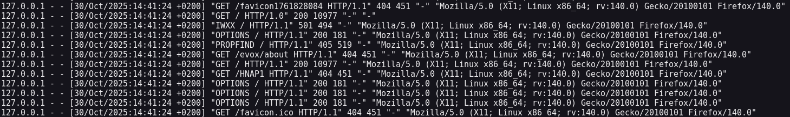

---

## j) Vapaaehtoinen, vaikea: Invisible, invincible. Etsi jokin toinen nmap:n skripti, jonka verkkoliikenteessä esiintyy merkkijono "nmap" isolla tai pienellä. Muuta nmap:n koodia niin, että tuo merkkijono ei enää näy verkkoliikenteessä

Käynnistin SSH palvelimen, ja skannasin sen `-A` parametrilla myös. Sieltä löytyi muutama paikka missä näkyy nmap, muutamissa eri paketeissa.


Kyseessä on siis SSH-1.5 Protokolla, minkä käyttäjä tekee palvelimen kanssa. Sitten lähdin tekemään samallaisen grep pyynnön kun aikaisemmin, jotta löytäisin oikeat tiedostot mistä muuttaa näitä muuttujia.

```bash
sudo grep -R "SSH-1.5" /usr/share/nmap --line-number
sudo grep -R "SSH-2.0" /usr/share/nmap --line-number
```

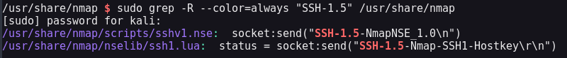

Sitten vain muutin tuolta pois Nmap tunnisteet muuttujista ja enää logi tiedostoissa eikä verkko skannauksessa ei näkynyt yhtään mitään. Kun tein uuden skannauksen.

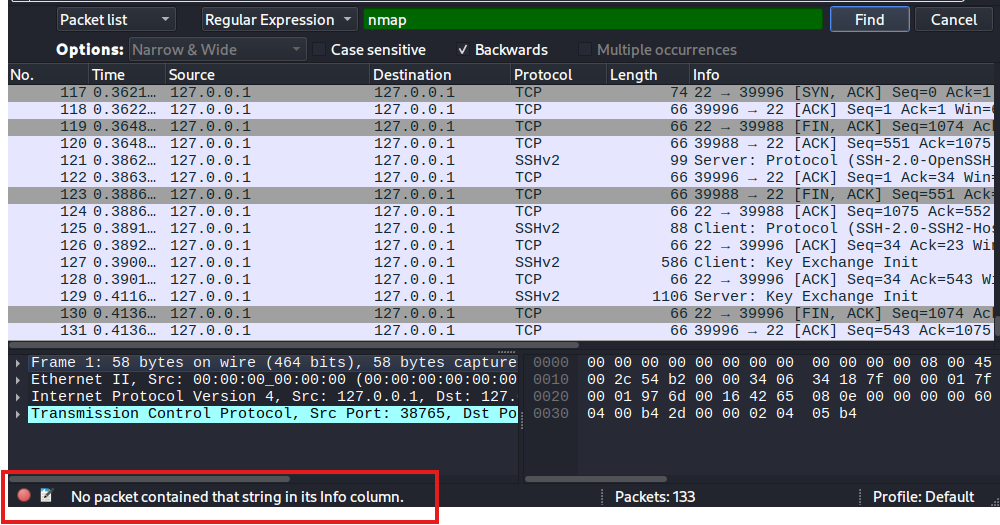

---

### Lähteet

#### 1. Karvinen 2025. Verkkoon tunkeutuminen ja tiedustelu. Luettavissa: [[https://terokarvinen.com/verkkoon-tunkeutuminen-ja-tiedustelu/]] Luettu: 30.10.2025

#### 2. Bianco 2014. The Pyramid of Pain. Luettavissa: [[http://detect-respond.blogspot.com/2013/03/the-pyramid-of-pain.html]] Luettu: 30.10.2025

#### 3. Caltagirone et al 2013. The Diamond Model of Intrusion Analysis. Luettavissa: [[https://www.threatintel.academy/wp-content/uploads/2020/07/diamond-model.pdf]] Luettu: 30.10.2025

#### 4. Dancuk 2024. Apache Log Files: How to View, Configure & Use Them. Luettaavissa: [[https://phoenixnap.com/kb/apache-access-log]] Luettu: 30.10.2025
