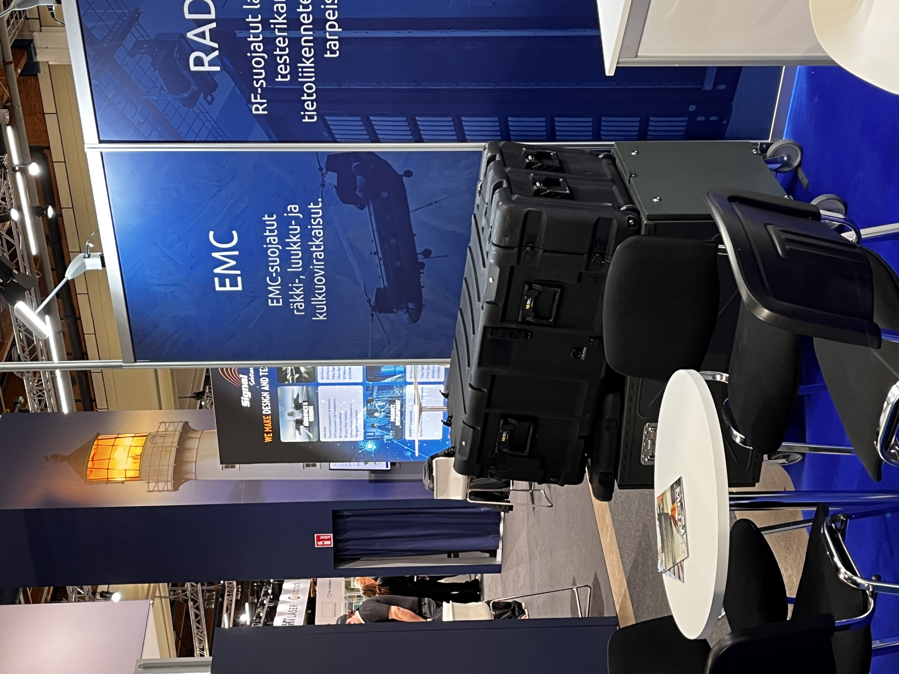

<!--- metadata

title: H3 - Messuilla
date: 4.11.2025
slug:
id: ICI013AS3A-3002
week: Week 45
summary: Vierailu Cyber Security Nordic 2025 messuilla. Tapasin monia yrityksiä ja verkostoiduin. Voitin myös paidan reversec pisteellä.
tags: [ "ICI013AS3A-3002", "Network Attacks"]

--->

## x) Osallistu [Cyber Security Nordic](https://cybersecuritynordic.messukeskus.com/) -tapahtumaan. Läksyksi tästä tapahtumasta teidän tulee tehdä lyhyt raportti siitä, mitä yrityksiä tapasitte, mitä mielenkiintoisia palveluita / tuotteita (max 3kpl) löysitte. (Tässä alakohdassa ei tarvitse tehdä testejä koneella.)

Taphtumassa oli montaa mielenkiintoista yritystä. Kävin juttelemassa monien eri yritysten kanssa ja sain kasvatettua verkostoani kivasti. Päälimmäisenä mulle jäi mieleen yrityksistä WithSecure kenen kanssa mulla oli hyvät keskustelut, Insta jolta sain hyviä vinkkejä ja Truesec, jotka oli erittäin mukavia.

Koska en ollut ihan kohderyhmää niin en näiden palveluista niin paljoa kysellyt kun kaikki tekee vähän kaikkea. Mutta eri tuotteet ja palvelut mitkä pisti silmään olivat YesWeHack tyyppien bug bounty alusta, mikä vaikutti mielenkiintoiselta. Toisena varmaan teknologia mesujen puolella oleva Ocotec:in EMP suojatut ratkaisut ja etenkin niiden kenttä käyttöön soveltuva minirack ratkaisu.

Kunniamainintana SSH oli paikalla, mutta en käynyt niiden kanssa juttelemassa. Voitin myös paidan reversec pisteellä, kun ratkaisin niiden pinen kryptaus haasteen.

---

### Lähteet

#### 1. Karvinen 2025. Verkkoon tunkeutuminen ja tiedustelu. Luettavissa: [[https://terokarvinen.com/verkkoon-tunkeutuminen-ja-tiedustelu/]] Luettu: 4.11.2025
