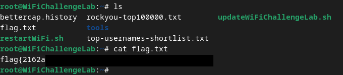
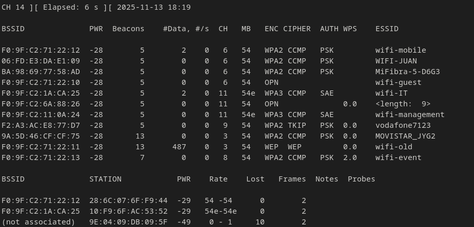
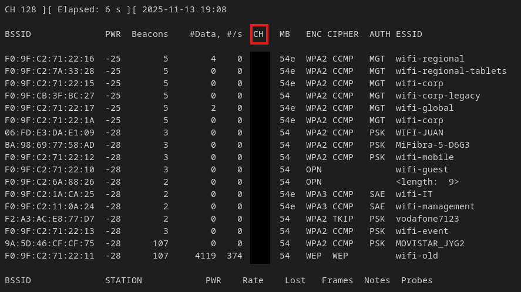
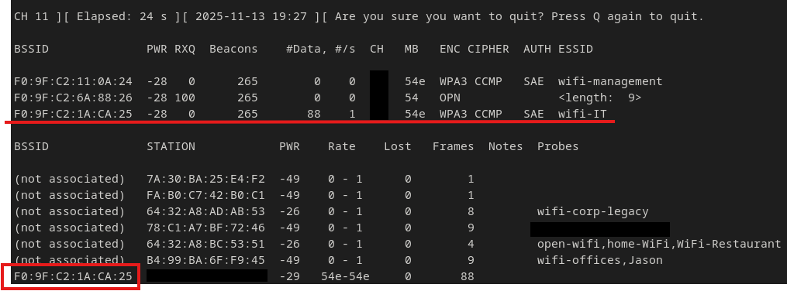
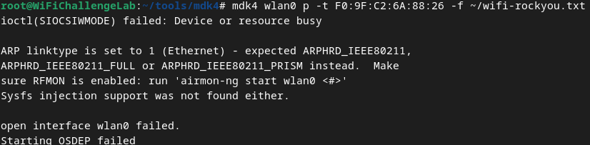

<!--- metadata

title: H6 - WiFi
date: 14.11.2025
slug:
id: ICI013AS3A-3002
week: Week 46
summary: Tutustuimme WiFi Challenge Lab 2.1 -harjoitusympäristöön ja suoritimme langattoman verkon hyökkäystehtäviä. Opin käyttämään työkaluja kuten airodump-ng, airgeddon ja mdk4 verkon skannaukseen, MAC-osoitteiden tunnistukseen ja SSID-tutkintaan. Harjoituksissa käsiteltiin WiFi-verkkojen haavoittuvuuksia ja avoimuutta.
tags: [ "ICI013AS3A-3002", "Network Attacks"]

--->

## a) Tutustu [wifi challenge lab 2.1](https://lab.wifichallenge.com/) harjoitus ympäristöön ja käytä tarvittaessa hyväksesi jo olemassa olevia ohjeita.

Aloin luomalla käyttäjän alustalle. Tämän jälkeen lähdin etsimään paikkaa, mistä saan ladattua harjoitus ympäristön. Ja se löytyi lopulta [[https://r4ulcl.com/posts/walkthrough-wifichallenge-lab-2.0/]] linkin takaa. Sielä kun sen sain ladattua ja asennettua niin päästiin itse asiaan.


Kun sain koneen käyntiin lopetin aikaisemman ohjeen seurannan ja menin suoraan asiaan. Eli [WifiChallenges](https://lab.wifichallenge.com/challenges) sivulta löytyivät kaikki haasteet. Aloitin ensimmäisestä 00 "Introduction" haasteesta.

## 00. What is the contents of the file /root/flag.txt on the VM?

Aloitin muuttamalla itselleni sudo oikeudet komennolla `sudo su` ja sitten vain `cd` komennolla niin pääsin haluttuun root kansioon josta löytyi lippu.



## 01. What is the channel that the wifi-global Access Point is currently using?

Tässä tehtävässä pitää selvittää kyseisen AP WiFi channel. Täs kohtaa olin ihan hukassa, koska kaikki tämä oli täysin vierasta mulle. Tiesin että mun pitää kyseisiä työkaluja käyttää niin lähdin lukemaan vaan eri työkaluista vaan googlaamalla niitä. Tästä ei paljoa apua ollut, koska mikään ei suoraan antanu vastausta. Niin lähdin kokeilemaan vaan työkaluja ja no omaksi onneks aika nopeasti selvisi että `Airgeddon` on työkalu, millä tämä voisi onnistua. Tämä on siis tämmönen langattoman verkon monitoimityökalu, mikä sisällyttää monia eri työkaluja.

Tämä alkoi selventyä kun luin käyttöohjetta Airgeddonista. Siinä mainittiin tämä network scanner `airodump-ng`. Tätä mä sitten lähdin kokeilemaan. Ja sieltähän saatiin jo jotakin vastausta.



Ei kuitnekaan löydy ihan sitä wifi-global kanavaa mitä etsitään. Luin sitten airodump-ng:n man sivuja ja sieltä löysin option `-b --band` minkä avulla voidaan valita taajuudet mitä halutaan kuunella. Ja vaihtoehdolla `abg` valitaan kaikki. `b` ja `g` käyttää 2.4Ghz ja `a` käyttää 5GHz taajuutta. Sitten vain uutta yritystä.

Ja sieltä se sitten löytyi kun erikseen mainitsin että haluan kaikilla kanavilla kuunneltavia wifi APita.



## 02. What is the MAC of the wifi-IT client?

Sitten lähdin tutkimaan mistä voisi löytää MAC osoitteita. Ja hieman aikaa mulla meni, mutta muutamien kokeilujen jälkeen selvisi, että samalla airodump-ng työkalulla voidaan tunnistaa eri client käyttäjien MAC osoitteita myös. Helpottaakseni työtä rajasin tämän haun `-c` optiolla, mikä tarkoittaa kanavaa. Tällä sain vain halutun kanavan minkä tietoja me halutaan saada tietää.

Tässä kohtaa me yritetään etsiä samaa BSSID kohtaa mikä olisi sama ja sitä kautta `Station` kolumnista me voidaan löytää MAC osoitteet.



## 03. What is the probe of 78:C1:A7:BF:72:46?

Tämä tehtävä meni äkkiä, koska tämän kyseisen kohteen MAC osoite löytyi aikaisemmasta skannauksesta ja näkyy samaisissa tuloksissa. `Probes` kolumnilla me löydetään oikea vastaus ja sieltä saatiin flagi! Flagi löytyy aikaisemmasta kuvasta kohdasta mikä on peitetty.

## 04. What is the ESSID of the hidden AP (mac F0:9F:C2:6A:88:26)?

Tähän jäin jumiin pidemmäksi aikaa. En meinannut mitenkään tajuta, mitä mun pitää tässä tehdä niin pidin pidemmän tauon ja palasin tehtävien ääreen muutamien tuntien päästä.

Sillon kun aloin perehtymään uudestaan tähän, tajusin että tämä haluttu MAC osoite ei antanut mitään probe dataa ulos. Siellä on muutamia vaihtoehtoja, mutta idea heräsi että voisiko tämä AP palauttaa sen ESSID jos sinne fuzzaa probe datalla client pyyntöjä. Sit lähdin etsimään työkaluista työkalua joka voisi tämmöistä edes tehdä.

Luin README.md tiedostoja lähinnä, että mitä eri työkalut edes tekevät ja mdk4 työkalun kohdalla `Attack Mode` kohdassa löytyi oikea työkalu kun `ATTACK MODE: p` tekee SSID probing hyökkäyksiä.

Työkalu oli tosiaan vieras itselle mutta onneksi README.md tiedostossa oli tosi hyvät ohjeet sille, miten työkalua ajetaan ja mite njuurikin jokainen eri hyökkäys mode toimii.

Siinä sit selvisi että mä tarvitsen jonkun sanalistan `-f` ja sitten kohde MAC osoitteen `-t`. Tehtävässä luki että rockyou listalla pitäisi pärjätä niin lähdin sitä kokeilemaan ensiksi.

```bash
mdk4 wlan0 p -t F0:9F:C2:6A:88:26 -f ~/rockyou-top100000.txt
```

Täs ei kuitenkaan tapahtunu mitään hetkeen niin mietin että onko mulla jokin väärin ja en tajunnu ollenkaan. Täs vaiheessa mä katoin vinkkiä aikaisemmasta walktrough ohjeesta ja olin oikeilla jäljillä. Virheeni kuitenkin oli, että en ollut tajunnut muokata sanalistaa sen mukaan että siellä olisi kohteeseen sopivasti `wifi-` alkupääte kaikkien sanojen edessä. Noh sitten muutin sen samalla komennolla mikä kyseisessä walktroughssa oli:

```bash
cat ~/rockyou-top100000.txt | awk '{print "wifi-" $1}' > ~/wifi-rockyou.txt
```

Laitoin koneen ajamaan uudestaan. Mutta ei mitään. Tässä vaiheessa ajattelin että pakko vika olla palvelussa, niin käynnistin koko homman uudestaan. Tämän jälkeen kun ajoin komennon uudestaan, sainkin hyödyllisen vastauksen.



Tästä selvisi että pitää ajaa komento `airmon-ng start wlan0`. Noh tässä kohtaa haasteista huolimatta sain sen ajettua nytten, mutta en saanut siitä silti mitään vastausta ikinä. Päätin sit lopulta luovuttaa tässä kohtaa ja aijon palata näihin tehtäviin tulevaisuudessa. Koska tykkään miten tämä alusta on rakennettu.

[(Laorden 2023)](https://r4ulcl.com/posts/walkthrough-wifichallenge-lab-2.0/)

---

## b) Kirjoita raportti siitä mitä opit ja mitkä asia yllättivät sinut kun tutustuit harjoitukseen.

No opin jo tosi paljon alkeita eri wifi hyökkäys työkaluista, ja tämä on osa-alue missä haluan parantua entisestään. Tuntuu että wifi on hyvinkin herkkä kaikelle ja sen kanssa tehdään paljon virheitä ja on laihoja sääntöjä.

Teknisiä taitoja mitä opin niin opin käyttämään alkeellisesti eri työkaluja kuten airodump-ng, airgeddon ja mdk4 vaikkakin en sitä koskaan saanut toimimaan. Siitä huolimatta, koen että tämä on osa-alue missä mulla on paljon kehitettävää ja vähän jopa yllätti miten vähän mä tästä tiedän.

Harjoituksia on myös hyvä määrä niin tässä varmasti ehtii oppimaan sitä sun tätä langattomista verkoista, kun näitä lähtee paremmin opiskelemaan omalla ajalla.

## c) Miten suhtautumisesi WLanin turvallisuuteen muuttui sen jälkeen kun teit harjoitukset?

No lähinnä mua rupes pelottamaan, miten paljon tietoa wifi verkosta voi client saada tietää ja miten avointa kaikki on. En kyllä luota ollenkaan omaan wifi verkkoon, niin olen erittäin tyytyväinen että olen sen eristänyt ihan omaan osioon eikä se nää fyysisesti mitään.

Pakko sanoo kyl et menin katsomaan oman wifi APn kaikki asetukset ja tilan. Ja kovettamaan sen parhaan mukaan kun tulin nyt vähän vainoharhaseksi.

---

### Lähteet

#### 1. Karvinen 2025. Verkkoon tunkeutuminen ja tiedustelu. Luettavissa: [[https://terokarvinen.com/verkkoon-tunkeutuminen-ja-tiedustelu/]] Luettu: 13.11.2025

#### 2. Laorden 2023. Walkthrough WiFiChallenge Lab v2.0. Luettavissa: [[https://r4ulcl.com/posts/walkthrough-wifichallenge-lab-2.0/]] Luettu: 13.11.2025

#### 3. Luettavissa: [[https://lab.wifichallenge.com/challenges]] Luettu: 13.11.2025

#### 4. Airgeddon. Airgeddon Github. Luettavissa: [[https://github.com/v1s1t0r1sh3r3/airgeddon]] Luettu: 13.11.2025

#### 5. Mildly Offensive InfoSec. Airgeddon: Setup & Use Walkthrough. Luettavissa: [[https://thecurious.cloud/blog/2024/05/25/airgeddon-setup--use/]] Luettu: 13.11.2025