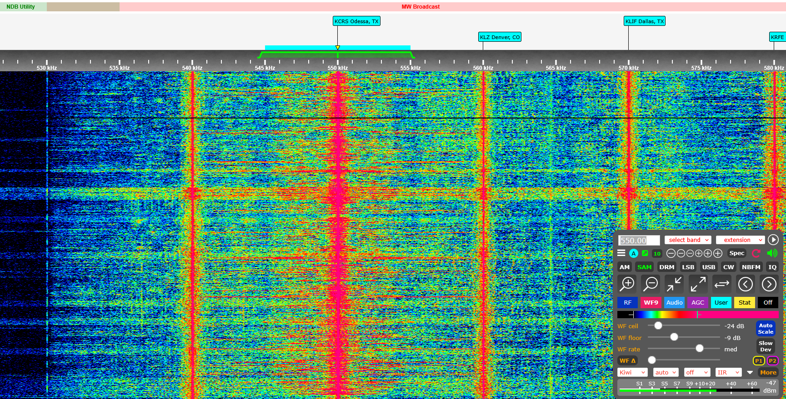
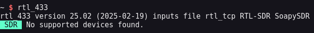
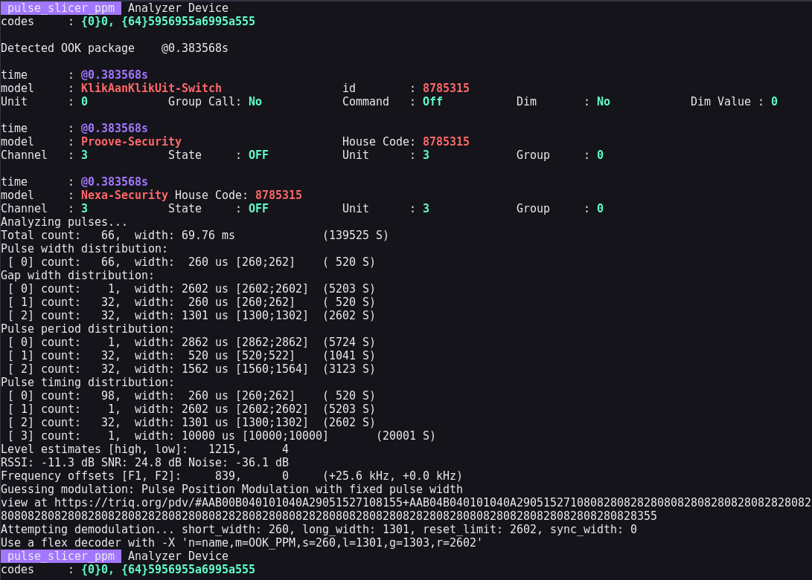
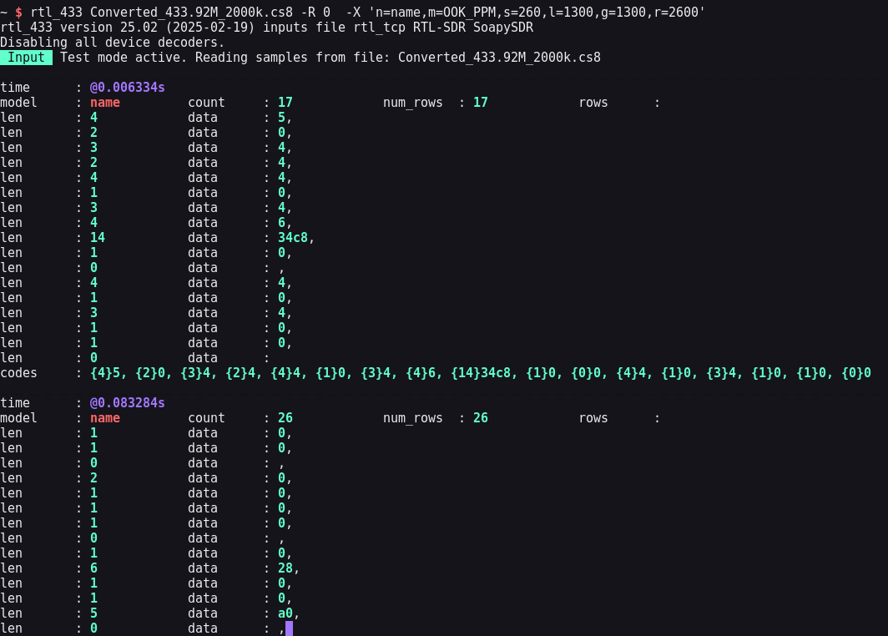
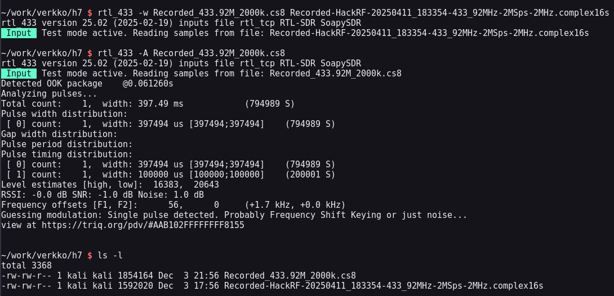
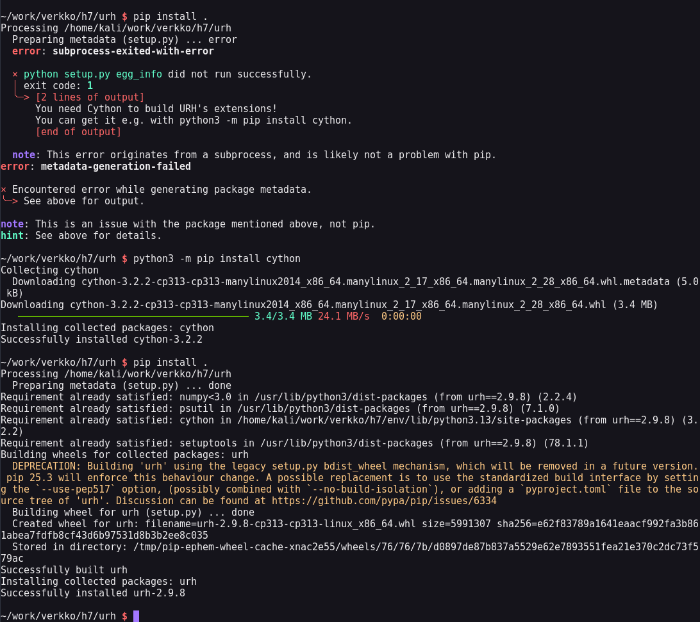
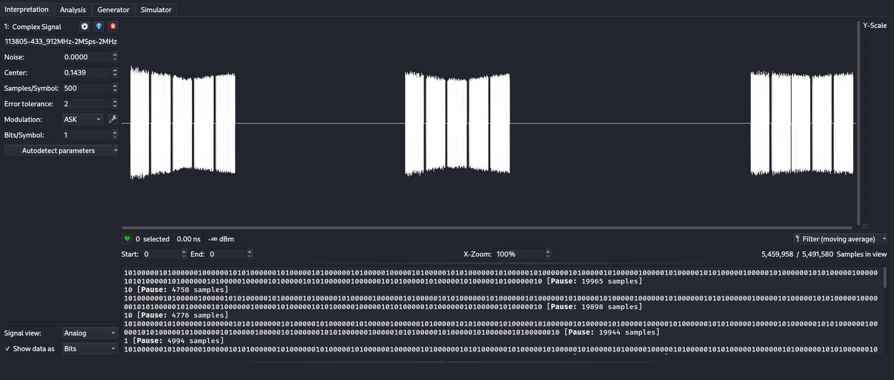
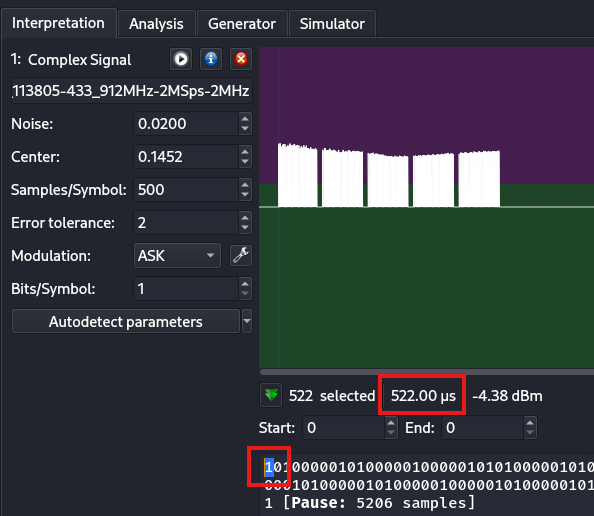

<!--- metadata

title: H7 - Aaltoja harjaamassa
date: 3.12.2025
slug:
id: ICI013AS3A-3002
week: Week 49
summary: 433 MHz -SDR-signaaleja tutkittiin WebSDR:n, rtl_433:n ja URH:n avulla. Julkinen lähetys kuunneltiin etävastaanottimella, signaalit demoduloitiin (ASK/OOK), pulssiajat ja tunnisteet tunnistettiin, ja .complex16s-muunnoksissa ilmeni konversio-ongelmia.
tags: [ "ICI013AS3A-3002", "Network Attacks"]

--->

## x) Lue ja tiivistä. (Tässä x-alakohdassa ei tarvitse tehdä testejä tietokoneella, vain lukeminen tai kuunteleminen ja tiivistelmä riittää. Tiivistämiseen riittää muutama ranskalainen viiva.)

## Hubacek 2019: [Universal Radio Hacker SDR Tutorial on 433 MHz radio plugs](https://youtu.be/sbqMqb6FVMY?t=199) (Video, alkaen 3:19 ja päättyen 7:40. Yhteensä noin 4 min.)

## Cornelius 2022: [Decode 433.92 MHz weather station data](https://www.onetransistor.eu/2022/01/decode-433mhz-ask-signal.html)

## Vapaaehtoinen, vaikeahko: Lohner 2019: [Decoding ASK/OOK_PPM Signals with URH and rtl_433](https://github.karllohner.com/SDR/Decoding/Example_2019-01-24/)

Ensimmäisessä videossa Hubecek demonstroi perus URHn käyttöä.

- Ensikis hän etsi oikean taajuden, mitä kuunella jotta tallennus vaiheessa kuunnellaan oikeaa taajuutta.

- Sitten hän tallensi pienen pätkän radio liikennettä softaradio vastaanottimen ja radio ohjaimen välillä.

- Jonka jälkeen hän purki signaalin automaattisesti, selitti parametreja vähän ja demoduloi signaalin.

Correliuksen blogi kirjoituksessa käsiteltiin käytännön esimerkkiä sää asemien lähettämästä radio liikenteen purkamisesta.

- Hän käyttää esimerkissään `rtl_433` ja `URH` työkaluja.

- Esimerkissä käydään hyvin teknisesti läpi koko URHn käyttö prosessi ensimmäisestä taajuuden etsinnästä ihan analysointiin asti.

---

## a) WebSDR. Etäkäytä WebSDR-ohjelmaradiota, joka on kaukana sinusta ja kuuntele radioliikennettä. Radioliikenne tulee siepata niin, että radiovastaanotin on joko eri maassa tai vähintään 400 km paikasta, jossa teet tätä tehtävää. Käytä esimerkkinä julkista, suurelle yleisölle tarkoitettua viestiä, esimerkiksi yleisradiolähetystä. Kerro löytämäsi taajuus, aallonpituus ja modulaatio. Kuvaile askeleet ja ota ruutukaappaus. (Tehtävässä ei saa ilmaista sellaisen viestin sisältöä tai olemassaoloa, joka ei ole tarkoitettu julkiseksi. Voit sen sijaan kuvailla, miten sait julkisen radiolähetyksen kuulumaan kaiuttimistasi. Julkisten, esimerkiksi yleisradiolähetysten sisältöä saa tietysti kuvailla.)

Löysin websdr kanavan hakemalla "websdr map" duckduckgo:sta ja käytin [World of recivers and transmitters](https://rx-tx.info/map-sdr-points?) sivua radiovastaanottimien etsimiseen. Sieltä etsin vain random vastaanottimen joka osottautui olemaan [Radio Free Range Texan](http://sdrlink.hopto.org:8073/)

Sitten itse tietoihin. Löysin jonkin paikallisen radiolähetyksen KCRS radio kanavalta. Kanavan taajuus oli `550 kHz`, aallonpituus `10220` ja modulaatio oli `SAM`. Kanavan etsintään tässä SDR:ssä oli valmiiksi valittavat tagit, mutta etsin kanavan ihan vain katsomalla vesiputous kuvaa ja etsimällä sieltä herkimpiä radioaaltoja. Sitten säädin aallonpituuden oikeaksi ihan vain kuuntelemalla radio aaltoja ja valitsemalla, missä kohtaa kuului parhaiten. En muuttanut muita asetuksia sen kummemmin.



Sisällöltään kanava oli hyvinkin hauska mun mielestä. Se oli jotenkin dramaattinen uutislähetys ja he puhu aika paljon politiikasta ja puolet ajasta kanavalta tuli vain mainoksia. Mutta en ole amerikkalaista radiota ennen kuunnellut paitsi GTA 5 radiota ja se kuulosti hyvinkin paljon samalta, mikä jotenki nauratti mua. Kuuntelin muitakin taajuuksia ihan huvikseni, mutta korviini ei osunut mitään jännittävää.

---

## b) rtl_433. Asenna rtl_433 automaattista analyysia varten. Kokeile, että voit ajaa sitä. './rtl_433' vastaa "rtl_433 version 25.02 branch..."

Kalilla asennus on hyvinkin yksinkertainen. Asensin sen käyttämällä vain aptia komennolla:

```bash
sudo apt install rtl-433
```

Työkalu asentui ja käynnistyi ongelmitta. Versio myös vastasi 25.02.



---

## c) Automaattinen analyysi. Mitä tässä näytteessä tapahtuu? Mitä tunnisteita (id yms) löydät? [Converted_433.92M_2000k.cs8](https://terokarvinen.com/verkkoon-tunkeutuminen-ja-tiedustelu/samples/Converted_433.92M_2000k.cs8). Analysoi näyte 'rtl_433' ohjelmalla

Aloitin lataamalla .cs8 tiedoston. Sitten vain ajoin tiedoston rtl_433 ohjelmalla ilman mitään optioita. Tämä ei palauttanut mitään muuta mielenkiintoista kun vaan yhden id:n ``8785315`.

```bash
rtl_433 <sample>
```

Sitten luin vähän työkalun man sivuja ja löysin sieltä `-A` option joka on pulse analyzer. En ollut ihan varma mitä se tekee, mutta käytännössä automatisoi jokaisen pulsen analysoinnin. Sieltä tuli paljon enemmän dataa ulos mutta en ihan osannut tulkita tästä mitään vielä.



Täs kohtaa halusin selvittää tästä vielä lisää niin lähdin lukemaan x) tehtävässä vapaaehtoista lukumatskua, minkä aluksi hyppäsin yli. Sieltä löytyi täydellinen esimerkki tähän, minkä sit tajusin että löytyi myös tästä analysoidusta datasta, mitä en ymmärtänyt laisinkaan aluksi. Mutta tässä sanottiin että käytä flex decoderia -X optioilla:

```bash
-X 'n=name,m=OOK_PPM,s=260,l=1301,g=1303,r=2602'
```

Joten lähdin tätä vielä kokeilemaan. Koska aikasemmassa resurssissa oli kerrottu, mitä nämä optiot kaikki tarkoittavat näiden pulssien pituuksia ja välejä, joten varmuuden vuoksi pyörristin nämä luvut tasaluvuiksi, jotta ei missattais mitään vahingossa.

Tästä sit tuliki aikamoista soppaa ulos, mistä en kyl oo yhtään varmaa. Oletan et tämä on nyt ainakin osittain sitä decoodattua signaalin dataa.



Kuvassa vain muutaman pulsen datat.

---

## d) Too compex 16? Olet nauhoittanut näytteen 'urh' -ohjelmalla .complex16s-muodossa. Muunna näyte rtl_433-yhteensopivaan muotoon ja analysoi se. Näyte [Recorded-HackRF-20250411_183354-433_92MHz-2MSps-2MHz.complex16s](https://terokarvinen.com/verkkoon-tunkeutuminen-ja-tiedustelu/samples/Recorded-HackRF-20250411_183354-433_92MHz-2MSps-2MHz.complex16s)

Luulin että käännös olisi helppoa tehdä, mutta osottautuikin aika hankalaksi. Seurasin myöskin vinkkeihin laitettua ohjetta, mutta siitäkään ei ollut apua. Eli yritin muuttaa ladatun tiedoston `.cs8` muotoon. Onnistuin kääntämään sen ilman mitään error viestejä, mutta jostakin syystä en saanut siitä millään käännöksellä ulos isompaa viestiä kun mitä kuvassa näkyy. Eli input loppu aina `...F8155` kohtaan joka kerta. Muunnettu tiedosto oli myös isompi kun alkuperäinen, mitä ei pitäisi ymmärtääkseni myöskään käydä niin en nyt sit tiedä mikä tässä oli pielessä.



Kun en saanut tästä ulos mitään dataa, ja mikään yrittämäni asia, minkä olisi pitänyt toimia niin en sit enään osannut lähteä ratkaisemaan tätä pidemmälle.

---

## e) Ultimate. Asenna URH, the Ultimate Radio Hacker

Sitten lähdettiin asentamaan URH työkalua. Luennolla selvisi että tässä on tällä hetkellä jokin bugi, minkä johdosta asennus on haasteellista eikä onnistu oletus tavoilla. Käytinkin sitten luennolla saamiani ohjeita tämän asentamiseen. Tässä step-by-step ohje.

1. Luo virtuaaliympäristö python riippuvuuksia varten ja käynnistä se

    ```bash
    virtualenv --system-site-packages env
    source env/bin/activate
    ```

2. Kloonaa URH git repo

    ```bash
    git clone --depth=1 https://github.com/jopohl/urh.git
    ```

    Note: `--depth=1` kloonaa vain repon viimeisimmän version, eikä koko repon historiaa.

3. Asenna työkalu käyttämällä pip

    ```bash
    cd urh/
    python3 -m pip install cython
    pip install .
    ```

    Note: pip install . komennossa `.` tarkennetaan, jotta tiedostot ladataan kyseisestä kansiosta eikä internetistä. Tämä oli se ratkaisu tämän hetkiseen bugiin, mikä vaikeuttaa normaalia latausta. 4.12.2025.

Mulla tuli ongelmia tossa kolmos kohdassa, kun en ollut asentanu vielä cythonia niin se piti asentaa vielä, mitä luennon ohjeissa ei ollut, mutta tämän jälkeen kaikki toimi ongelmitta ja sain työkalun toimimaan.



---

## Tarkastele näytettä [1-on-on-on-HackRF-20250412_113805-433_912MHz-2MSps-2MHz.complex16s](https://terokarvinen.com/verkkoon-tunkeutuminen-ja-tiedustelu/samples/1-on-on-on-HackRF-20250412_113805-433_912MHz-2MSps-2MHz.complex16s). Siinä Nexan pistorasian kaukosäätimen valon 1 ON -nappia on painettu kolmesti. Käytä Ultimate Radio Hacker 'urh' -ohjelmaa

## f) Yleiskuva. Kuvaile näytettä yleisesti: kuinka pitkä, millä taajuudella, milloin nauhoitettu? Miltä näyte silmämääräisesti näyttää?

Ladattuani näytteen ja avattuani se URH:illa voidaan tehdä yleiskuva analyysi. Eli näyte on 5.49s pitkä. Loput tiedot me saadaan tiedoston nimestä selville, mikäli niitä ei ole muutettu. Eli näytteen taajuus on 433.912MHz ja se on nauhoitettu 4.12.2025. Nopealla katsauksella nauhoite näyttää vastaavan väitettä mitä se pitää sisällään. Pienenä huomiona viimeinen allto ei ihan näytä samalta kuin ensimmäiset kaksi, mutta on saman tyyppinen vähintäänkin.



## g) Bittistä. Demoduloi signaali niin, että saat raakabittejä. Mikä on oikea modulaatio? Miten pitkä yksi raakabitti on ajassa? Kuvaile tätä aikaa vertaamalla sitä johonkin. (Monissa singaaleissa on line encoding, eli lopullisia bittejä varten näitä "raakabittejä" on vielä käsiteltävä)

Sitten kaivetaan vähän syvemmälle. Kurssi materjaalien perusteella oikea modulaatio olisi `ASK`. Tämän avasti tosi hyvin Cornelius kirjotuksessaan. Signaalista voidaan siis tunnistaa että tämä on `on and off` modulaatio (AM). ASK tarkoittaa avattuna amplitude shift keying ja niin kuin hänen esimerkissään, myös meidän esimerkissä on vain yksi amplitudi myöskin.

Yksi raakabitti on noin `523.00 µs` pitkä ajassa eli noin puoli millisekunttia. Sitä voi verrata nykyaikaisen kameran valotusaikaan (shutter speed).



Yritin vielä tästä poistaa line encodingin mutta en oikeen enään ymmärtänyt tän päälle kunnolla joten jätin tehtävän tähän kohtaan. En käsitellyt raakabittejä pidemmälle.

---

### Lähteet

#### 1. Karvinen 2025. Verkkoon tunkeutuminen ja tiedustelu. Luettavissa: [[https://terokarvinen.com/verkkoon-tunkeutuminen-ja-tiedustelu/]] Luettu: 3.12.2025

#### 2. Hubecek 2019. Universal Radio Hacker SDR Tutorial on 433 MHz radio plugs. hubmartin. Video. Katsottavissa: [[https://youtu.be/sbqMqb6FVMY?t=199]] Katsottu: 3.12.2025

#### 3. Cornelius. 1.4.2022. Decode 433.92 MHz weather station data. One Transistor blogi. Luettavissa: [[https://www.onetransistor.eu/2022/01/decode-433mhz-ask-signal.html]] Luettu: 3.12.2025

#### 4. Lohner 2019. Decoding ASK/OOK_PPM Signals with URH and rtl_433. Luettavissa: [[https://github.karllohner.com/SDR/Decoding/Example_2019-01-24/]] Luettu: 3.12.2025

#### 5. Zuckschwedt 2024. Introduction to I/Q formats. Github. Luettavissa: [[https://github.com/merbanan/rtl_433/blob/ac1e4a8c5a36fb90e3b06c0f01cef00bb3b2614d/docs/IQ_FORMATS.md]] Luettu: 3.12.2025
