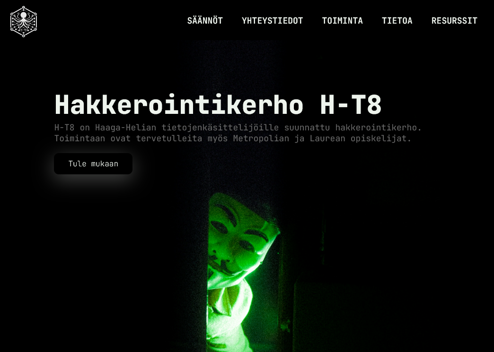
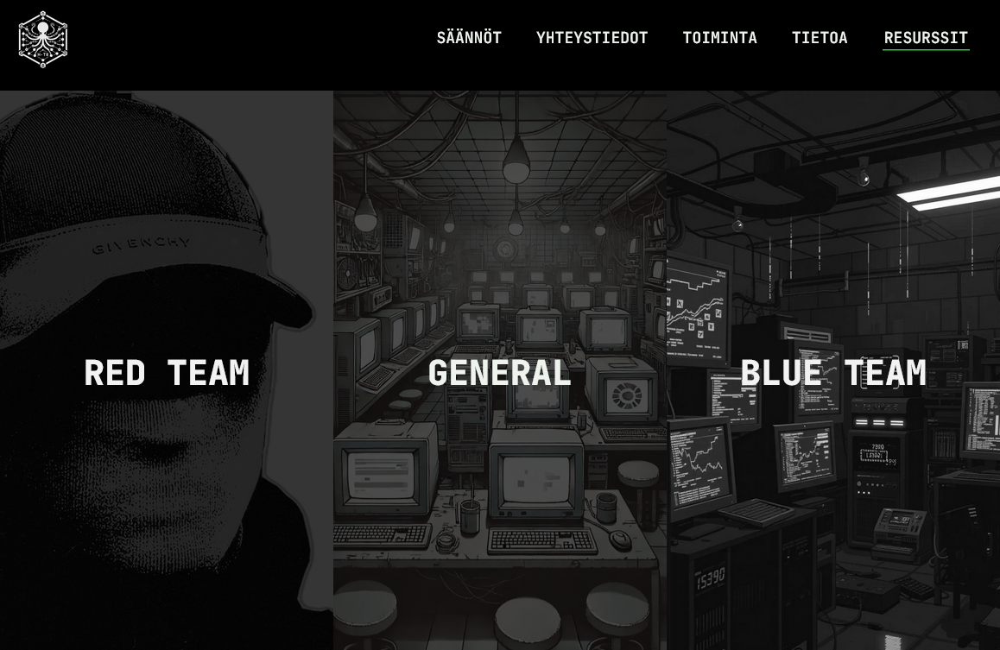
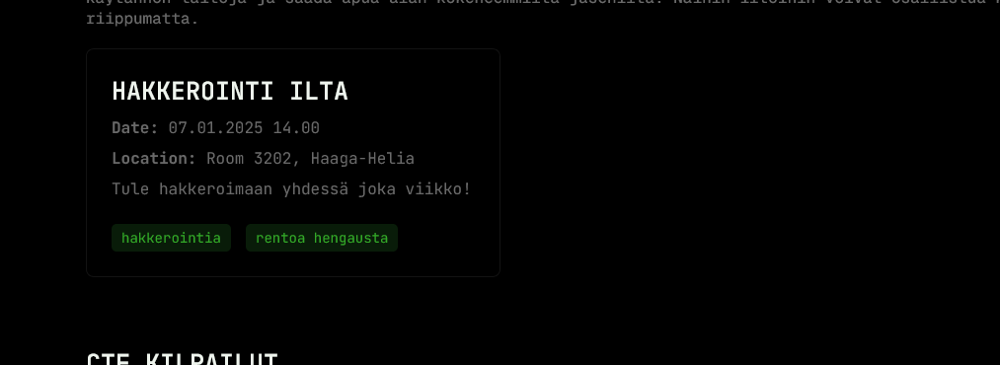

<!--- metadata
id: 005
title: H-T8 Club Website
subtitle: Website
date: 27.12.2024
url: projects/project.html?project=H-T8
image: assets/projects/H-T8/H-T8.webp
imageAlt: H-T8 Club Website logo
summary: The H-T8 website is created for a student hacking club focused on cybersecurity and ethical hacking. This article delves into the technical journey behind the website's creation, highlighting JavaScript-driven features and implementation details that bring functionality and interactivity to life.
tags: ["HTML", "CSS", "JavaScript", "Software"]
creators: Robin Niinemets
duration: 2 weeks
tools: ["HTML", "JavaScript", "CSS"]
buttons: [{"text": "H-T8 Website", "url": "https://askdatdude.github.io/H-T8/"}, {"text": "Github Repository", "url": "https://github.com/AskDatDude/H-T8"}]
--->

### Concept and Design Goals

The H-T8 website was conceptualized as a seamless entry point for university students interested in ethical hacking, many of whom might be hesitant or entirely new to the field. The design objectives for the project included:

- **Clarity and Accessibility:** Ensuring a user-friendly interface with clear navigation and well-organized content.
- **Engagement:** Providing a visually captivating experience that resonates with the club's focus on cybersecurity.
- **Scalability:** Building a platform that can be easily expanded as the club grows.
- **Interactivity:** Leveraging JavaScript to enhance user engagement and bring the site to life.

The resulting design balances clean, intuitive aesthetics with technical sophistication, embodying the innovative spirit of the H-T8 club.

---

### Technical Implementation

## Dynamic Navigation System

A key feature of the website is its dynamic navigation bar, which enhances the user experience through JavaScript-powered smooth scrolling. When users click on a menu item, the JavaScript scroll functionality takes over, animating the transition to the relevant section of the page. This polished interaction adds a layer of professionalism while maintaining focus on usability.

## Interactive Event Highlights

One of the most practical implementations of JavaScript is in the "Toiminta" (Activities) section, where upcoming events and activities are displayed dynamically. Content for this section is sourced from an external JSON file. This approach allows for modular updates: the club can add or modify events by editing the JSON file without needing to alter the core HTML structure. This method ensures ease of maintenance and promotes scalability.

## Responsive Features and Adaptive Layouts

Responsiveness was a top priority for the H-T8 website. While CSS handles most layout adjustments, JavaScript supplements this by detecting the viewport size in real time and triggering specific adjustments for smaller screens. For instance:

- The navigation bar collapses into a hamburger menu for mobile users, with JavaScript managing the toggle functionality.
- Certain animations are disabled or simplified on mobile devices to preserve performance and avoid overwhelming users on slower networks.

## Custom Animations

Hover effects and transitions across the site are a combination of JavaScript and CSS. For example, when users hover over a navigation link, JavaScript dynamically applies classes to control the timing and responsiveness of the hover effect. These small touches create a smoother and more engaging experience, demonstrating the careful attention given to interactivity.

---

### Deployment and Maintenance

The H-T8 website is hosted on GitHub Pages, leveraging its seamless integration with version control for straightforward updates and rollbacks. This choice ensures high availability and reliability, while JavaScript-based tools enable automated checks to validate changes before deployment.

## Content Optimization

JavaScript also plays a role in optimizing content delivery. For example:

- **Lazy Loading:** Images and other heavy assets are loaded dynamically as users scroll, reducing the initial page load time.
- **Error Handling:** JavaScript validates user inputs and manages errors, ensuring smoother interactions in forms and other interactive elements.

Together, these practices create a stable and sustainable platform for the club's growing community.

---

### Conclusion

The "H-T8" website was created from the ground up with a focus on user experience, interactivity, and scalability. By leveraging JavaScript for dynamic content, responsive design, and custom animations, the site delivers a polished and engaging experience that aligns with the club's mission. The technical implementation details discussed in this article provide a glimpse into the thought and effort that went into creating a platform that not only informs but also inspires students to explore the world of ethical hacking.

And personally I got to learn a lot about JavaScript. Also I used the new CSS subclassing feature which was a great learning experience and improved the readability of the code.
